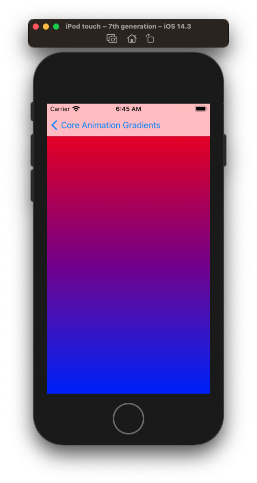
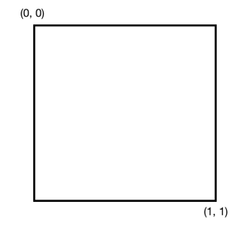
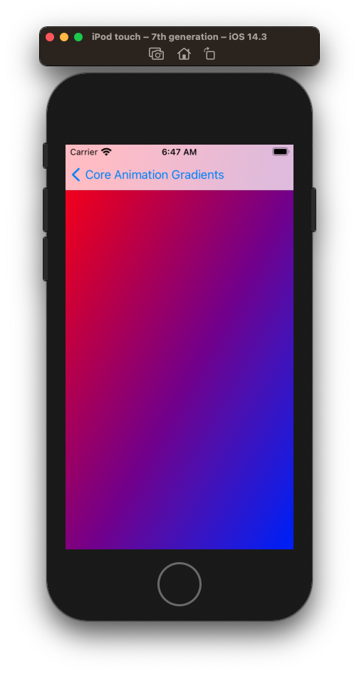
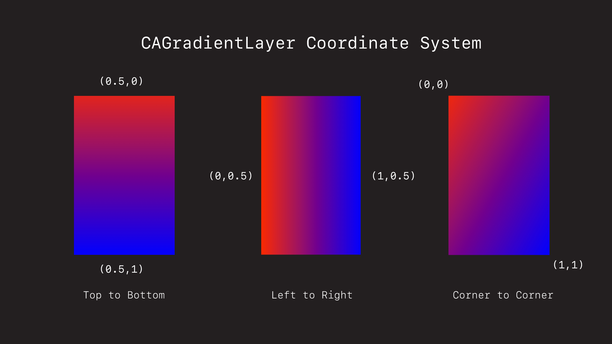
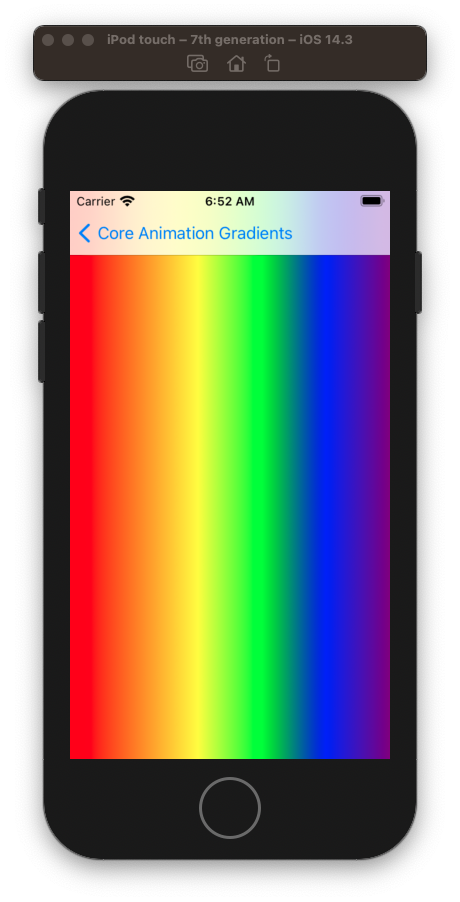
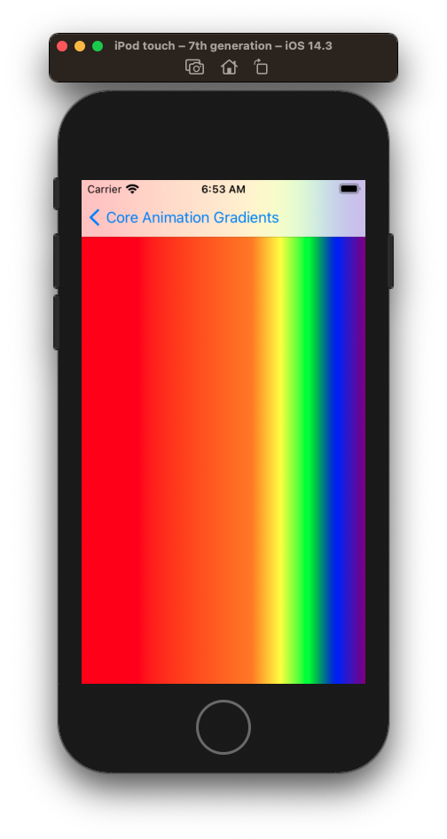
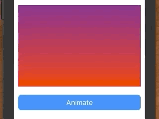
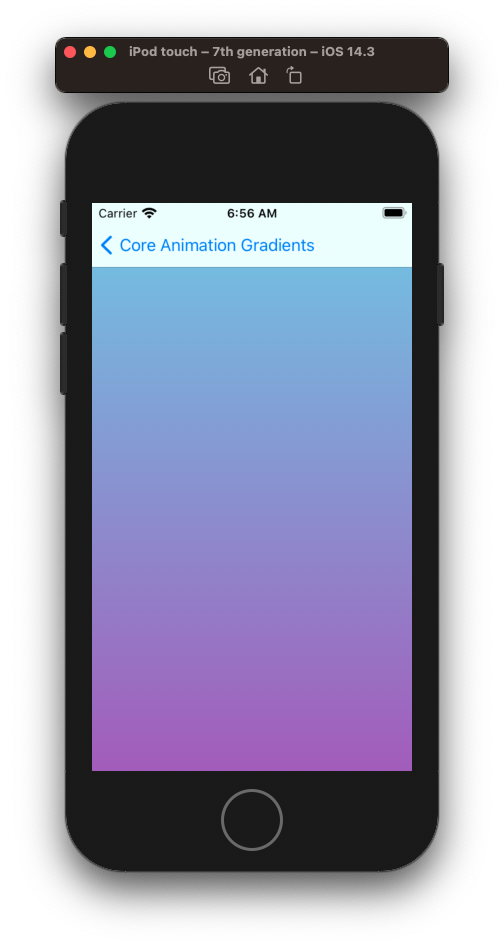
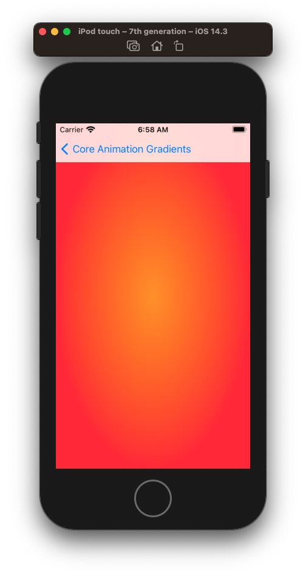
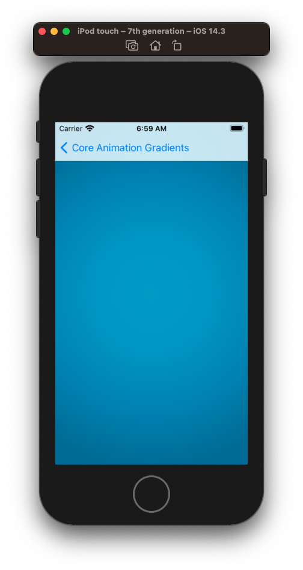

# CAGradientLayers

The `CAGradientLayer` is a layer you can add to a view that draws a color gradient over its background


### Top down



You can add a gradient to any `UIView` by creating a `CAGradientLayer`, specifying its colors, setting it’s frame, direction, and then adding it to the view.

```swift
class DefaultTopToBottomViewController: UIViewController {

    override func viewDidAppear(_ animated: Bool) {
        super.viewDidAppear(animated)

        let gradientLayer = CAGradientLayer()
        gradientLayer.frame = view.bounds
        gradientLayer.colors = [UIColor.red.cgColor, UIColor.blue.cgColor]

        view.layer.addSublayer(gradientLayer)
    }
}
```

### Left to right

You can specify the direction of the gradient using this simple coordinate system.



Simply set the `startPoint` `endPoint` of the gradient to change its direction.


Here for example is how we would go upper-left to bottom-right.

```swift
let gradientLayer = CAGradientLayer()
gradientLayer.frame = view.bounds
gradientLayer.colors = [UIColor.red.cgColor, UIColor.blue.cgColor]
gradientLayer.startPoint = CGPoint(x: 0.0, y: 0.0)
gradientLayer.endPoint = CGPoint(x: 1.0, y: 1.0)
```



And like this.




## Setting the color location



By default, the colors you add will be evenly displayed.

```swift
class DefaultColorViewController: UIViewController {

    override func viewDidAppear(_ animated: Bool) {
        super.viewDidAppear(animated)

        let gradientLayer = CAGradientLayer()
        gradientLayer.frame = view.bounds
        gradientLayer.startPoint = CGPoint(x:0.0, y:0.5)
        gradientLayer.endPoint = CGPoint(x:1.0, y:0.5)
        gradientLayer.colors = [UIColor.red.cgColor, UIColor.orange.cgColor, UIColor.yellow.cgColor, UIColor.green.cgColor, UIColor.blue.cgColor, UIColor.purple.cgColor]
        
        view.layer.addSublayer(gradientLayer)
    }
}
```

But you can specify the stop locations for a color like this.

```swift
class CustomColorViewController: UIViewController {

    override func viewDidAppear(_ animated: Bool) {
        super.viewDidAppear(animated)

        let gradientLayer = CAGradientLayer()
        gradientLayer.frame = view.bounds
        gradientLayer.startPoint = CGPoint(x:0.0, y:0.5)
        gradientLayer.endPoint = CGPoint(x:1.0, y:0.5)
        gradientLayer.colors = [UIColor.red.cgColor, UIColor.orange.cgColor, UIColor.yellow.cgColor, UIColor.green.cgColor, UIColor.blue.cgColor, UIColor.purple.cgColor]
        gradientLayer.locations = [0.0, 0.6, 0.7, 0.8, 0.9, 1.0]
        
        view.layer.addSublayer(gradientLayer)
    }
}
```



## Animation



You can animate a gradient by creating a `CABasicAnimation`, setting its `keyPath` to `colors`, and then setting its `fromValue` and `toValue` sets of colors.

Here I haved created an extension that takes the new colors, sets the duration of the animation, and adds it to the layer.

```swift
extension CAGradientLayer {
    
    func setColors(_ newColors: [CGColor],
                   animated: Bool = true,
                   withDuration duration: TimeInterval = 0,
                   timingFunctionName name: CAMediaTimingFunctionName? = nil) {
        
        if !animated {
            self.colors = newColors
            return
        }
        
        let colorAnimation = CABasicAnimation(keyPath: "colors")
        colorAnimation.fromValue = colors
        colorAnimation.toValue = newColors
        colorAnimation.duration = duration
        colorAnimation.isRemovedOnCompletion = false
        colorAnimation.fillMode = CAMediaTimingFillMode.forwards
        colorAnimation.timingFunction = CAMediaTimingFunction(name: name ?? .linear)

        add(colorAnimation, forKey: "colorsChangeAnimation")
    }
}
```


Full example source.

```swift
import UIKit

class AnimationViewController: UIViewController {
    
    let stackView = UIStackView()
    let gradientView = AnimatedGradientView()
    let button = makeButton(withText: "Animate")
    
    override func viewDidLoad() {
        super.viewDidLoad()
        style()
        layout()
    }
}

extension AnimationViewController {
    
    func style() {
        stackView.translatesAutoresizingMaskIntoConstraints = false
        stackView.axis = .vertical
        stackView.spacing = 20
        
        gradientView.translatesAutoresizingMaskIntoConstraints = false
        
        button.translatesAutoresizingMaskIntoConstraints = false
        button.addTarget(self, action: #selector(buttonTapped(_:)), for: .primaryActionTriggered)
    }
    
    func layout() {
        stackView.addArrangedSubview(gradientView)
        stackView.addArrangedSubview(button)
        
        view.addSubview(stackView)
        
        NSLayoutConstraint.activate([
            stackView.centerXAnchor.constraint(equalTo: view.centerXAnchor),
            stackView.centerYAnchor.constraint(equalTo: view.centerYAnchor),
            gradientView.widthAnchor.constraint(equalToConstant: 300),
            gradientView.heightAnchor.constraint(equalToConstant: 200),
        ])
    }
    
    @objc func buttonTapped(_ sender: UIButton) {
        gradientView.setNeedsLayout()
    }
}

class AnimatedGradientView: UIView {
    
    let topColor: UIColor = UIColor.lightBlue
    let bottomColor: UIColor = UIColor.lightPurple
    
    let gradientLayer = CAGradientLayer()
    
    override init(frame: CGRect) {
        super.init(frame: frame)
        commonInit()
    }
    
    required init?(coder aDecoder: NSCoder) {
        super.init(coder: aDecoder)
        commonInit()
    }
    
    private func commonInit() {
        gradientLayer.colors = [topColor.cgColor, bottomColor.cgColor]
        layer.addSublayer(gradientLayer)
    }
    
    override open func layoutSubviews() {
        super.layoutSubviews()
        
        if gradientLayer.frame != bounds {
            gradientLayer.frame = bounds
        }
        
        let newColors = [
            UIColor.purple.cgColor,
            UIColor.red.cgColor,
            UIColor.orange.cgColor
        ]

        gradientLayer.setColors(newColors,
                                animated: true,
                                withDuration: 2,
                                timingFunctionName: .linear)
    }
}

extension CAGradientLayer {
    
    func setColors(_ newColors: [CGColor],
                   animated: Bool = true,
                   withDuration duration: TimeInterval = 0,
                   timingFunctionName name: CAMediaTimingFunctionName? = nil) {
        
        if !animated {
            self.colors = newColors
            return
        }
        
        let colorAnimation = CABasicAnimation(keyPath: "colors")
        colorAnimation.fromValue = colors
        colorAnimation.toValue = newColors
        colorAnimation.duration = duration
        colorAnimation.isRemovedOnCompletion = false
        colorAnimation.fillMode = CAMediaTimingFillMode.forwards
        colorAnimation.timingFunction = CAMediaTimingFunction(name: name ?? .linear)

        add(colorAnimation, forKey: "colorsChangeAnimation")
    }
}

func makeButton(withText text: String) -> UIButton {
    let button = UIButton()
    button.translatesAutoresizingMaskIntoConstraints = false
    button.setTitle(text, for: .normal)
    button.titleLabel?.adjustsFontSizeToFitWidth = true
    button.contentEdgeInsets = UIEdgeInsets(top: 8, left: 16, bottom: 8, right: 16)
    button.backgroundColor = .systemBlue
    button.layer.cornerRadius = 8
    return button
}
```

## Using as a View

### LinearGradientView



Sometimes it is useful to represent your gradients in a `UIView`. Here for example we create a `LinearGradientView`.

```swift
class LinearGradientView: UIView {
    
    let topColor: UIColor = UIColor.lightBlue
    let bottomColor: UIColor = UIColor.lightPurple
    
    let gradientLayer = CAGradientLayer()
    
    override init(frame: CGRect) {
        super.init(frame: frame)
        commonInit()
    }
    
    required init?(coder aDecoder: NSCoder) {
        super.init(coder: aDecoder)
        commonInit()
    }
    
    private func commonInit() {
        gradientLayer.colors = [topColor.cgColor, bottomColor.cgColor]
        layer.addSublayer(gradientLayer)
    }
    
    override open func layoutSubviews() {
        super.layoutSubviews()
        
        if gradientLayer.frame != bounds {
            gradientLayer.frame = bounds
        }
    }
}
```

And then add it to the main `view` of our `UIViewController`. Now we have a nice background view while still being able to add any other subviews that we want.

```swift
class LinearGradientViewController: UIViewController {

    override func loadView() {
        super.loadView()
        view = LinearGradientView()
    }
}
```


### Radial as a View



You can make a gradient radial by setting its type.

```swift
gradientLayer.type = .radial
```

```swift
class RadialCAGradientViewController: UIViewController {

    override func viewDidAppear(_ animated: Bool) {
        super.viewDidAppear(animated)

        let gradientLayer = CAGradientLayer()
        gradientLayer.type = .radial
        gradientLayer.colors = [
            UIColor.systemOrange.cgColor,
            UIColor.systemRed.cgColor
        ]
        gradientLayer.startPoint = CGPoint(x: 0.5, y: 0.5)
        gradientLayer.endPoint = CGPoint(x: 1, y: 1)
        
        gradientLayer.frame = view.bounds
        
        view.layer.addSublayer(gradientLayer)
    }
}
```

### Radial via Core Graphics



If you need more full control over the radial curve you can also specify it yourself in Core Graphics.

```swift
class RadialGradientLayer: CALayer {
    
    @objc public var colors = [UIColor.systemRed.cgColor, UIColor.systemBlue.cgColor] {
        didSet {
            backgroundColor = colors.last
        }
    }
    
    required override init() {
        super.init()
        needsDisplayOnBoundsChange = true
    }
    
    required init?(coder aDecoder: NSCoder) {
        super.init(coder: aDecoder)
    }
    
    required override init(layer: Any) {
        super.init(layer: layer)
    }
    
    override func draw(in context: CGContext) {
        context.saveGState()
        
        let center = CGPoint(x: bounds.width / 2, y: bounds.height / 2)
        let endRadius = max(bounds.width, bounds.height) / 2
        
        var locations = [CGFloat]()
        for index in 0...colors.count - 1 {
            locations.append(CGFloat(index) / CGFloat(colors.count - 1))
        }
        
        if let gradient = CGGradient(colorsSpace: nil, colors: colors as CFArray, locations: locations) {
            context.drawRadialGradient(gradient, startCenter: center, startRadius: 0.0, endCenter: center, endRadius: endRadius, options: CGGradientDrawingOptions.drawsBeforeStartLocation)
        }
    }
}

public class RadialGradientView: UIView {
    
    let darkestColor: UIColor = .radialDarkestBlue
    let darkerColor: UIColor = .radialDarkerBlue
    let lighterColor: UIColor = .radialLighterBlue
    let lightestColor: UIColor = .radialLightestBlue
    
    let gradientLayer = RadialGradientLayer()
    
    override init(frame: CGRect) {
        super.init(frame: frame)
        commonInit()
    }
    
    required init?(coder aDecoder: NSCoder) {
        super.init(coder: aDecoder)
        commonInit()
    }
    
    override public func layoutSubviews() {
        super.layoutSubviews()
        
        if gradientLayer.frame != bounds {
            gradientLayer.frame = bounds
        }
    }
    
    private func commonInit() {
        backgroundColor = darkestColor
        gradientLayer.colors = [lightestColor.cgColor, lighterColor.cgColor, darkerColor.cgColor, darkestColor.cgColor]
        layer.addSublayer(gradientLayer)
    }
    
}

class RadialCGGradientViewController: UIViewController {

    override func loadView() {
        super.loadView()
        view = RadialGradientView()
    }
}
```

### Links that help

- [Apple CAGradientLayer](https://developer.apple.com/documentation/quartzcore/cagradientlayer)
- [How to use CAGradientLayer](https://appcodelabs.com/ios-gradients-how-use-cagradientlayer-swift)


