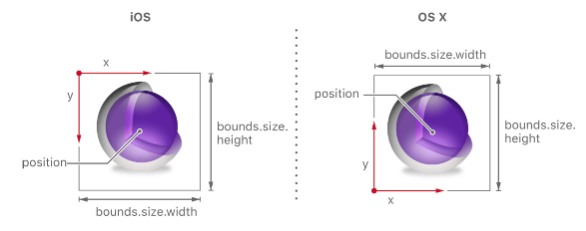
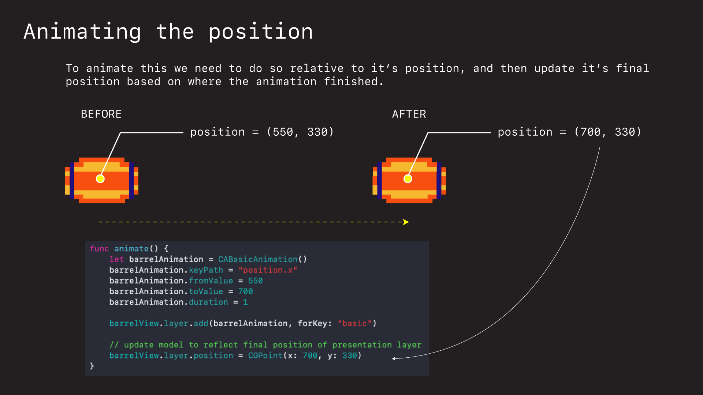
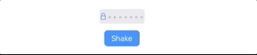
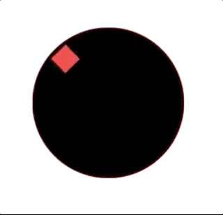
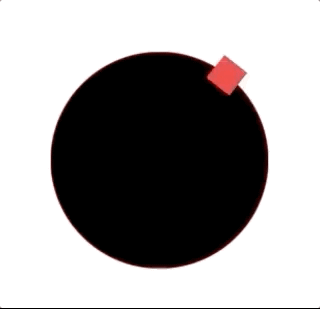

# Core Animation Intro

Core Animation (CA) is a library iOS developers use to animate and manipulate content in their UIViews. You specify the start and end points for how you would like a view to be manipulated, and Core Animation interpolates the frames in between and handles the creation and display of the animation.

The power of Core Animation is it’s speed. Core Animation works off the main run loop and is about to leverage GPU hardware. That means it can do calculations off the main thread, and update views very quickly.


## What is Core Animation


Core Animation provides a general purpose system for animating views and other visual elements of your app. It does this by caching the contents of views into bitmaps that can be manipulated directly by the graphics hardware.

It sits below UIKit. Whenever you animate anything with UIKit it's Core Animation (or CA) that is doing the work behind the scenes. And by learning more about how it works, you are going to gain deeper insight into how to use it effectively.

## The Coordinate System

The basic coordinate system starts with the origin in the upper-right-hand corner for iOS (Mac is lower left). And the key thing to note is the center of the `layer` or it's `position`.


When we create a `UIImageView` we can specify the `CGRect` (whose lays the image out relative to the x and y values in the upper righ-hand-corner), but as we will see shortly, when we go to animate it, it is the position or `anchor point` that we will change.

## Two parallel layers

CA maintains two parallel layer hierarchies: 

- the *model layer tree* and 
- the *presentation layer tree*. 

Layers in the former represent the current state, while layers in the latter represent the in-flight values of animations.

This is important to understand because the presentation layer (where the animations take place) don't affect the model layer. If your animation ends and your view is in a different place, you need to update your model layer to reflect that final position as shown below in basic animation.


## A Basic Animation

To animate something in CA we often do so relative to it's anchor point or position.



Note how the `position` is in the middle of the image. This position is half the width and half the height away from the images initial "position" of it's `CGRect` in the upper-right-hand corner.

That's why when animating we often need to take this into account.

For example, say we define an image with a `CGRect` defined at (500, 300).


```swift
lazy var barrelView: UIImageView = {
    let view = UIImageView(frame: CGRect(x: 500, y: 300, width: 100, height: 60))
    view.image = UIImage(named: "barrel")
    
    return view
}()
```

To animate and move it 150 pts to the right, we need to do so relative to its position - which is 500 plus half the width of the image itself 100/2. Or 550.

```swift
let barrelAnimation = CABasicAnimation()
barrelAnimation.keyPath = "position.x"
barrelAnimation.fromValue = 550
barrelAnimation.toValue = 700
barrelAnimation.duration = 1
    
barrelView.layer.add(barrelAnimation, forKey: "basic")
```


Notice when we do the image flips back to it's original position? That's the *model presentation* thing I was talking about. By default the animation will not modify the presentation layer beyond its duration. It will be removed when it is done and the presentation layer will fall back to the values of the model layer.

We can fix this by updating the *model layer* to equal the final position of the animation from the *presentation layer*.

```swift
let barrelAnimation = CABasicAnimation()
barrelAnimation.keyPath = "position.x"
barrelAnimation.fromValue = 550
barrelAnimation.toValue = 700
barrelAnimation.duration = 1
    
barrelView.layer.add(barrelAnimation, forKey: "basic")
    
// update model to reflect final position of presentation layer
barrelView.layer.position = CGPoint(x: 700, y: 330)
```



Note also how when updating the model we can't just use the initial y-value of the `CGRect`. We have to use the y-position which is 300 + height/2 = 300 pts.

Now the barrel stays where is should, our *model* and *presentation* layers are in sync, and all is good.


## Keyframe animations

To get full control over what happens in an animation and when use `CAKeyframeAnimation`.

Here is an example of how we can make a login form shake by moving the `position.x` of a textfield back and forth at specific times over a 0.4 sec duration.



```swift
let animation = CAKeyframeAnimation()
animation.keyPath = "position.x"
animation.values = [0, 10, -10, 10, 0]
animation.keyTimes = [0, 0.16, 0.5, 0.83, 1]
animation.duration = 0.4

animation.isAdditive = true
loginView.layer.add(animation, forKey: "shake")
```

`isAdditive` determines if the value specified by the animation is added to the current render tree value to produce the new render tree value.

## Animating along paths

You can animate layers along paths.

```swift
let orbit = CAKeyframeAnimation()
orbit.keyPath = "position"
orbit.path = CGPath(ellipseIn: boundingRect, transform: nil)
orbit.duration = 2
orbit.isAdditive = true
orbit.repeatCount = HUGE
orbit.calculationMode = CAAnimationCalculationMode.paced;
orbit.rotationMode = CAAnimationRotationMode.rotateAuto;
```

The key thing to remember here is that the path is always relative to the shape, and it's outside view.

For example if we just plunked a square down in the middle of a screen according to it's position, when we want to animate it it would wobble, because the square's center isn't flush with the circles.

```swift
let view = UIImageView(frame: CGRect(x: 1024/2, y: 1366/2, width: 40, height: 40))
```

If you ever see this kind of offset in your animations, that's what going on. 



The way to fix this is to shift the square so that it's center is flush with the center of screen. The animation is fine. It is always going to animate the square in a perfect circle. 

The wobble is there because the square isn't in the middle of the screen. It's position is. But not it's center.


So by moving the square up and to the left by half it's width and height (40/2 pts) we fix it.

```swift
let view = UIImageView(frame: CGRect(x: 1024/2 - 40/2, y: 1366/2 - 40/2, width: 40, height: 40))
```




### Links that help

- [Core Animation Apple Docs](https://developer.apple.com/library/archive/documentation/Cocoa/Conceptual/CoreAnimation_guide/CoreAnimationBasics/CoreAnimationBasics.html#//apple_ref/doc/uid/TP40004514-CH2-SW3)
- [Key Path list](https://developer.apple.com/library/archive/documentation/Cocoa/Conceptual/CoreAnimation_guide/Key-ValueCodingExtensions/Key-ValueCodingExtensions.html#//apple_ref/doc/uid/TP40004514-CH12-SW2) 
- [Animatable Properties](https://developer.apple.com/library/archive/documentation/Cocoa/Conceptual/CoreAnimation_guide/AnimatableProperties/AnimatableProperties.html)
- [Good overview and intro to CA upon which these notes were based](https://www.objc.io/issues/12-animations/animations-explained/)
- [Detailed notes](https://gist.github.com/JeOam/94e833bcefd738d805cc)

