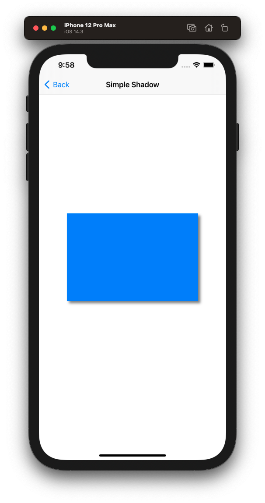
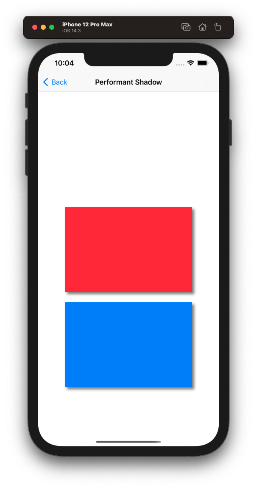
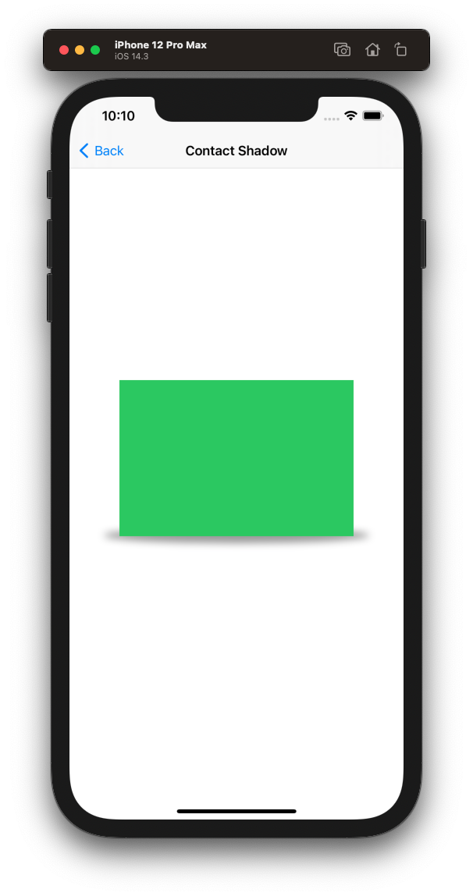
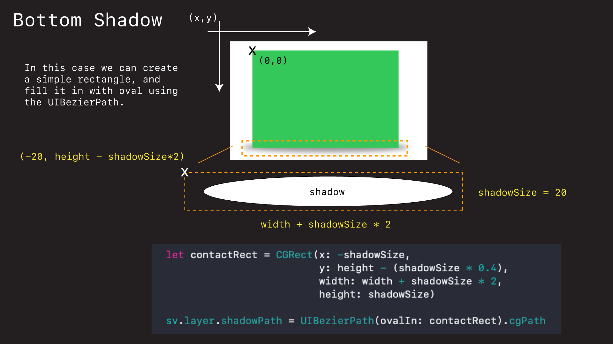
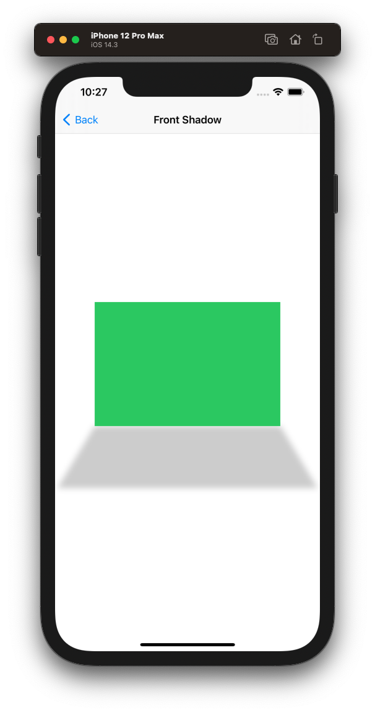
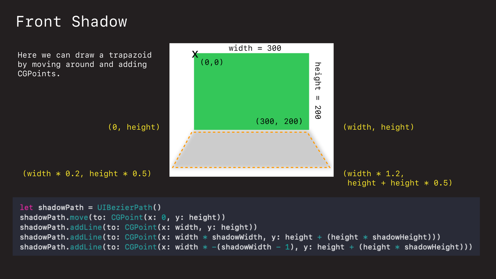

# Shadows

Here are some ways you can add shadows to your views in iOS.

## How do shadows work?

Shadows are added to `UIViews` via its `CALayer`.


```swift
shadowView.layer.shadowOpacity = 0.5
shadowView.layer.shadowOffset = CGSize(width: 5, height: 5)
```

You simply set the shadows opacity, specify an offset, and voila - shadows!




```swift
import UIKit

class SimpleViewController: UIViewController {
    
    let shadowView = UIView()
    
    override func viewDidLoad() {
        super.viewDidLoad()
        title = "Simple Shadow"
        shadowView.backgroundColor = .systemBlue
        
        shadowView.translatesAutoresizingMaskIntoConstraints = false

        view.addSubview(shadowView)
        
        NSLayoutConstraint.activate([
            shadowView.centerXAnchor.constraint(equalTo: view.centerXAnchor),
            shadowView.centerYAnchor.constraint(equalTo: view.centerYAnchor),
            shadowView.widthAnchor.constraint(equalToConstant: 300),
            shadowView.heightAnchor.constraint(equalToConstant: 200),
        ])

        shadowView.layer.shadowOpacity = 0.5
        shadowView.layer.shadowOffset = CGSize(width: 5, height: 5)
    }
}
```

## Performant Shadows

Drawing shadows can be an expensive operation. To make the rendering of them more performant we can:

   1. Rasterizing them (create a bitmap cache).
   2. Assigning them an explicit path.

```swift
// for performance...
shadowView.layer.rasterizationScale = UIScreen.main.scale
shadowView.layer.shadowPath = UIBezierPath(rect: shadowView.bounds).cgPath
```

>Note: Paths often need view bounds, which can only be determined once a view has been rendered. For that reason you often need to to add the shadows to a view in `viewDidAppear` or in `layoutSubviews` of a custom view.



```swift
import UIKit

class PerformantViewController: UIViewController {
    
    let shadowView = UIView()
    let myView = MyView()
    
    override func viewDidLoad() {
        super.viewDidLoad()
        title = "Performant Shadow"
        
        shadowView.backgroundColor = .systemRed
        shadowView.translatesAutoresizingMaskIntoConstraints = false

        myView.backgroundColor = .systemBlue
        myView.translatesAutoresizingMaskIntoConstraints = false

        view.addSubview(shadowView)
        view.addSubview(myView)
        
        NSLayoutConstraint.activate([
            shadowView.centerXAnchor.constraint(equalTo: view.centerXAnchor),
            shadowView.centerYAnchor.constraint(equalTo: view.centerYAnchor),
            shadowView.widthAnchor.constraint(equalToConstant: 300),
            shadowView.heightAnchor.constraint(equalToConstant: 200),
            
            myView.centerXAnchor.constraint(equalTo: view.centerXAnchor),
            myView.topAnchor.constraint(equalToSystemSpacingBelow: shadowView.bottomAnchor, multiplier: 3),
            myView.widthAnchor.constraint(equalToConstant: 300),
            myView.heightAnchor.constraint(equalToConstant: 200),
        ])
    }
    
    override func viewDidAppear(_ animated: Bool) {
        super.viewDidAppear(animated)
        
        shadowView.layer.shadowOpacity = 0.5
        shadowView.layer.shouldRasterize = true
        shadowView.layer.shadowOffset = CGSize(width: 5, height: 5)
        
        // for performance...
        shadowView.layer.rasterizationScale = UIScreen.main.scale
        shadowView.layer.shadowPath = UIBezierPath(rect: shadowView.bounds).cgPath
    }
    
    class MyView: UIView {
        
        override init(frame: CGRect) {
            super.init(frame: frame)
        }
        
        required init?(coder: NSCoder) {
            fatalError("init(coder:) has not been implemented")
        }
        
        override var intrinsicContentSize: CGSize {
            return CGSize(width: 200, height: 200)
        }
        
        override func layoutSubviews() {
            super.layoutSubviews()
            
            // do shadow work here once size is known
            addShadow()
        }
        
        func addShadow() {
            layer.shadowOpacity = 0.5
            layer.shouldRasterize = true
            layer.shadowOffset = CGSize(width: 5, height: 5)
            layer.rasterizationScale = UIScreen.main.scale
            layer.shadowPath = UIBezierPath(rect: bounds).cgPath
        }
    }
}
```

## Custom Shadows

Drawing custom shadows comes down to drawing `UIBezier` curves and specifying their dimensions in Core Graphics. Here are some examples.

### Bottom shadow



We can add a shadow to the bottom of a view by defining a Bezier curve in the form of an oval and adding it to the views `layer` like this.

```swift
//
//  ContactShadowViewController.swift
//  ShadowsDemo
//
//  Created by jrasmusson on 2021-01-23.
//

import UIKit

class BottomViewController: BaseViewController {

    override func viewDidAppear(_ animated: Bool) {
        super.viewDidAppear(animated)
        title = "Contact Shadow"

        let shadowSize: CGFloat = 20
        let height = sv.bounds.height
        let width = sv.bounds.width
        
        let contactRect = CGRect(x: -shadowSize,
                                 y: height - (shadowSize * 0.4),
                                 width: width + shadowSize * 2,
                                 height: shadowSize)

        sv.layer.shadowPath = UIBezierPath(ovalIn: contactRect).cgPath
        sv.layer.shadowRadius = 5
        sv.layer.shadowOpacity = 0.4
    }
}
```

The trick to understanding these custom shadows is understanding Core Graphics and its coordinate system.



Here we are defining a `CGRect`, which is going to define the dimensions of our shadow, and then drawing inside it an oval.

>Note: The origin is in the upper-left hand corner of our original view, and the `CGRect` is defined relative to that.

### Front shadow

Once you understand how `CGRect` works, you can define any type of shadow you like. Here is one that faces forward.



**BaseViewController.swift** (used in following examples)

```swift
import UIKit

class BaseViewController: UIViewController {
    
    let sv = UIView() // shadowView
    
    override func viewDidLoad() {
        super.viewDidLoad()
        title = "Base Shadow"
        
        sv.backgroundColor = .systemGreen
        sv.translatesAutoresizingMaskIntoConstraints = false

        view.addSubview(sv)
        
        NSLayoutConstraint.activate([
            sv.centerXAnchor.constraint(equalTo: view.centerXAnchor),
            sv.centerYAnchor.constraint(equalTo: view.centerYAnchor),
            sv.widthAnchor.constraint(equalToConstant: 300),
            sv.heightAnchor.constraint(equalToConstant: 200),
        ])
    }
}
```

**FrontViewController.swift**

```swift
import UIKit

class FrontViewController: BaseViewController {

    override func viewDidAppear(_ animated: Bool) {
        super.viewDidAppear(animated)
        title = "Front Shadow"

        let height = sv.bounds.height
        let width = sv.bounds.width
        
        // how wide and high the shadow should be, where 1.0 is identical to the view
        let shadowWidth: CGFloat = 1.20
        let shadowHeight: CGFloat = 0.5

        let shadowPath = UIBezierPath()
        shadowPath.move(to: CGPoint(x: 0, y: height))
        shadowPath.addLine(to: CGPoint(x: width, y: height))
        shadowPath.addLine(to: CGPoint(x: width * shadowWidth, y: height + (height * shadowHeight)))
        shadowPath.addLine(to: CGPoint(x: width * -(shadowWidth - 1), y: height + (height * shadowHeight)))
        
        sv.layer.shadowPath = shadowPath.cgPath
        sv.layer.shadowRadius = 5
        sv.layer.shadowOffset = .zero
        sv.layer.shadowOpacity = 0.2
    }
}
```

Here is a picture visualizing how the geometry of this shadow was calculated.



### Links that help

- [Paul Hudson Examples](https://www.hackingwithswift.com/articles/155/advanced-uiview-shadow-effects-using-shadowpath)