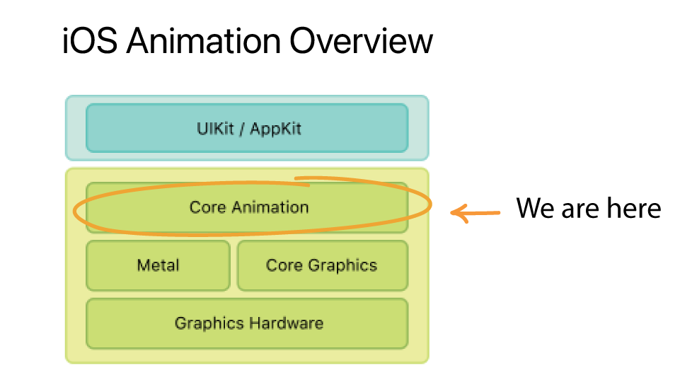

# Core Animation Intro

Core animation can be confusing at first, but if we learn it from first principles it will make understanding the rest of Animation in iOS a lot easier so let's start here.

## What is Core Animation


Core Animation provides a general purpose system for animating views and other visual elements of your app. It does this by caching the contents of views into bitmaps that can be manipulated directly by the graphics hardware.

It sits below UIKit. Whenever you animate anything with UIKit it's Core Animation (or CA) that is doing the work behind the scenes. And by learning more about how it works, you are going to gain deeper insight into how to use it effectively.

## What's important to understand?

The key thing to understand about CA is that when you add an animation layer to your view, your aren't actually changing the underlying view - just it's animation.

CA maintains two parallet layer hierarchies: the *model layer tree* and the *presentation layer tree*. Layers in the former represent the current state, while layers in the latter represent the in-flight values of animations.

You can switch between these layers easily (`CALayer presentationLayer` and `CALayer modelLayer`). But if you ever inspect a layer during an animation and notice that it's values aren't different, this is why. It's the presentation layer that's being anination, not the model layer.

## A Basic Animation

This is how we can animate the rolling of a barrel from one value to another.

First we position the barrel on the screen.

```swift
lazy var barrelView: UIImageView = {
    let view = UIImageView(frame: CGRect(x: 500, y: 300, width: 98, height: 61))
    view.image = UIImage(named: "barrel")
    
    return view
}()
```

Then we animate it like this.

```swift
let barrelAnimation = CABasicAnimation()
barrelAnimation.keyPath = "position.x"
barrelAnimation.fromValue = 500
barrelAnimation.toValue = 700
barrelAnimation.duration = 1
    
barrelView.layer.add(barrelAnimation, forKey: "basic")
```

The values 500 and 700 are absolute in that they are relative to the absolute coordinate system used to position the barrel in the first place. That's why I choose to do this layout using `CGFrame` and `CGRect` - I wanted to position this barrel exactly.


Notice of the animation resets itself when complete? That's the *model presentation* thing I was talking about. By default the animation will not modify the presentation layer beyond its duration. It will be removed when it is done and the presentation layer will fall back to the values of the model layer.

The recommended way to deal with this is to update the model to reflect the final stage of the presentation - that way the models are in sync.

```swift
func animate() {
    let barrelAnimation = CABasicAnimation()
    barrelAnimation.keyPath = "position.x"
    barrelAnimation.fromValue = 500
    barrelAnimation.toValue = 700
    barrelAnimation.duration = 1
    
    barrelView.layer.add(barrelAnimation, forKey: "basic")
    
    // update model to reflect final position of presentation layer
    barrelView.layer.position = CGPoint(x: 700, y: 300)
}
```

Now the barrel stays where is should, and all is good.


### Links that help

- [Core Animation Apple Docs](https://developer.apple.com/library/archive/documentation/Cocoa/Conceptual/CoreAnimation_guide/CoreAnimationBasics/CoreAnimationBasics.html#//apple_ref/doc/uid/TP40004514-CH2-SW3)
- [Good overview and intro to CA upon which these notes were based](https://www.objc.io/issues/12-animations/animations-explained/)

