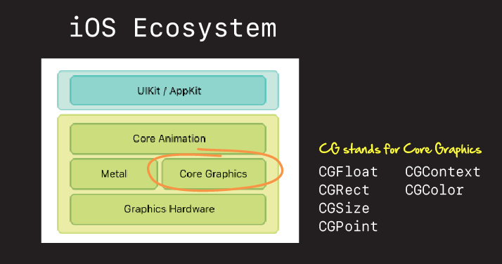
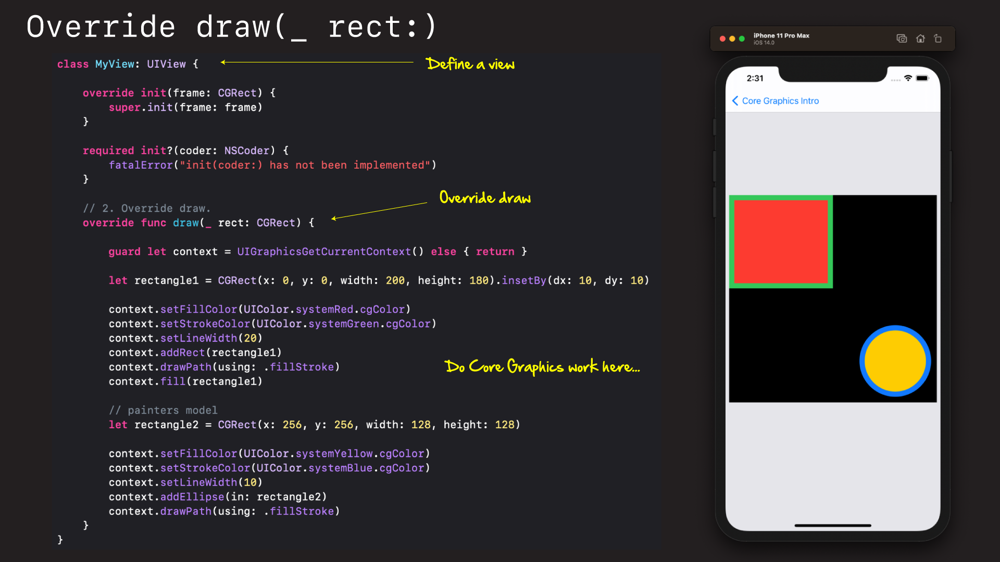
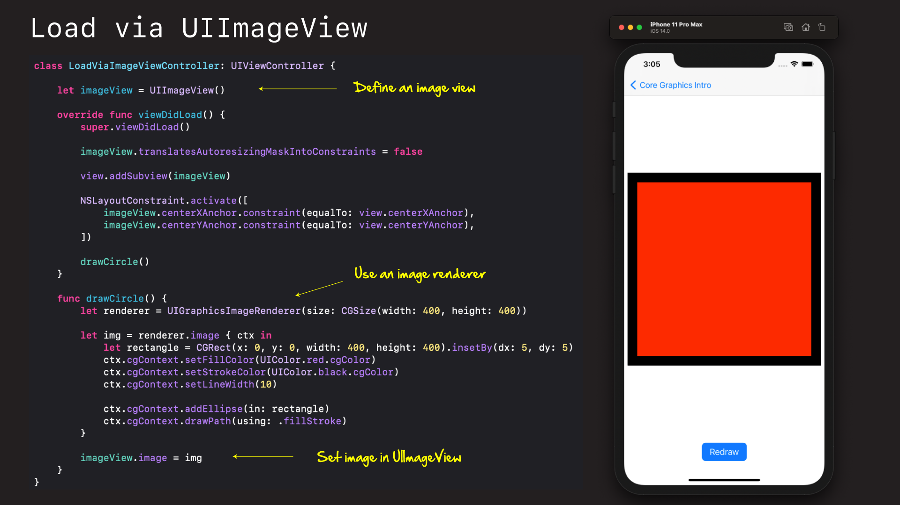
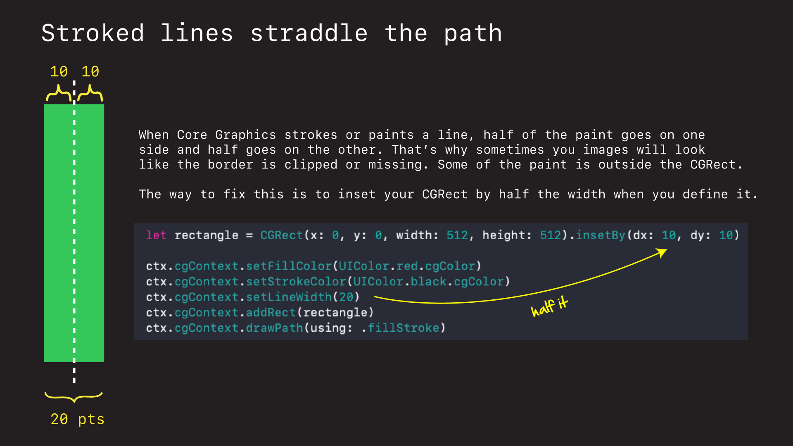

# Core Graphics Intro

## What is Core Graphics?

Core Graphics is Apple's library for drawing things in iOS and on the Mac. It's been around for over 20 years. It is a very mature stable library. And it is what enables images to appear on our iPhones.

We often don't work with it directly in iOS. Most of our work is done in a higher level frameworks and libraries like UIKit and CocoaTouch. But Core Graphics (aka Quartz is always there). And it is the basis everything is built upon.



## How does it work

The standard way to create an image in CG is to override the `drawRect` in a `UIView`.



```swift
import UIKit

class DrawRectViewController: UIViewController {
    
    let drawRectView = MyView()
    
    override func viewDidLoad() {
        super.viewDidLoad()
        view.backgroundColor = .systemGray5
        
        drawRectView.translatesAutoresizingMaskIntoConstraints = false
                
        view.addSubview(drawRectView)
        
        NSLayoutConstraint.activate([
            drawRectView.centerXAnchor.constraint(equalTo: view.centerXAnchor),
            drawRectView.centerYAnchor.constraint(equalTo: view.centerYAnchor),
            drawRectView.widthAnchor.constraint(equalToConstant: 400),
            drawRectView.heightAnchor.constraint(equalToConstant: 400),
        ])
        
        print(UIScreen.main.bounds.size)
    }
}

class MyView: UIView {
    
    override init(frame: CGRect) {
        super.init(frame: frame)
    }
    
    required init?(coder: NSCoder) {
        fatalError("init(coder:) has not been implemented")
    }
    
    override func draw(_ rect: CGRect) {

        guard let context = UIGraphicsGetCurrentContext() else { return }

        let rectangle1 = CGRect(x: 0, y: 0, width: 200, height: 180).insetBy(dx: 10, dy: 10)
                
        context.setFillColor(UIColor.systemRed.cgColor)
        context.setStrokeColor(UIColor.systemGreen.cgColor)
        context.setLineWidth(20)
        context.addRect(rectangle1)
        context.drawPath(using: .fillStroke)
        context.fill(rectangle1)
        
        let rectangle2 = CGRect(x: 256, y: 256, width: 128, height: 128)

        context.setFillColor(UIColor.systemYellow.cgColor)
        context.setStrokeColor(UIColor.systemBlue.cgColor)
        context.setLineWidth(10)
        context.addEllipse(in: rectangle2)
        context.drawPath(using: .fillStroke)
    }
}
```

But you can also create a `UIImageView` and draw your image into there.



```swift
import UIKit

class LoadViaImageViewController: UIViewController {

    let imageView = UIImageView()
    
    override func viewDidLoad() {
        super.viewDidLoad()
        
        imageView.translatesAutoresizingMaskIntoConstraints = false

        view.addSubview(imageView)
        
        NSLayoutConstraint.activate([
            imageView.centerXAnchor.constraint(equalTo: view.centerXAnchor),
            imageView.centerYAnchor.constraint(equalTo: view.centerYAnchor),
        ])

        drawCircle()
    }
    
    func drawCircle() {
        let renderer = UIGraphicsImageRenderer(size: CGSize(width: 400, height: 400))

        let img = renderer.image { ctx in
            let rectangle = CGRect(x: 0, y: 0, width: 400, height: 400).insetBy(dx: 5, dy: 5)
            ctx.cgContext.setFillColor(UIColor.red.cgColor)
            ctx.cgContext.setStrokeColor(UIColor.black.cgColor)
            ctx.cgContext.setLineWidth(10)

            ctx.cgContext.addEllipse(in: rectangle)
            ctx.cgContext.drawPath(using: .fillStroke)
        }

        imageView.image = img
    }
}
```

You basically create a `UIView`, override it's `draw(_ rect:)` function, and then do your Core Graphics (CG) work in there.

The actual CG work is done using API like these to draw shapes and images.

- Points - `CGContextMoveToPoint`
- Lines - `CGContextAddLineToPoint` / `CGContextAddLines`
- Arcs - `CGContextAddArc`
- Curves - `CGContextAddCurveToPoint` / `AddQuadCurveToPoint`
- Closing a Subpath - `CGContextClosePath`
- Ellipses - `CGContextAddEllipseInRect`
- Rectangles - `CGContextAddRect`

 
## Gotchas

There are a couple of gotchas the can trip people up when getting started. Let's review a few now.

### The Coordinate System

First of the coordinate system. In iOS the CG coordinate system goes down and to the right.


This is important to understand because a lot of people think the origin will be in the middle of the circle or square that they draw. It isn't. It's in the upper-left and all drawing start at (0,0) from there.

## Stroking a line straddles the path




### Links that help

- [Apple Docs on Core Graphics](https://developer.apple.com/library/archive/documentation/GraphicsImaging/Conceptual/drawingwithquartz2d/Introduction/Introduction.html#//apple_ref/doc/uid/TP40007533-SW1)
- [Paul Hudson Tutorial](https://www.hackingwithswift.com/read/27/3/drawing-into-a-core-graphics-context-with-uigraphicsimagerenderer)
- [Swift Arcade Video](https://youtu.be/won0gA05ce0)
