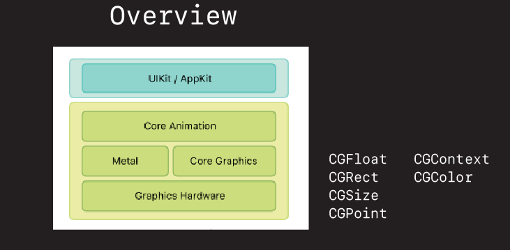

# Core Graphics Intro

## What is Core Graphics?

Core Graphics is Apple's library for drawing things in iOS and on the Mac. It's been around for over 20 years. It is a very mature stable library. And it is what enables images to appear on our iPhones.

We often don't work with it directly in iOS. Most of our work is done in a higher level frameworks and libraries like UIKit and CocoaTouch. But Core Graphics (aka Quartz is always there). And it is the basis everything is built upon.



## How does it work

Drawing in CG is basically a three step process.

1. Define a view.
2. Get a context.
3. Draw.

Let's look at a couple of examples.

### Overriding drawRect

The standard or canonical way to draw in a `UIView` is to override the views `drawRect` method like this.


```swift
//
//  DrawRectViewController.swift
//  CoreGraphicsIntro
//
//  Created by jrasmusson on 2021-01-18.
//

import UIKit

class DrawRectViewController: UIViewController {
    
    // 1. Define a view.
    let drawRectView = DrawRectView()
    
    override func viewDidLoad() {
        super.viewDidLoad()
        view.backgroundColor = .systemGray5
        
        drawRectView.translatesAutoresizingMaskIntoConstraints = false
                
        view.addSubview(drawRectView)
        
        NSLayoutConstraint.activate([
            drawRectView.centerXAnchor.constraint(equalTo: view.centerXAnchor),
            drawRectView.centerYAnchor.constraint(equalTo: view.centerYAnchor),
            drawRectView.widthAnchor.constraint(equalToConstant: 512),
            drawRectView.heightAnchor.constraint(equalToConstant: 512),
        ])
    }
}

class DrawRectView: UIView {
    
    override init(frame: CGRect) {
        super.init(frame: frame)
    }
    
    required init?(coder: NSCoder) {
        fatalError("init(coder:) has not been implemented")
    }
    
    // 2. Override draw
    override func draw(_ rect: CGRect) {
        
        let rectangle1 = CGRect(x: 0, y: 0, width: 200, height: 180).insetBy(dx: 10, dy: 10)
        
        guard let context = UIGraphicsGetCurrentContext() else { return }
        
        context.setFillColor(UIColor.systemRed.cgColor)
        context.setStrokeColor(UIColor.systemGreen.cgColor)
        context.setLineWidth(20)
        context.addRect(rectangle1)
        context.drawPath(using: .fillStroke)
        context.fill(rectangle1)
        
        // painters model
        
        let rectangle2 = CGRect(x: 256, y: 256, width: 128, height: 128)

        context.setFillColor(UIColor.systemYellow.cgColor)
        context.setStrokeColor(UIColor.systemBlue.cgColor)
        context.setLineWidth(10)

        context.addEllipse(in: rectangle2)
        context.drawPath(using: .fillStroke)
    }
}
```

### Loading via UIImageView

Another way you will see Core Graphics images painted in UIKit is to load them via a `UIImageView`.

Here you define a `UIImageView` you would like to hold your CG image, and then you load it by setting the image your create into the `UIImageView`.

```swift
//
//  BasicShapesViewController.swift
//  CoreGraphicsIntro
//
//  Created by jrasmusson on 2021-01-18.
//

import UIKit

class LoadViaImageViewController: UIViewController {

    // 1. Define container view.
    let imageView = UIImageView()
    let button = makeButton(withText: "Redraw")
    var currentDrawType = 0
    
    override func viewDidLoad() {
        super.viewDidLoad()
        style()
        layout()
        drawRectangle()
    }
}

extension LoadViaImageViewController {
    
    func style() {
        imageView.translatesAutoresizingMaskIntoConstraints = false
        imageView.backgroundColor = .systemGray5
        button.addTarget(self, action: #selector(buttonTapped(_:)), for: .primaryActionTriggered)
    }
    
    func layout() {
        view.addSubview(imageView)
        view.addSubview(button)
        
        NSLayoutConstraint.activate([
            imageView.centerXAnchor.constraint(equalTo: view.centerXAnchor),
            imageView.centerYAnchor.constraint(equalTo: view.centerYAnchor),
            
            button.centerXAnchor.constraint(equalTo: view.centerXAnchor),
            button.bottomAnchor.constraint(equalTo: view.safeAreaLayoutGuide.bottomAnchor, constant: -16),
        ])
    }
    
    @objc func buttonTapped(_ sender: UIButton) {
        currentDrawType += 1
        
        if currentDrawType > 1 {
            currentDrawType = 0
        }
        
        switch currentDrawType {
        case 0:
            drawRectangle()
        case 1:
            drawCircle()
        default:
            break
        }
    }
}

func makeButton(withText text: String) -> UIButton {
    let button = UIButton()
    button.translatesAutoresizingMaskIntoConstraints = false
    button.setTitle(text, for: .normal)
    button.titleLabel?.adjustsFontSizeToFitWidth = true
    button.contentEdgeInsets = UIEdgeInsets(top: 8, left: 16, bottom: 8, right: 16)
    button.backgroundColor = .systemBlue
    button.layer.cornerRadius = 8
    return button
}

// MARK: - Shapes

extension LoadViaImageViewController {
    
    func drawRectangle() {
        
        // 2. Get a renderer.
        let render = UIGraphicsImageRenderer(size: CGSize(width: 512, height: 512))
        
        // 3. Create your image with the passed in context.
        let image = render.image { ctx in
            let rectangle = CGRect(x: 0, y: 0, width: 512, height: 512).insetBy(dx: 5, dy: 5)
            ctx.cgContext.setFillColor(UIColor.red.cgColor)
            ctx.cgContext.setStrokeColor(UIColor.black.cgColor)
            ctx.cgContext.setLineWidth(10)
            ctx.cgContext.addRect(rectangle)
            ctx.cgContext.drawPath(using: .fillStroke)
        }
        
        // 4. Add the image to your view.
        imageView.image = image
    }
    
    func drawCircle() {
        let renderer = UIGraphicsImageRenderer(size: CGSize(width: 512, height: 512))

        let img = renderer.image { ctx in
            let rectangle = CGRect(x: 0, y: 0, width: 512, height: 512).insetBy(dx: 5, dy: 5)
            ctx.cgContext.setFillColor(UIColor.red.cgColor)
            ctx.cgContext.setStrokeColor(UIColor.black.cgColor)
            ctx.cgContext.setLineWidth(10)

            ctx.cgContext.addEllipse(in: rectangle)
            ctx.cgContext.drawPath(using: .fillStroke)
        }

        imageView.image = img
    }
}
```

## Gotchas

There are a couple of gotchas the can trip people up when getting started. Let's review a few now.

### The Coordinate System

First of the coordinate system. In iOS the CG coordinate system goes down and to the right.


This is important to understand because a lot of people think the origin will be in the middle of the circle or square that they draw. It isn't. It's in the upper-left and all drawing start at (0,0) from there.

## Stroking a line straddles the path


## Source

See Demo directory in this folder for full project.


### Links that help

- [Apple Docs on Core Graphics](https://developer.apple.com/library/archive/documentation/GraphicsImaging/Conceptual/drawingwithquartz2d/Introduction/Introduction.html#//apple_ref/doc/uid/TP40007533-SW1)
- [Paul Hudson Tutorial](https://www.hackingwithswift.com/read/27/3/drawing-into-a-core-graphics-context-with-uigraphicsimagerenderer)

