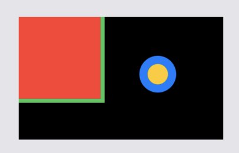
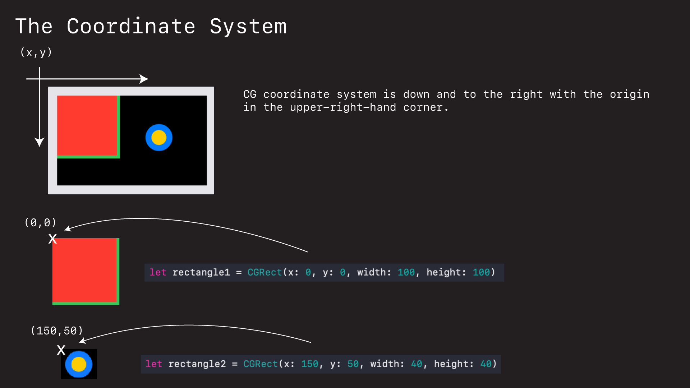
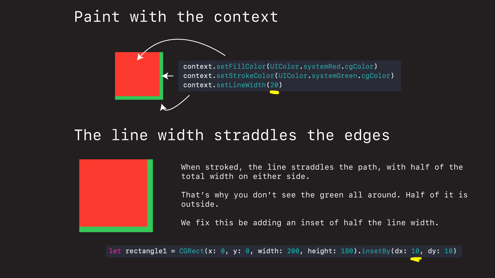
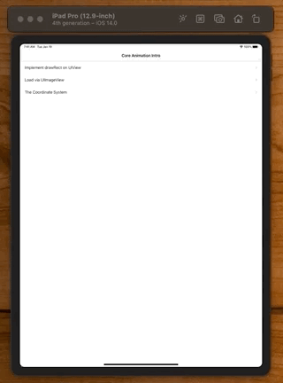

# Core Graphics Intro

## What is Core Graphics?

Core Graphics is Apple's library for drawing things in iOS and on the Mac. It is a library that contains primitives for programmatically drawing lines, circles, squares, patterns, arcs... anything we can think of.

## How does it work

Drawing in CG is basically a three step process.

1. Define a view.
2. Get a context.
3. Draw.

Let's look at a couple of examples.

### Overriding drawRect

The standard or canonical way to draw in a `UIView` is to override the views `drawRect` method like this.



```swift
import Foundation
import UIKit

class DrawRectView: UIView {
    
    override init(frame: CGRect) {
        super.init(frame: frame)
    }
    
    required init?(coder: NSCoder) {
        fatalError("init(coder:) has not been implemented")
    }
    
    override func draw(_ rect: CGRect) {
        
        let rectangle1 = CGRect(x: 0, y: 0, width: 200, height: 180)
        
        guard let context = UIGraphicsGetCurrentContext() else { return }
        
        context.setFillColor(UIColor.systemRed.cgColor)
        context.setStrokeColor(UIColor.systemGreen.cgColor)
        context.setLineWidth(20)
        context.addRect(rectangle1)
        context.drawPath(using: .fillStroke)
        context.fill(rectangle1)
        
        // painters model
        
        let rectangle2 = CGRect(x: 256, y: 256, width: 128, height: 128)

        context.setFillColor(UIColor.systemYellow.cgColor)
        context.setStrokeColor(UIColor.systemBlue.cgColor)
        context.setLineWidth(10)

        context.addEllipse(in: rectangle2)
        context.drawPath(using: .fillStroke)
    }
}
```

You basically create a `UIView`. Override what you would like to draw in the `draw(_ rect)` method, and do your Core Graphics work in there.

Now there is a whole bunch of interesting stuff going on here. Let's unpack this code a bit.

#### The Coordinate System

First of the coordinate system. In iOS the CG coordinate system goes down and to the right.



This is important to understand because a lot of people think the origin will be in the middle of the circle or square that they draw. It isn't. It's in the upper-left and all drawing start at (0,0) from there.

### Paint with the context

The way we affect our look and style of our draws is by setting properties on our `context`. We get the context like this.

```swift
let context = UIGraphicsGetCurrentContext()
```

And then we set properties like this.

```swift
context.setFillColor(UIColor.systemRed.cgColor)
context.setStrokeColor(UIColor.systemGreen.cgColor)
context.setLineWidth(10)
```

Stroke is the border color. One interesting thing about borders and stroking them in CG is that the line width straddles the path.



What that means is that we often need to offset our shapes when we are drawing along the borders of our views. 

Fortunately there is an easy way to do that. We simply `inserBy(dx: dy:)` on our rectangle canvases when we define them. And the shifts everything in.

So for a line width of 20pts, we want to inset by half that - 10 pts.

```swift
let rectangle1 = CGRect(...).insetBy(dx: 10, dy: 10)
context.setLineWidth(20)
```

### Loading via a UIImageView

Another way you will see Core Graphics images painted in UIKit is to load them via a `UIImageView`.

Here you define a `UIImageView` you would like to hold your CG image, and then you load it by setting the image your create into the `UIImageView`.

```swift
class LoadViaImageViewController: UIViewController {

    // 1. Define container.
    let imageView = UIImageView() 

    func drawRectangle() {
    
    	// 2. Create graphic.
        let render = UIGraphicsImageRenderer(size: CGSize(width: 512, height: 512))
        
        let image = render.image { ctx in
            let rectangle = CGRect(x: 0, y: 0, width: 512, height: 512).insetBy(dx: 5, dy: 5)
            ctx.cgContext.setFillColor(UIColor.red.cgColor)
            ctx.cgContext.setStrokeColor(UIColor.black.cgColor)
            ctx.cgContext.setLineWidth(10)
            ctx.cgContext.addRect(rectangle)
            ctx.cgContext.drawPath(using: .fillStroke)
        }
        
        // 3. Load into image container
        imageView.image = image // set CG image here
    }
```

Here we are using 

```swift
let render = UIGraphicsImageRenderer(size: CGSize(width: 512, height: 512))
```

Which is a graphics renderer for creating Core Graphics backed images. This is what we use to create the `UIImage` that we can then set into our `UIImageView` in our view controller like this.

```swift
imageView.image = image
```

## Source

**DrawRectViewController.swift**

```swift
//
//  DrawRectViewController.swift
//  CoreGraphicsIntro
//
//  Created by jrasmusson on 2021-01-18.
//

import UIKit

class DrawRectViewController: UIViewController {
    
    let drawRectView = DrawRectView()
    let label = UILabel()
    
    override func viewDidLoad() {
        super.viewDidLoad()
        view.backgroundColor = .systemGray5
        
        drawRectView.translatesAutoresizingMaskIntoConstraints = false
        label.translatesAutoresizingMaskIntoConstraints = false
        label.numberOfLines = 0
        label.font = UIFont.preferredFont(forTextStyle: .title1)
        
        label.text = "drawRect gives you full control over what a layer will render. The container view must still define the space that the via is going to draw in (in this case Auto Layout with width and height 512x512). But when it comes to drawing, drawRect uses it's own local coordinate system and renders exactly when it wants where it wants it."
        
        view.addSubview(drawRectView)
        view.addSubview(label)
        
        NSLayoutConstraint.activate([
            drawRectView.centerXAnchor.constraint(equalTo: view.centerXAnchor),
            drawRectView.centerYAnchor.constraint(equalTo: view.centerYAnchor),
            drawRectView.widthAnchor.constraint(equalToConstant: 512),
            drawRectView.heightAnchor.constraint(equalToConstant: 512),
            
            label.topAnchor.constraint(equalToSystemSpacingBelow: drawRectView.bottomAnchor, multiplier: 4),
            label.centerXAnchor.constraint(equalTo: view.centerXAnchor),
            label.leadingAnchor.constraint(equalToSystemSpacingAfter: view.leadingAnchor, multiplier: 4),
            view.trailingAnchor.constraint(equalToSystemSpacingAfter: label.trailingAnchor, multiplier: 4),
        ])
    }
}
```

**DrawRectView.swift**

```swift
//
//  DrawRectView.swift
//  CoreGraphicsIntro
//
//  Created by jrasmusson on 2021-01-18.
//

import Foundation
import UIKit

class DrawRectView: UIView {
    
    override init(frame: CGRect) {
        super.init(frame: frame)
    }
    
    required init?(coder: NSCoder) {
        fatalError("init(coder:) has not been implemented")
    }
    
    override func draw(_ rect: CGRect) {
        
        let rectangle1 = CGRect(x: 0, y: 0, width: 200, height: 180).insetBy(dx: 10, dy: 10)
        
        guard let context = UIGraphicsGetCurrentContext() else { return }
        
        context.setFillColor(UIColor.systemRed.cgColor)
        context.setStrokeColor(UIColor.systemGreen.cgColor)
        context.setLineWidth(20)
        context.addRect(rectangle1)
        context.drawPath(using: .fillStroke)
        context.fill(rectangle1)
        
        // painters model
        
        let rectangle2 = CGRect(x: 256, y: 256, width: 128, height: 128)

        context.setFillColor(UIColor.systemYellow.cgColor)
        context.setStrokeColor(UIColor.systemBlue.cgColor)
        context.setLineWidth(10)

        context.addEllipse(in: rectangle2)
        context.drawPath(using: .fillStroke)
    }
}
```

**LoadViewImageViewController.swift**

```swift
//
//  BasicShapesViewController.swift
//  CoreGraphicsIntro
//
//  Created by jrasmusson on 2021-01-18.
//

import UIKit

// https://www.hackingwithswift.com/read/27/4/ellipses-and-checkerboards

class LoadViaImageViewController: UIViewController {

    // 1. Define container.
    let imageView = UIImageView()
    let button = makeButton(withText: "Redraw")
    var currentDrawType = 0
    
    override func viewDidLoad() {
        super.viewDidLoad()
        style()
        layout()
        drawRectangle()
    }
}

extension LoadViaImageViewController {
    
    func style() {
        imageView.translatesAutoresizingMaskIntoConstraints = false
        imageView.backgroundColor = .systemGray5
        button.addTarget(self, action: #selector(buttonTapped(_:)), for: .primaryActionTriggered)
    }
    
    func layout() {
        view.addSubview(imageView)
        view.addSubview(button)
        
        NSLayoutConstraint.activate([
            imageView.centerXAnchor.constraint(equalTo: view.centerXAnchor),
            imageView.centerYAnchor.constraint(equalTo: view.centerYAnchor),
            
            button.centerXAnchor.constraint(equalTo: view.centerXAnchor),
            button.bottomAnchor.constraint(equalTo: view.safeAreaLayoutGuide.bottomAnchor, constant: -16),
        ])
    }
    
    @objc func buttonTapped(_ sender: UIButton) {
        currentDrawType += 1
        
        if currentDrawType > 1 {
            currentDrawType = 0
        }
        
        switch currentDrawType {
        case 0:
            drawRectangle()
        case 1:
            drawCircle()
        default:
            break
        }
    }
}

func makeButton(withText text: String) -> UIButton {
    let button = UIButton()
    button.translatesAutoresizingMaskIntoConstraints = false
    button.setTitle(text, for: .normal)
    button.titleLabel?.adjustsFontSizeToFitWidth = true
    button.contentEdgeInsets = UIEdgeInsets(top: 8, left: 16, bottom: 8, right: 16)
    button.backgroundColor = .systemBlue
    button.layer.cornerRadius = 8
    return button
}

// MARK: - Shapes

extension LoadViaImageViewController {
    
    // Because `setLineWidth` straddles the path, we need to inset the rectangle by
    // half the line width if we want the image to be fully visible in the rect area.
    //
    // .insetBy(dx: 5, dy: 5)
    //
    // For a line width of 10
    //
    // ctx.cgContext.setLineWidth(10)
    //
    func drawRectangle() {
        let render = UIGraphicsImageRenderer(size: CGSize(width: 512, height: 512))
        
        let image = render.image { ctx in
            let rectangle = CGRect(x: 0, y: 0, width: 512, height: 512).insetBy(dx: 5, dy: 5)
            ctx.cgContext.setFillColor(UIColor.red.cgColor)
            ctx.cgContext.setStrokeColor(UIColor.black.cgColor)
            ctx.cgContext.setLineWidth(10)
            ctx.cgContext.addRect(rectangle)
            ctx.cgContext.drawPath(using: .fillStroke)
        }
        
        imageView.image = image
    }
    
    func drawCircle() {
        let renderer = UIGraphicsImageRenderer(size: CGSize(width: 512, height: 512))

        // 2. Create graphic.
        let img = renderer.image { ctx in
            let rectangle = CGRect(x: 0, y: 0, width: 512, height: 512).insetBy(dx: 5, dy: 5)
            ctx.cgContext.setFillColor(UIColor.red.cgColor)
            ctx.cgContext.setStrokeColor(UIColor.black.cgColor)
            ctx.cgContext.setLineWidth(10)

            ctx.cgContext.addEllipse(in: rectangle)
            ctx.cgContext.drawPath(using: .fillStroke)
        }

        // 3. Load into imageView container.
        imageView.image = img
    }
}
```

**CoordinateSystemViewController.swift**

```swift
//
//  CoordinateSystemViewController.swift
//  CoreGraphicsIntro
//
//  Created by jrasmusson on 2021-01-18.
//

import UIKit

// Note: Dimensions are hardcode for iPad Pro (12.9-inch) (4th generation)
//       bounds = 1024 x 1366

class CoordinateSystemViewController: UIViewController {

    // this absolutely positions a square in the middle of the screen.
    // note how the square is placed according to it's upper-left-hand coordinate
    let redBoxInParentView = UIView(frame: CGRect(x: 1024/2, y: 1366/2, width: 200, height: 100))
    
    // or we can specify a view, and do our layout in there
    // to get the circle in the middle we had to take into account it's radious and shift it up and to the left
    let yellowCircleContainerView = UIImageView(frame: CGRect(x: 1024/2-300/2, y: 1366/2-300/2, width: 300, height: 300))
    
    override func viewDidLoad() {
        super.viewDidLoad()
        
        redBoxInParentView.backgroundColor = .systemRed
        
        view.addSubview(yellowCircleContainerView)
        view.addSubview(redBoxInParentView)
        
        drawCircle()
    }
    
    //
    // This method gets an image renderer and uses it to create an image which we can then set in our
    // UIImageView container. Not how the coordinate system used here is relative to the renderer.
    //
    // Also because the line width = 10pts, and because lines are drawn on paths, half the circle will
    // appear outside and half will appear inside. For that reason we need to offset the circle 5pts
    // x and y to have full circle appear in layer.
    func drawCircle() {
        let renderer = UIGraphicsImageRenderer(size: CGSize(width: 300, height: 300))

        let img = renderer.image { ctx in
            let rectangle = CGRect(x: 0, y: 0, width: 300, height: 300).insetBy(dx: 5, dy: 5) // line width 10

            ctx.cgContext.setStrokeColor(UIColor.yellow.cgColor)
            ctx.cgContext.setLineWidth(10)

            ctx.cgContext.addEllipse(in: rectangle)
            ctx.cgContext.drawPath(using: .fillStroke)
        }

        yellowCircleContainerView.image = img
    }
}
```

See Demo directory in this folder for full project.



### Links that help

- [Apple Docs on Core Graphics](https://developer.apple.com/library/archive/documentation/GraphicsImaging/Conceptual/drawingwithquartz2d/Introduction/Introduction.html#//apple_ref/doc/uid/TP40007533-SW1)
- [Paul Hudson Tutorial](https://www.hackingwithswift.com/read/27/3/drawing-into-a-core-graphics-context-with-uigraphicsimagerenderer)

