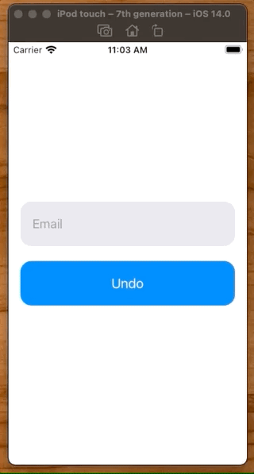
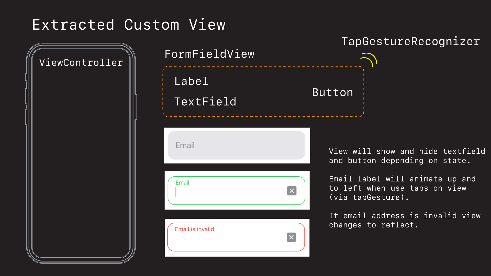
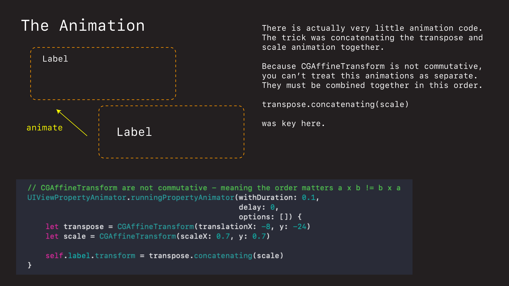

# Login Form Field

This example shows you how to create an amimated login form field.



## Design



This control was built as a custom `UIView`. The `label`, `textfield`,  and `cancelButton` are displayed and hidden depending on the state of the `textfield`. All layout is done via auto layout.

## Animation



There actually wasn't a lot to animate in the control - only the scaling and transposing of the label up when the user taps the control.

The tricky thing was getting the animation order right. `CGAffineTransform` didn't behave quite as I suspected. For example if you scale and then transpose as discrete animations, it does them individually OK but fails when applied serially one after the other.

The trick was discovering that you could `concatenate` them together.

```swift
let transpose = CGAffineTransform(translationX: -8, y: -24)
let scale = CGAffineTransform(scaleX: 0.7, y: 0.7)
    
self.label.transform = transpose.concatenating(scale)
```

This made the animation work the way I wanted, and produced the desired look.

## Source

You can find the entire project in this directory. Or you can browse below.

**ViewController.swift**

```swift
//
//  ViewController.swift
//  Login
//
//  Created by jrasmusson on 2021-01-04.
//

import UIKit

class ViewController: UIViewController {

    let stackView = UIStackView()
    
    let formFieldView = FormFieldView()
    let undoButton = makeButton(withText: "Undo")
    
    override func viewDidLoad() {
        super.viewDidLoad()
        
        style()
        layout()
    }
}

extension ViewController {
    
    func style() {
        stackView.translatesAutoresizingMaskIntoConstraints = false
        stackView.axis = .vertical
        stackView.spacing = 20
        stackView.alignment = .leading
        
        undoButton.addTarget(self, action: #selector(undoTapped), for: .primaryActionTriggered)
    }
    
    func layout() {
        stackView.addArrangedSubview(formFieldView)
        stackView.addArrangedSubview(undoButton)
        
        view.addSubview(stackView)
        
        NSLayoutConstraint.activate([
            stackView.centerXAnchor.constraint(equalTo: view.centerXAnchor),
            stackView.centerYAnchor.constraint(equalTo: view.centerYAnchor),
            formFieldView.leadingAnchor.constraint(equalToSystemSpacingAfter: view.leadingAnchor, multiplier: 2),
            view.trailingAnchor.constraint(equalToSystemSpacingAfter: formFieldView.trailingAnchor, multiplier: 2),
            undoButton.heightAnchor.constraint(equalTo: formFieldView.heightAnchor),
            undoButton.widthAnchor.constraint(equalTo: formFieldView.widthAnchor),
        ])
    }
}

// MARK: - Actions
extension ViewController {
    
    @objc func undoTapped() {
        formFieldView.undo()
    }
    
}

// MARK: - Factories

func makeButton(withText text: String) -> UIButton {
    let button = UIButton()
    button.translatesAutoresizingMaskIntoConstraints = false
    button.setTitle(text, for: .normal)
    button.titleLabel?.adjustsFontSizeToFitWidth = true
    button.contentEdgeInsets = UIEdgeInsets(top: 8, left: 16, bottom: 8, right: 16)
    button.backgroundColor = .systemBlue
    button.layer.cornerRadius = 60/4
    return button
}
```

**FormFieldView.swift**

```swift
//
//  FormFieldView.swift
//  Login
//
//  Created by jrasmusson on 2021-01-04.
//

import Foundation
import UIKit

private struct Local {
    static let height: CGFloat = 60
    static let tintColorValid: UIColor = .systemGreen
    static let tintColorInValid: UIColor = .systemRed
    static let backgroundColor: UIColor = .systemGray5
    static let foregroundColor: UIColor = .systemGray
}

class FormFieldView: UIView {

    let label = UILabel()
    let invalidLabel = UILabel()
    
    let textField = UITextField()
    let cancelButton = makeSymbolButton(systemName: "clear.fill", target: self, selector: #selector(cancelTapped(_:)))
    
    override init(frame: CGRect) {
        super.init(frame: frame)
        setup()
        style()
        layout()
    }
    
    required init?(coder: NSCoder) {
        fatalError("init(coder:) has not been implemented")
    }
    
    override var intrinsicContentSize: CGSize {
        return CGSize(width: UIView.noIntrinsicMetric, height: Local.height)
    }
}

extension FormFieldView {
    
    func setup() {
        textField.delegate = self
    }
    
    func style() {
        translatesAutoresizingMaskIntoConstraints = false
        backgroundColor = Local.backgroundColor
        layer.cornerRadius = Local.height / 4
        
        // label
        label.translatesAutoresizingMaskIntoConstraints = false
        label.textColor = .systemGray
        label.text = "Email"
        
        // invalid
        invalidLabel.translatesAutoresizingMaskIntoConstraints = false
        invalidLabel.textColor = Local.tintColorInValid
        invalidLabel.text = "Email is invalid"
        invalidLabel.font = UIFont.preferredFont(forTextStyle: .caption1)
        invalidLabel.isHidden = true
        
        // textfield
        textField.translatesAutoresizingMaskIntoConstraints = false
        textField.tintColor = Local.tintColorValid
        textField.isHidden = true
        
        // button
        cancelButton.translatesAutoresizingMaskIntoConstraints = false
        cancelButton.imageView?.tintColor = Local.foregroundColor
        cancelButton.isHidden = true
        
        let tap = UITapGestureRecognizer(target: self, action: #selector(tapped(_: )))
        addGestureRecognizer(tap)
    }
    
    func layout() {
        addSubview(label)
        addSubview(invalidLabel)
        addSubview(textField)
        addSubview(cancelButton)
        
        NSLayoutConstraint.activate([
            // label
            label.centerYAnchor.constraint(equalTo: centerYAnchor),
            label.leadingAnchor.constraint(equalToSystemSpacingAfter: leadingAnchor, multiplier: 2),
            
            // invalidLabel
            invalidLabel.topAnchor.constraint(equalTo: topAnchor, constant: 6),
            invalidLabel.leadingAnchor.constraint(equalToSystemSpacingAfter: leadingAnchor, multiplier: 2),
            
            // textfield
            textField.leadingAnchor.constraint(equalToSystemSpacingAfter: leadingAnchor, multiplier: 2),
            trailingAnchor.constraint(equalToSystemSpacingAfter: textField.trailingAnchor, multiplier: 2),
            bottomAnchor.constraint(equalToSystemSpacingBelow: textField.bottomAnchor, multiplier: 2),
            
            // button
            cancelButton.centerYAnchor.constraint(equalTo: centerYAnchor),
            trailingAnchor.constraint(equalToSystemSpacingAfter: cancelButton.trailingAnchor, multiplier: 2),
        ])
    }
    
    
    @objc func tapped(_ recognizer: UITapGestureRecognizer) {
        if(recognizer.state == UIGestureRecognizer.State.ended) {
            enterEmailAnimation()
        }
    }
}

// MARK: - Animations

extension FormFieldView {
    
    func enterEmailAnimation() {

        UIViewPropertyAnimator.runningPropertyAnimator(withDuration: 0.1,
                                                       delay: 0,
                                                       options: []) {
            // style
            self.backgroundColor = .white
            self.label.textColor = Local.tintColorValid
            self.layer.borderWidth = 1
            self.layer.borderColor = self.label.textColor.cgColor
            self.textField.tintColor = Local.tintColorValid
            
            // move
            let transpose = CGAffineTransform(translationX: -8, y: -24)
            let scale = CGAffineTransform(scaleX: 0.7, y: 0.7)
            self.label.transform = transpose.concatenating(scale)
            
        } completion: { position in
            self.textField.isHidden = false
            self.textField.becomeFirstResponder()
            
            self.cancelButton.isHidden = false
        }
    }
    
    func showInvalidEmailMessage() {
        label.isHidden = true
        invalidLabel.isHidden = false
        layer.borderColor = Local.tintColorInValid.cgColor
        textField.tintColor = Local.tintColorInValid
    }
}

// MARK: - TextFieldDelegate

extension FormFieldView: UITextFieldDelegate {
    
    func textFieldShouldReturn(_ textField: UITextField) -> Bool {
        textField.endEditing(true)
        return true
    }
    
    func textFieldShouldEndEditing(_ textField: UITextField) -> Bool {
        if textField.text != "" {
            return true
        }
        return false
    }
    
    func textFieldDidEndEditing(_ textField: UITextField) {
        guard let emailText = textField.text else { return }
            
        if isValidEmail(emailText) {
            undo()
        } else {
            showInvalidEmailMessage()
        }
        
        textField.text = ""
    }
}

// MARK: - Actions

extension FormFieldView {
    func undo() {
        let size = UIViewPropertyAnimator(duration: 0.1, curve: .linear) {
            // style
            self.backgroundColor = Local.backgroundColor
            self.label.textColor = Local.foregroundColor
            self.layer.borderWidth = 0
            self.layer.borderColor = UIColor.clear.cgColor
            
            // visibility
            self.label.isHidden = false
            self.invalidLabel.isHidden = true
            self.textField.isHidden = true
            self.textField.text = ""
            self.cancelButton.isHidden = true

            // move
            self.label.transform = .identity
        }
        size.startAnimation()
    }
    
    @objc func cancelTapped(_ sender: UIButton) {
        textField.resignFirstResponder()
        undo()
    }
}

// MARK: - Factories

func makeSymbolButton(systemName: String, target: Any, selector: Selector) -> UIButton {
    let configuration = UIImage.SymbolConfiguration(scale: .large)
    let image = UIImage(systemName: systemName, withConfiguration: configuration)
    
    let button = UIButton()
    button.translatesAutoresizingMaskIntoConstraints = false
    button.addTarget(target, action: selector, for: .primaryActionTriggered)
    button.setImage(image, for: .normal)
    button.imageView?.contentMode = .scaleAspectFit
    
    return button
}

// MARK: Utils

func isValidEmail(_ email: String) -> Bool {
    let emailRegEx = "[A-Z0-9a-z._%+-]+@[A-Za-z0-9.-]+\\.[A-Za-z]{2,64}"

    let emailPred = NSPredicate(format:"SELF MATCHES %@", emailRegEx)
    return emailPred.evaluate(with: email)
}
```


