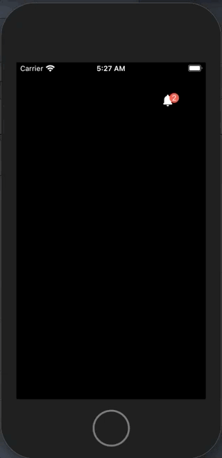
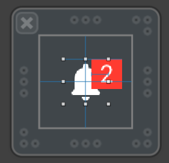
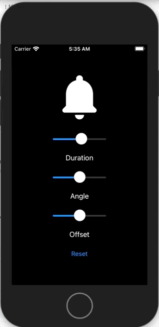
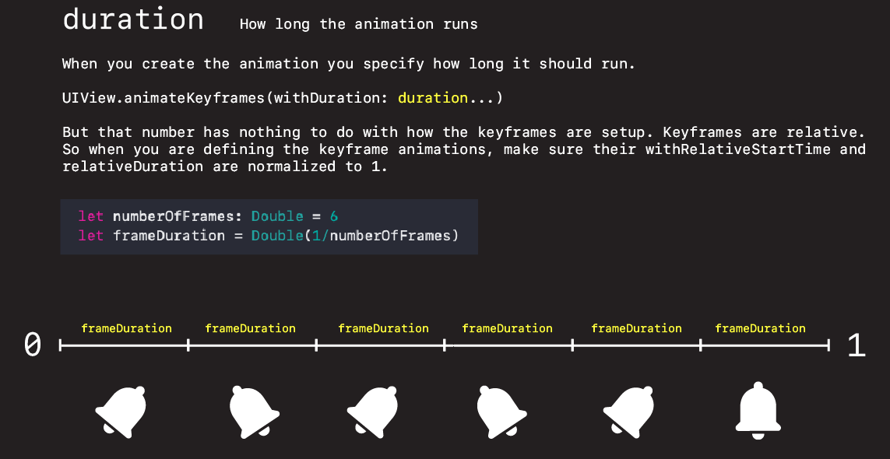
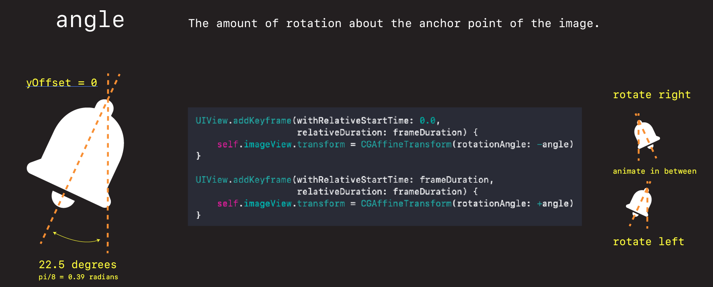
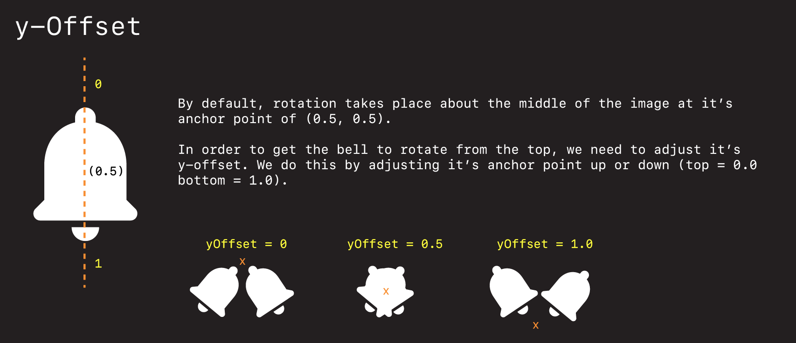

# Shaky Bell

How to add this effect to your iOS apps.



## How it's built

`UIImageView` with `UIButton`.



**BadgeLabel.swift**

```swift
//
//  BadgeLabel.swift
//  BellAnimation1
//
//  Created by jrasmusson on 2021-06-02.
//

import Foundation
import UIKit

class BadgeLabel: UIView {
        
    @IBOutlet var contentView: UIView!
    @IBOutlet var buttonView: UIButton!
    @IBOutlet var imageView: UIImageView!
    
    let buttonHeight: CGFloat = 16
    
    override func awakeFromNib() {
        super.awakeFromNib()
        let bundle = Bundle(for: BadgeLabel.self)
        bundle.loadNibNamed(String(describing: BadgeLabel.self), owner: self, options: nil)
        addSubview(contentView)
        
        setup()
    }
}

// MARK: - Setup
extension BadgeLabel {
    func setup() {
        buttonView.layer.cornerRadius = buttonHeight/2
        
        let singleTap = UITapGestureRecognizer(target: self, action: #selector(imageViewTapped(_: )))
        imageView.addGestureRecognizer(singleTap)
        imageView.isUserInteractionEnabled = true
    }
}

// MARK: - Actions
extension BadgeLabel {
    @objc func imageViewTapped(_ recognizer: UITapGestureRecognizer) {
        shakeWith(duration: 1.0, angle: .pi/8, yOffset: 0.0)
    }

    private func shakeWith(duration: Double, angle: CGFloat, yOffset: CGFloat) {
        print("duration: \(duration) angle: \(angle) offset: \(yOffset)")
        
        let numberOfFrames: Double = 6
        let frameDuration = Double(1/numberOfFrames)
        
        imageView.setAnchorPoint(CGPoint(x: 0.5, y: yOffset))

        print("anchorPoint: \(imageView.layer.anchorPoint)")

        UIView.animateKeyframes(withDuration: duration, delay: 0, options: [],
          animations: {
            UIView.addKeyframe(withRelativeStartTime: 0.0,
                               relativeDuration: frameDuration) {
                self.imageView.transform = CGAffineTransform(rotationAngle: -angle)
            }
            UIView.addKeyframe(withRelativeStartTime: frameDuration,
                               relativeDuration: frameDuration) {
                self.imageView.transform = CGAffineTransform(rotationAngle: +angle)
            }
            UIView.addKeyframe(withRelativeStartTime: frameDuration*2,
                               relativeDuration: frameDuration) {
                self.imageView.transform = CGAffineTransform(rotationAngle: -angle)
            }
            UIView.addKeyframe(withRelativeStartTime: frameDuration*3,
                               relativeDuration: frameDuration) {
                self.imageView.transform = CGAffineTransform(rotationAngle: +angle)
            }
            UIView.addKeyframe(withRelativeStartTime: frameDuration*4,
                               relativeDuration: frameDuration) {
                self.imageView.transform = CGAffineTransform(rotationAngle: -angle)
            }
            UIView.addKeyframe(withRelativeStartTime: frameDuration*5,
                               relativeDuration: frameDuration) {
                self.imageView.transform = CGAffineTransform.identity
            }
          },
          completion: nil
        )
    }
}
```

### Test Rig

Created a test rig to play with three variables we can manipulate.

- duration
- angle
- yOffset



**ViewController.swift**

```swift
import UIKit

class ViewController: UIViewController {

    @IBOutlet var bellView: NotificationBadgeView!
    @IBOutlet var durationSlider: UISlider!
    @IBOutlet var angleSlider: UISlider!
    @IBOutlet var offsetSlider: UISlider!

    override func viewDidLoad() {
        super.viewDidLoad()
        // Do any additional setup after loading the view.
    }

    @IBAction func durationChanged(_ sender: UISlider) {
        bellView.duration = Double(sender.value)*2
    }

    @IBAction func angleChanged(_ sender: UISlider) {
        let normalized = CGFloat(sender.value) * .pi/2
        bellView.angle = normalized
    }

    @IBAction func offsetChanged(_ sender: UISlider) {
        bellView.yOffset = CGFloat(sender.value)
    }

    @IBAction func reset(_ sender: UIButton) {
        durationSlider.value = 0.5
        angleSlider.value = 0.5
        offsetSlider.value = 0.5

        bellView.duration = Double(1)
        bellView.angle = .pi/8
        bellView.yOffset = 0.5
    }
}
```

## How the animation works

There are three things we can tweak on this animation:

- duration: how long the animation runs
- angle: the amount the animation rotates in radians
- yOffset: the point about which the animation rotates along the y-axis






