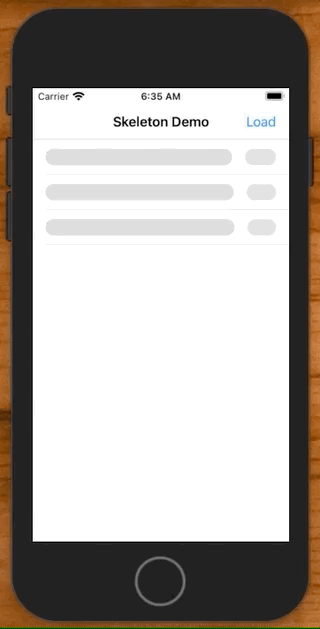
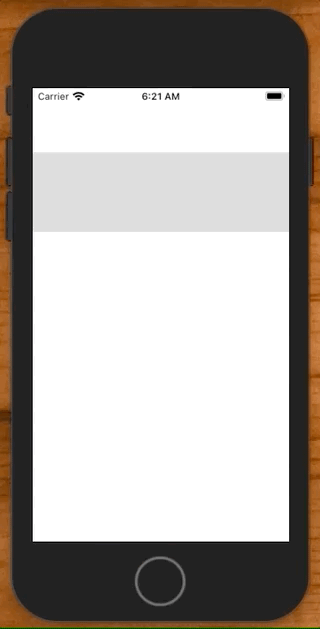
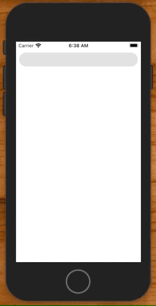

# Shimmer Effect

How to add this effect to your iOS apps.



## The Basics



One way to do this is to create a gradient layer, and animate the gradient’s `from` and `to` values as a sublayer of the object you want the shimmer to appear behind.

For example, here is how we can add a shimmer to a `UILabel`.

```swift
import UIKit

class ViewController: UIViewController {

    override func viewDidLoad() {
        super.viewDidLoad()

        // Create the label
        let label = UILabel()
        label.text = "Shimmer"
        label.font = UIFont.systemFont(ofSize: 80)
        label.frame = CGRect(x: 0, y: 80, width: view.frame.width, height: 100)
        label.textAlignment = .center

        // Create the gradient
        let gradient = CAGradientLayer()
        gradient.startPoint = CGPoint(x: 0, y: 0.5)
        gradient.endPoint = CGPoint(x: 1, y: 0.5)

        // Add the gradient to the label. Causes this sublayer to appear on top.
        label.layer.addSublayer(gradient)

        // Create the shimmer animation
        let animationGroup = makeAnimationGroup()
        animationGroup.beginTime = 0.0
        gradient.add(animationGroup, forKey: "backgroundColor")

        // Set the gradients frame to the labels bounds
        gradient.frame = label.bounds
        
        view.addSubview(label)
    }
    
    func makeAnimationGroup(previousGroup: CAAnimationGroup? = nil) -> CAAnimationGroup {
        let animDuration: CFTimeInterval = 1.5
        
        let anim1 = CABasicAnimation(keyPath: #keyPath(CAGradientLayer.backgroundColor))
        anim1.fromValue = UIColor.gradientLightGrey.cgColor
        anim1.toValue = UIColor.gradientDarkGrey.cgColor
        anim1.duration = animDuration
        anim1.beginTime = 0.0

        let anim2 = CABasicAnimation(keyPath: #keyPath(CAGradientLayer.backgroundColor))
        anim2.fromValue = UIColor.gradientDarkGrey.cgColor
        anim2.toValue = UIColor.gradientLightGrey.cgColor
        anim2.duration = animDuration
        anim2.beginTime = anim1.beginTime + anim1.duration

        let group = CAAnimationGroup()
        group.animations = [anim1, anim2]
        group.repeatCount = .greatestFiniteMagnitude
        group.duration = anim2.beginTime + anim2.duration
        group.isRemovedOnCompletion = false

        if let previousGroup = previousGroup {
            // Offset groups by 0.33 seconds for effect
            group.beginTime = previousGroup.beginTime + 0.33
        }

        return group
    }
}

extension UIColor {
    static var gradientDarkGrey: UIColor {
        return UIColor(red: 239 / 255.0, green: 241 / 255.0, blue: 241 / 255.0, alpha: 1)
    }

    static var gradientLightGrey: UIColor {
        return UIColor(red: 201 / 255.0, green: 201 / 255.0, blue: 201 / 255.0, alpha: 1)
    }
}
```

### With Auto Layout



We can apply the same effect in Auto Layout. We just need to remember to set the bounds of the gradient when the Auto Layout size has been determined. In this case in `viewDidAppear`.

```swift
import UIKit

class ViewController: UIViewController {

    let label = UILabel()
    let gradientLayer = CAGradientLayer()
    
    override func viewDidLoad() {
        super.viewDidLoad()
        setup()
        layout()
    }
    
    override func viewDidAppear(_ animated: Bool) {
        super.viewDidAppear(animated)
        
        gradientLayer.frame = label.bounds
        gradientLayer.cornerRadius = label.bounds.height / 2
    }
}

extension ViewController {
    
    func setup() {
        label.translatesAutoresizingMaskIntoConstraints = false
        label.text = "Shimmer"
        label.font = UIFont.preferredFont(forTextStyle: .largeTitle)
        
        gradientLayer.startPoint = CGPoint(x: 0, y: 0.5)
        gradientLayer.endPoint = CGPoint(x: 1, y: 0.5)
        label.layer.addSublayer(gradientLayer)
        
        let titleGroup = makeAnimationGroup()
        titleGroup.beginTime = 0.0
        gradientLayer.add(titleGroup, forKey: "backgroundColor")
    }
    
    func layout() {
        view.addSubview(label)
        
        NSLayoutConstraint.activate([
            label.topAnchor.constraint(equalToSystemSpacingBelow: view.safeAreaLayoutGuide.topAnchor, multiplier: 1),
            label.leadingAnchor.constraint(equalToSystemSpacingAfter: view.leadingAnchor, multiplier: 1),
            view.trailingAnchor.constraint(equalToSystemSpacingAfter: label.trailingAnchor, multiplier: 1),
            label.heightAnchor.constraint(equalToConstant: 36),
        ])
    }
    
    func makeAnimationGroup(previousGroup: CAAnimationGroup? = nil) -> CAAnimationGroup {
        let animDuration: CFTimeInterval = 1.5
        let anim1 = CABasicAnimation(keyPath: #keyPath(CAGradientLayer.backgroundColor))
        anim1.fromValue = UIColor.gradientLightGrey.cgColor
        anim1.toValue = UIColor.gradientDarkGrey.cgColor
        anim1.duration = animDuration
        anim1.beginTime = 0.0

        let anim2 = CABasicAnimation(keyPath: #keyPath(CAGradientLayer.backgroundColor))
        anim2.fromValue = UIColor.gradientDarkGrey.cgColor
        anim2.toValue = UIColor.gradientLightGrey.cgColor
        anim2.duration = animDuration
        anim2.beginTime = anim1.beginTime + anim1.duration

        let group = CAAnimationGroup()
        group.animations = [anim1, anim2]
        group.repeatCount = .greatestFiniteMagnitude
        group.duration = anim2.beginTime + anim2.duration
        group.isRemovedOnCompletion = false

        if let previousGroup = previousGroup {
            group.beginTime = previousGroup.beginTime + 0.33
        }

        return group
    }
}

extension UIColor {

    static var gradientDarkGrey: UIColor {
        return UIColor(red: 239 / 255.0, green: 241 / 255.0, blue: 241 / 255.0, alpha: 1)
    }

    static var gradientLightGrey: UIColor {
        return UIColor(red: 201 / 255.0, green: 201 / 255.0, blue: 201 / 255.0, alpha: 1)
    }
}
```

## In Practice


To use this in practice you will create two views, one shimmering (`SkeletonCell`), and another with what you really want to display (`CustomCell`). Then once your view is `loaded`, you’ll hide the shimmer and show the real view.

You can also offset the shimmer between multiple controls on your screen by adjusting the begin time from a previous group.

```swift
    func makeAnimationGroup(previousGroup: CAAnimationGroup? = nil) -> CAAnimationGroup {
		  ...
		  
        if let previousGroup = previousGroup {
            // Offset groups by 0.33 seconds for effect
            group.beginTime = previousGroup.beginTime + 0.33
        }
}
```

To offer this ability to multiple controls easier, you can create a protocol and offer this functionality through there.

```swift
protocol SkeletonLoadable {}

extension SkeletonLoadable {   
    func makeAnimationGroup(previousGroup: CAAnimationGroup? = nil) -> CAAnimationGroup {
    ...
    }
}

// inherit
extension SkeletonCell: SkeletonLoadable {}
```

Full source

**ViewController.swift**

```swift
import UIKit

struct Game {
    let title: String
    let year: String
    init(_ name: String, _ year: String) {
        self.title = name
        self.year = year
    }
}

class ViewController: UIViewController {

    let games = [
                Game("Pacman", "1980"),
                Game("Space Invaders", "1978"),
                Game("Frogger", "1981")
    ]
    
    let cellId = "cellId"
    let skeletonCellId = "skeletonCellId"
    var tableView = UITableView()
    
    var loaded = false
    
    lazy var loadButtonItem: UIBarButtonItem = {
            let barButtonItem = UIBarButtonItem(title: "Load", style: .plain, target: self, action: #selector(loadTapped))
            return barButtonItem
    }()
    
    override func viewDidLoad() {
        super.viewDidLoad()
        setup()
    }

    func setup() {
        title = "Skeleton Demo"
        navigationItem.rightBarButtonItem = loadButtonItem
        
        tableView.dataSource = self

        tableView.register(CustomCell.self, forCellReuseIdentifier: cellId)
        tableView.register(SkeletonCell.self, forCellReuseIdentifier: skeletonCellId)
        tableView.tableFooterView = UIView()
        
        view = tableView
    }
    
    @objc func loadTapped() {
        loaded = !loaded
        tableView.reloadData()
    }
}

extension ViewController: UITableViewDataSource {
    func tableView(_ tableView: UITableView, cellForRowAt indexPath: IndexPath) -> UITableViewCell {
        
        if loaded {
            let cell = tableView.dequeueReusableCell(withIdentifier: cellId, for: indexPath) as! CustomCell
            cell.game = games[indexPath.row]
            cell.accessoryType = .disclosureIndicator
            return cell
        } else {
            let cell = tableView.dequeueReusableCell(withIdentifier: skeletonCellId, for: indexPath) as! SkeletonCell
            cell.game = games[indexPath.row]
            return cell
        }
    }

    func tableView(_ tableView: UITableView, numberOfRowsInSection section: Int) -> Int {
        return games.count
    }
}

func makeButton(withText text: String) -> UIButton {
    let button = UIButton()
    button.translatesAutoresizingMaskIntoConstraints = false
    button.setTitle(text, for: .normal)
    button.titleLabel?.adjustsFontSizeToFitWidth = true
    button.contentEdgeInsets = UIEdgeInsets(top: 8, left: 16, bottom: 8, right: 16)
    button.backgroundColor = .systemBlue
    button.layer.cornerRadius = 8
    return button
}
```

**CustomCell.swift**

```swift
import UIKit

class CustomCell: UITableViewCell {

    let titleLabel = UILabel()
    let yearLabel = UILabel()
    
    var game: Game? {
        didSet {
            guard let game = game else { return }
            titleLabel.text = game.title
            yearLabel.text = game.year
        }
    }
    
    override init(style: UITableViewCell.CellStyle, reuseIdentifier: String?) {
        super.init(style: style, reuseIdentifier: reuseIdentifier)
        setup()
        layout()
    }

    required init?(coder aDecoder: NSCoder) {
        fatalError("init(coder:) has not been implemented")
    }
}

extension CustomCell {

    func setup() {
        titleLabel.translatesAutoresizingMaskIntoConstraints = false
        yearLabel.translatesAutoresizingMaskIntoConstraints = false
    }
    
    func layout() {
        addSubview(titleLabel)
        addSubview(yearLabel)
        
        NSLayoutConstraint.activate([
            titleLabel.leadingAnchor.constraint(equalToSystemSpacingAfter: leadingAnchor, multiplier: 2),
            yearLabel.leadingAnchor.constraint(equalToSystemSpacingAfter: titleLabel.trailingAnchor, multiplier: 2),
            trailingAnchor.constraint(equalToSystemSpacingAfter: yearLabel.trailingAnchor, multiplier: 2),
            titleLabel.centerYAnchor.constraint(equalTo: centerYAnchor),
            yearLabel.centerYAnchor.constraint(equalTo: centerYAnchor),
        ])
        
        yearLabel.setContentHuggingPriority(UILayoutPriority.defaultHigh, for: .horizontal)
    }
}
```

**SkeletonCell.swift**

```swift
import UIKit

class SkeletonCell: UITableViewCell {

    let titleLabel = UILabel()
    let titleLayer = CAGradientLayer()

    let yearLabel = UILabel()
    let yearLayer = CAGradientLayer()

    var game: Game? {
        didSet {
            guard let game = game else { return }
            titleLabel.text = game.title
            yearLabel.text = game.year
        }
    }
    
    override init(style: UITableViewCell.CellStyle, reuseIdentifier: String?) {
        super.init(style: style, reuseIdentifier: reuseIdentifier)
        setup()
        layout()
    }

    required init?(coder aDecoder: NSCoder) {
        fatalError("init(coder:) has not been implemented")
    }
    
    override func layoutSubviews() {
        super.layoutSubviews()
        
        titleLayer.frame = titleLabel.bounds
        titleLayer.cornerRadius = titleLabel.bounds.height / 2
        
        yearLayer.frame = yearLabel.bounds
        yearLayer.cornerRadius = yearLabel.bounds.height / 2
    }
}

extension SkeletonCell {

    func setup() {
        titleLabel.translatesAutoresizingMaskIntoConstraints = false
        yearLabel.translatesAutoresizingMaskIntoConstraints = false
        
        titleLayer.startPoint = CGPoint(x: 0, y: 0.5)
        titleLayer.endPoint = CGPoint(x: 1, y: 0.5)
        titleLabel.layer.addSublayer(titleLayer)

        yearLayer.startPoint = CGPoint(x: 0, y: 0.5)
        yearLayer.endPoint = CGPoint(x: 1, y: 0.5)
        yearLabel.layer.addSublayer(yearLayer)

        let titleGroup = makeAnimationGroup()
        titleGroup.beginTime = 0.0
        titleLayer.add(titleGroup, forKey: "backgroundColor")
        
        let yearGroup = makeAnimationGroup(previousGroup: titleGroup)
        yearLayer.add(yearGroup, forKey: "backgroundColor")
    }
    
    func layout() {
        addSubview(titleLabel)
        addSubview(yearLabel)
        
        NSLayoutConstraint.activate([
            titleLabel.leadingAnchor.constraint(equalToSystemSpacingAfter: leadingAnchor, multiplier: 2),
            yearLabel.leadingAnchor.constraint(equalToSystemSpacingAfter: titleLabel.trailingAnchor, multiplier: 2),
            trailingAnchor.constraint(equalToSystemSpacingAfter: yearLabel.trailingAnchor, multiplier: 2),
            titleLabel.centerYAnchor.constraint(equalTo: centerYAnchor),
            yearLabel.centerYAnchor.constraint(equalTo: centerYAnchor),
        ])
        
        yearLabel.setContentHuggingPriority(UILayoutPriority.defaultHigh, for: .horizontal)
    }
}

// inherit
extension SkeletonCell: SkeletonLoadable {}

extension UIColor {

    static var gradientDarkGrey: UIColor {
        return UIColor(red: 239 / 255.0, green: 241 / 255.0, blue: 241 / 255.0, alpha: 1)
    }

    static var gradientLightGrey: UIColor {
        return UIColor(red: 201 / 255.0, green: 201 / 255.0, blue: 201 / 255.0, alpha: 1)
    }

}
```

**SkeletonLoadable.swift**

```swift
import UIKit

/*
 Function programming inheritance.
 */

protocol SkeletonLoadable {}

extension SkeletonLoadable {
    
    func makeAnimationGroup(previousGroup: CAAnimationGroup? = nil) -> CAAnimationGroup {
        let animDuration: CFTimeInterval = 1.5
        let anim1 = CABasicAnimation(keyPath: #keyPath(CAGradientLayer.backgroundColor))
        anim1.fromValue = UIColor.gradientLightGrey.cgColor
        anim1.toValue = UIColor.gradientDarkGrey.cgColor
        anim1.duration = animDuration
        anim1.beginTime = 0.0

        let anim2 = CABasicAnimation(keyPath: #keyPath(CAGradientLayer.backgroundColor))
        anim2.fromValue = UIColor.gradientDarkGrey.cgColor
        anim2.toValue = UIColor.gradientLightGrey.cgColor
        anim2.duration = animDuration
        anim2.beginTime = anim1.beginTime + anim1.duration

        let group = CAAnimationGroup()
        group.animations = [anim1, anim2]
        group.repeatCount = .greatestFiniteMagnitude // infinite
        group.duration = anim2.beginTime + anim2.duration
        group.isRemovedOnCompletion = false

        if let previousGroup = previousGroup {
            // Offset groups by 0.33 seconds for effect
            group.beginTime = previousGroup.beginTime + 0.33
        }

        return group
    }
    
}
```

## An alternative


In the previous example we animated the gradient colors. Another approach is to create a gradient and animate it along the views x-axis.

Couple of interesting things here. First, we need to clip the `mastKtoBounds` of the gradient to the label so it doesn't spill over.

```swift
titleLabel.layer.masksToBounds = true // key
```

Second, we rotate the gradient 45 degrees...

```swift
let angle = 45 * CGFloat.pi / 180
titleLayer.colors = [UIColor.systemGray6.cgColor, UIColor.systemGray5.cgColor]
titleLayer.locations = [0, 1]
titleLayer.transform = CATransform3DMakeRotation(angle, 0, 0, 1)
```

And then animate it way off into the distance by multiplying the `toValue` by the width time x20.

```swift
let animation = CABasicAnimation(keyPath: "transform.translation.x")
animation.fromValue = -view.frame.width
animation.toValue = view.frame.width * 20
```

```swift
import UIKit

class ViewController: UIViewController {

    let titleLabel = UILabel()
    let titleLayer = CAGradientLayer()
    
    override func viewDidLoad() {
        super.viewDidLoad()
        setup()
        layout()
    }
    
    override func viewDidAppear(_ animated: Bool) {
        super.viewDidAppear(animated)
        
        titleLayer.frame = titleLabel.bounds
        titleLayer.cornerRadius = titleLabel.bounds.height / 2
    }
}

extension ViewController {
    
    func setup() {
        titleLabel.translatesAutoresizingMaskIntoConstraints = false
        titleLabel.backgroundColor = .systemGray6
        titleLabel.font = UIFont.preferredFont(forTextStyle: .largeTitle)
        titleLabel.layer.masksToBounds = true // key
        
        let angle = 45 * CGFloat.pi / 180
        titleLayer.colors = [UIColor.systemGray6.cgColor, UIColor.systemGray5.cgColor]
        titleLayer.locations = [0, 1]
        titleLayer.transform = CATransform3DMakeRotation(angle, 0, 0, 1)
        
        titleLabel.layer.addSublayer(titleLayer) // key
        
        let animation = CABasicAnimation(keyPath: "transform.translation.x")
        animation.fromValue = -view.frame.width
        animation.toValue = view.frame.width * 20
        animation.repeatCount = Float.infinity
        animation.beginTime = 0.0
        animation.duration = 20
        
        titleLayer.add(animation, forKey: "myAnimation")
    }
    
    func layout() {
        view.addSubview(titleLabel)
        
        NSLayoutConstraint.activate([
            titleLabel.topAnchor.constraint(equalToSystemSpacingBelow: view.safeAreaLayoutGuide.topAnchor, multiplier: 1),
            titleLabel.leadingAnchor.constraint(equalToSystemSpacingAfter: view.leadingAnchor, multiplier: 1),
            view.trailingAnchor.constraint(equalToSystemSpacingAfter: titleLabel.trailingAnchor, multiplier: 1),
            titleLabel.heightAnchor.constraint(equalToConstant: 36),
        ])
    }
    
}

extension UIColor {
    static var gradientDarkGrey: UIColor {
        return UIColor(red: 239 / 255.0, green: 241 / 255.0, blue: 241 / 255.0, alpha: 1)
    }

    static var gradientLightGrey: UIColor {
        return UIColor(red: 201 / 255.0, green: 201 / 255.0, blue: 201 / 255.0, alpha: 1)
    }
}
```

### Links that help

- [Apple Core Animation Adding Sublayer Docs](https://developer.apple.com/library/archive/documentation/Cocoa/Conceptual/CoreAnimation_guide/BuildingaLayerHierarchy/BuildingaLayerHierarchy.html)
- [Lets Build That App Alternative Example](https://www.youtube.com/watch?v=RRuQZSbueJE)


