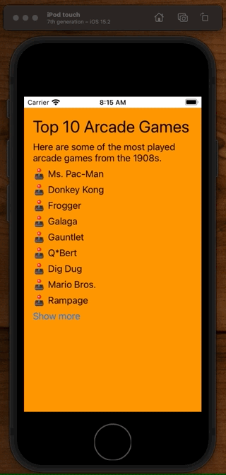

# Animating in Stack Views

## Visibility

The simplest things you can do when it comes to stack views and animations is chnages an controls visibility.

```swift
// MARK: Animations
extension ViewController {

    func animateVisibility() {
        let duration = 0.4
        let animatables = [extraLabel1, extraLabel2, extraLabel3, extraLabel4, extraLabel5]

        let animation = UIViewPropertyAnimator(duration: duration, curve: .easeInOut) { [self] in
            _ = animatables.map { $0?.isHidden = !showAll }
        }
        animation.startAnimation()
    }
}
```


Here you can see how the stack view animates the visibility of the control in by collapsing the visible area while maintaining the label height.

## Visibility + Alpha

A nicer effect can be acheived if you change the `alpha` of the controls first, and then animate their visibility after.

```swift
// MARK: Animations
extension ViewController {

    func animateVisibility() {
       ...
    }

    func animateVisibilityAndAlpha() {
        let duration = 2.0
        let animatables = [extraLabel1, extraLabel2, extraLabel3, extraLabel4, extraLabel5]
        if showAll {
            _ = animatables.map { $0?.alpha = 0}
        }

        let animation = UIViewPropertyAnimator(duration: duration, curve: .easeInOut) { [self] in
            _ = animatables.map { $0?.isHidden = !showAll }
            _ = animatables.map { $0?.alpha = 1}
        }
        animation.startAnimation()
    }
}
```



Not bad. An improvement. But we can do even better.

## 🕹 Staggering for effect

One really cool thing you can do with animations is stagger them. By separating the visibility and alpha animations, and playing with different durations, we can get some really nice effects like this:

```swift
// MARK: Animations
extension ViewController {

    func animateVisibility() {
       ...
    }

    func animateVisibilityAndAlpha() {
		...
    }

    func staggerAnimations() {
        let duration1 = 0.4
        let duration2 = 0.2

        // initially hide...
        let animatables = [extraLabel1, extraLabel2, extraLabel3, extraLabel4, extraLabel5]
        _ = animatables.map { $0?.alpha = 0 }

        // then animate visibility in...
        let firstAnimation = UIViewPropertyAnimator(duration: duration1, curve: .easeInOut) { [self] in
            _ = animatables.map { $0?.isHidden = !showAll }
        }

        firstAnimation.addCompletion { position in
            if position == .end {
                // followed by alpha
                let secondAnimation = UIViewPropertyAnimator(duration: duration2, curve: .easeInOut) {
                    _ = animatables.map { $0?.alpha = 1 }
                }
                secondAnimation.startAnimation()
            }
        }
        firstAnimation.startAnimation()
    }
}
```

