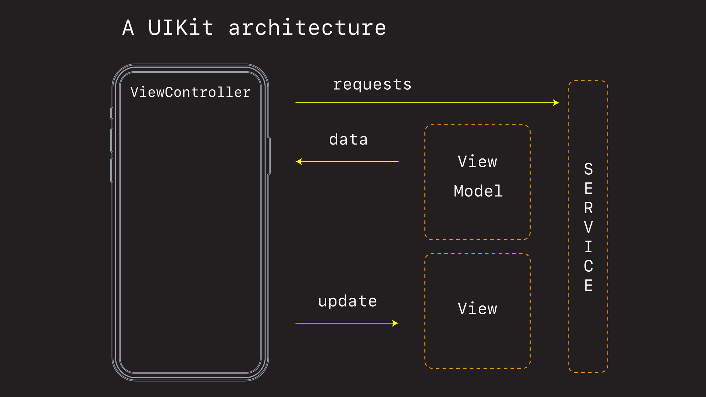

# Default UIKit Architecture 🕹

This is my default UIKit architecture.

### Services

The *Service layer* shields the internals of the app from the outside world. This is where we have data requests, talk to web servers, and get back *ViewModel* data.

### View Models

A *View Model* is a struct specifically created for the view we are creating. It acts as mediator or translator. It can take data from the outside world and convert it into something the view understands.

### View Controller

The *View Controller* acts as the overall coordinator. It is purposefully lean, takes the results of it's network requests, and passes the results off to it's subviews.

### Views

Extracting subviews make reasoning about your app easier. It puts all the UI code and logic in one place, and makes updating and changing views easier.

### Testing

Structuring your app like this makes testing easier. You can swap in fake mocked services via closures or dependency injection, and you only ever need to work with pure Swift model data when updating and testing the state of your UI.