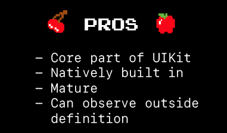
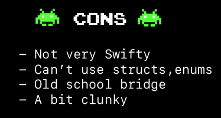
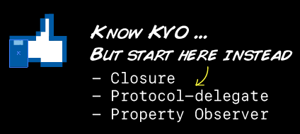
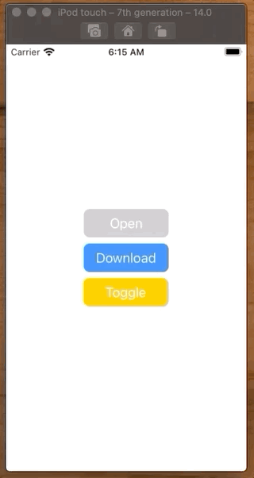
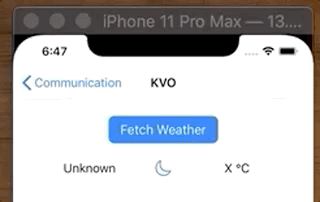

# Key-Value Observing

KVO is a communication pattern in Swift where one object can observe another and react to a change state. It’s handy for sync’ing changes in viewModel data with your view controllers. It’s common enough that you will see it used in building applications. And it’s worth understanding because you may need to work with it in applications you need to maintain.




KVO is worth knowing. Because you will see it used in iOS applications, and it is sometimes the only way you can observe a closed object that you want to respond to. But don't make it your first choice. Instead reach for a simple closure, or protocol-delegate. But have KVO in your back pocket as it is good to understand.



## Example 1

Say I want to dynamically update my UI based on whether a user has an app, like Shazam, installed. How could I do that? I could observe it.



```swift
//
//  ViewController.swift
//  Observable
//
//  Created by Jonathan Rasmusson (Contractor) on 2020-11-13.
//

import UIKit

struct ShazamUtils {
    
    static let shawGoWifiURL = URL(string: "shazam://")!
    
    static func hasShazam() -> Bool {
        return UIApplication.shared.canOpenURL(shawGoWifiURL)
    }
}

// 1 Extend NSObject
class ViewModel: NSObject {

    // 2 Make a property observable
    @objc dynamic var shazamInstalled: Bool = false

    override init() {
        super.init()
        
        // check if Shazam is there at startup
        shazamInstalled = ShazamUtils.hasShazam()
        
        NotificationCenter.default.addObserver(forName: UIApplication.didBecomeActiveNotification, object: nil, queue: nil) { [weak self] (_) in
            // check again if/when app becomes active
            self?.shazamInstalled = ShazamUtils.hasShazam()
        }
        
    }
}

class ViewController: UIViewController {

    let useWifiButton = makeButton(withText: "Open")
    let downloadWifiButton = makeButton(withText: "Download")
    let toggleButton = makeButton(withText: "Toggle")

    let stackView = makeVerticalStackView()

    var viewModel = ViewModel()
    
    // 3 Track the observation
    var observation: Any?

    override func viewDidLoad() {
        super.viewDidLoad()

        setup()
        layout()

        // 4 Observe it
        observation = viewModel.observe(\.shazamInstalled, options: [.initial, .new], changeHandler: appInstalledDidChange(viewModel:observedChange:))
    }

    // 5 Update when changed
    func appInstalledDidChange(viewModel: ViewModel, observedChange: NSKeyValueObservedChange<Bool>) {
        if viewModel.shazamInstalled {
            useWifiButton.backgroundColor = .systemBlue
            downloadWifiButton.backgroundColor = .systemGray3
        } else {
            useWifiButton.backgroundColor = .systemGray3
            downloadWifiButton.backgroundColor = .systemBlue
        }
    }

    func setup() {
        toggleButton.addTarget(self, action: #selector(togglePressed), for: .touchUpInside)
        toggleButton.backgroundColor = .systemYellow
    }

    func layout() {
        stackView.addArrangedSubview(useWifiButton)
        stackView.addArrangedSubview(downloadWifiButton)
        stackView.addArrangedSubview(toggleButton)

        view.addSubview(stackView)

        NSLayoutConstraint.activate([
            stackView.centerXAnchor.constraint(equalTo: view.centerXAnchor),
            stackView.centerYAnchor.constraint(equalTo: view.centerYAnchor),
        ])
    }

    @objc func togglePressed() {
        viewModel.shazamInstalled = !viewModel.shazamInstalled
    }
}

func makeButton(withText text: String) -> UIButton {
    let button = UIButton()
    button.translatesAutoresizingMaskIntoConstraints = false
    button.setTitle(text, for: .normal)
    button.titleLabel?.adjustsFontSizeToFitWidth = true
    button.contentEdgeInsets = UIEdgeInsets(top: 8, left: 16, bottom: 8, right: 16)
    button.backgroundColor = .systemBlue
    button.layer.cornerRadius = 8
    return button
}

func makeVerticalStackView() -> UIStackView {
    let stack = UIStackView()
    stack.translatesAutoresizingMaskIntoConstraints = false
    stack.axis = .vertical
    stack.spacing = 8.0

    return stack
}
```

## Example 2



Make your property observable.

```swift
@objc
class KVOWeatherService: NSObject {

    // 1 Make weather observable
    //   - `dynamic` bridges objc and Swift. Use to enable Key-Value observing.
    @objc dynamic var weather = KVOWeather(city: "Unknown", temperature: "X °C", imageName: "moon")

    func fetchWeather(for city: String) {
        weather = KVOWeather(city: city, temperature: "21 °C", imageName: "sunset.fill")
    }

}

@objc
class KVOWeather: NSObject {
    var city: String
    var temperature: String!
    var imageName: String!
    
    init(city: String, temperature: String, imageName: String) {
        self.city = city
        self.temperature = temperature
        self.imageName = imageName
    }
}
```

Observe it.

```swift
    @objc func weatherPressed() {
        weatherService.fetchWeather(for: "San Francisco")
    }
    
    /// KVO
    var observableWeather: Any?
    @objc let weatherService = KVOWeatherService()

    override func viewDidLoad() {
        super.viewDidLoad()
        setupViews()

        // 2 Observe it
        observableWeather = weatherService.observe(\.weather, options: [.initial, .new]) {
            // 5 Get updated
            [unowned self] object, change in
            let weatherValue = change.newValue
            self.updateView(with: weatherValue!)
        }
    }
```

### Video

- [KVO in Swift](https://developer.apple.com/documentation/swift/cocoa_design_patterns/using_key-value_observing_in_swift)
- [What are Key-Value Observers and How Do They Work?](https://www.youtube.com/watch?v=eOLb_Z1F4hk)

