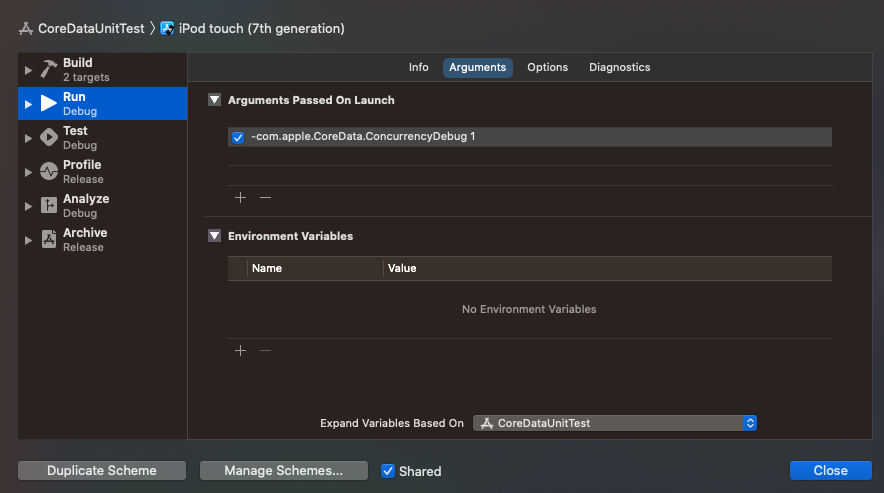

# Core Data & Unit Tests

## Enable the Concurrency Debugger

There is a debugger setting that will tell you when you are reading or writing from an incorrect context in Core Data but it is off by default. 

To enable it, go `Shift + Command + ,` to bring up your schemes, and then add the following to the debug `Run` scheme.

`-com.apple.CoreData.ConcurrencyDebug 1`



## Simple & Naive

If you try to write unit tests for your Core Data app naively, you are going to run into trouble. Take this `SimpleEmployeeManager` for instance. It does everything on the main thread.

**SimpleEmployeeManager.swift**

```swift
//
//  SimpleEmployeeManager.swift
//  CoreDataUnitTest
//
//  Created by jrasmusson on 2020-11-29.
//

import Foundation
import CoreData

/*
 This manager only uses the main thread viewContext.
 
 Simple. It works. But will experience data collisions when writing unit tests.
 
 */
struct SimpleEmployeeManager {
        
    let persistentContainer: NSPersistentContainer
    let mainContext: NSManagedObjectContext
    
    init() {
        persistentContainer = NSPersistentContainer(name: "MyData")
        persistentContainer.loadPersistentStores { description, error in
            guard error == nil else {
                fatalError("was unable to load store \(error!)")
            }
        }
        
        mainContext = persistentContainer.viewContext
    }
    
    @discardableResult
    func createEmployee(firstName: String) -> Employee? {
        let context = persistentContainer.viewContext
        
        let employee = Employee(context: context)
        
        employee.firstName = firstName
        
        do {
            try context.save()
            return employee
        } catch let error {
            print("Failed to create: \(error)")
        }
        
        return nil
    }
    
    func fetchEmployees() -> [Employee]? {
        let context = persistentContainer.viewContext
        
        let fetchRequest = NSFetchRequest<Employee>(entityName: "Employee")
        
        do {
            let employees = try context.fetch(fetchRequest)
            return employees
        } catch let error {
            print("Failed to fetch companies: \(error)")
        }
        
        return nil
    }
    
    func fetchEmployee(withName name: String) -> Employee? {
        let context = persistentContainer.viewContext
        
        let fetchRequest = NSFetchRequest<Employee>(entityName: "Employee")
        fetchRequest.fetchLimit = 1
        fetchRequest.predicate = NSPredicate(format: "firstName == %@", name)
        
        do {
            let employees = try context.fetch(fetchRequest)
            return employees.first
        } catch let error {
            print("Failed to fetch: \(error)")
        }
        
        return nil
    }
    
    func updateEmployee(employee: Employee) {
        let context = persistentContainer.viewContext
        
        do {
            try context.save()
        } catch let error {
            print("Failed to update: \(error)")
        }
    }
    
    func deleteEmployee(employee: Employee) {
        let context = persistentContainer.viewContext
        context.delete(employee)
        
        do {
            try context.save()
        } catch let error {
            print("Failed to delete: \(error)")
        }
    }
}
```

And if you try to write a unit test for it, using the same `NSManagedObjectContext`, you are going to get collisions - 💥. As your app and unit test will be sharing the same context.

**SimpleEmployeeManagerTest.swift**

```swift
//
//  SimpleEmployeeManagerTest.swift
//  CoreDataUnitTestTests
//
//  Created by jrasmusson on 2020-11-29.
//

import XCTest
import CoreData
@testable import CoreDataUnitTest

/*
 If we naively test with CoreData we run into the problem of our test
 data mixing with our app data due to both sharing the same context.
 
 What we want is a separate in-memory context that wipes itself clean every time.
 
 */
class SimpleEmployeeManagerTests: XCTestCase {
        
    var employeeManager: SimpleEmployeeManager!

    override func setUp() {
        super.setUp()
        employeeManager = SimpleEmployeeManager()
    }
    
    func test_create_employee() {
        employeeManager.createEmployee(firstName: "Jon")
        let employee = employeeManager.fetchEmployee(withName: "Jon")!

        XCTAssertEqual("Jon", employee.firstName)
    }
        
    // These demo purposes these fail 💥
//    func test_update_Employee() {
//        let employee = employeeManager.createEmployee(firstName: "Jon")!
//        employee.firstName = "Jonathan"
//        employeeManager.updateEmployee(employee: employee)
//        let updated = employeeManager.fetchEmployee(withName: "Jonathan")!
//
//        XCTAssertNil(employeeManager.fetchEmployee(withName: "Jon")!)
//        XCTAssertEqual("Jonathan", updated.firstName)
//    }
//
//    func test_delete_and_read_Employees() {
//
//        let employeeA = employeeManager.createEmployee(firstName: "A")!
//        let employeeB = employeeManager.createEmployee(firstName: "B")!
//        let employeeC = employeeManager.createEmployee(firstName: "C")!
//
//        employeeManager.deleteEmployee(employee: employeeB)
//
//        let employees = employeeManager.fetchEmployees()!
//
//        XCTAssertEqual(employees.count, 2)
//        XCTAssertTrue(employees.contains(employeeA))
//        XCTAssertTrue(employees.contains(employeeC))
//    }
}
```

## Medium

This fix to all this to create a new context that you use only in unit tests. That way your app can have it's main context when running in the app, and the unit tests can have a separate, cheap, in-memory context that never collides with the app. 

To do this create a `CoreDataManager` who can pass a main thread context to your manager class in the app, and a `CoreDataTestStack` for setting up the contexts in your unit tests.

**CoreDataManager.swift**

```swift
//
//  CoreDataManager.swift
//  CoreDataUnitTest
//
//  Created by jrasmusson on 2020-11-15.
//

// https://williamboles.me/can-unit-testing-and-core-data-become-bffs/
// https://medium.com/@aliakhtar_16369/mastering-in-coredata-part-11-multithreading-concurrency-rules-70f1f221dbcd

import Foundation
import CoreData

/*
 This is the CoreDataManager used by the app. It saves changes to disk.

 Managers can do operations via the:
 - `mainContext` with interacts on the main UI thread, or
 - `backgroundContext` with has a separate queue for background processing

 */
class CoreDataManager {
    
    static let shared = CoreDataManager()
    
    let persistentContainer: NSPersistentContainer
    let backgroundContext: NSManagedObjectContext
    let mainContext: NSManagedObjectContext
    
    private init() {
        persistentContainer = NSPersistentContainer(name: "MyData")
        let description = persistentContainer.persistentStoreDescriptions.first
        description?.type = NSSQLiteStoreType
        
        persistentContainer.loadPersistentStores { description, error in
            guard error == nil else {
                fatalError("was unable to load store \(error!)")
            }
        }
        
        mainContext = persistentContainer.viewContext
        
        backgroundContext = NSManagedObjectContext(concurrencyType: .privateQueueConcurrencyType)
        backgroundContext.mergePolicy = NSMergeByPropertyObjectTrumpMergePolicy
        backgroundContext.parent = self.mainContext
    }
}
```

**MediumEmployeeManager.swift**

```swift
//
//  MediumEmployeeManager.swift
//  CoreDataUnitTest
//
//  Created by jrasmusson on 2020-11-29.
//

import Foundation
import CoreData

/*
 This manager also works purely on the `mainContext`.
 The one difference is it's context can be set externally.
 Meaning if you wanted to pass in a context configured purely for in-memory you could.
 
 This enables you to write unit tests that don't collide with app data.
 We well as run them quickly in memory.
 
 */

struct MediumEmployeeManager {
    
    let mainContext: NSManagedObjectContext

    init(mainContext: NSManagedObjectContext = CoreDataManager.shared.mainContext) {
        self.mainContext = mainContext
    }

    @discardableResult
    func createEmployee(firstName: String) -> Employee? {
        let employee = Employee(context: mainContext)
        
        employee.firstName = firstName
        
        do {
            try mainContext.save()
            return employee
        } catch let error {
            print("Failed to create: \(error)")
        }
        
        return nil
    }
    
    func fetchEmployees() -> [Employee]? {
        let fetchRequest = NSFetchRequest<Employee>(entityName: "Employee")
        
        do {
            let employees = try mainContext.fetch(fetchRequest)
            return employees
        } catch let error {
            print("Failed to fetch companies: \(error)")
        }
        
        return nil
    }
    
    func fetchEmployee(withName name: String) -> Employee? {
        let fetchRequest = NSFetchRequest<Employee>(entityName: "Employee")
        fetchRequest.fetchLimit = 1
        fetchRequest.predicate = NSPredicate(format: "firstName == %@", name)
        
        do {
            let employees = try mainContext.fetch(fetchRequest)
            return employees.first
        } catch let error {
            print("Failed to fetch: \(error)")
        }
        
        return nil
    }
    
    func updateEmployee(employee: Employee) {
        do {
            try mainContext.save()
        } catch let error {
            print("Failed to update: \(error)")
        }
    }
    
    func deleteEmployee(employee: Employee) {
        mainContext.delete(employee)
        
        do {
            try mainContext.save()
        } catch let error {
            print("Failed to delete: \(error)")
        }
    }
}
```

**MediumEmployeeManagerTests.swift**

```swift
//
//  MediumEmployeeManagerTest.swift
//  CoreDataUnitTestTests
//
//  Created by jrasmusson on 2020-11-29.
//

import XCTest
import CoreData
@testable import CoreDataUnitTest

/*
 Here we avoid colliding with the app data by:
 
 - creating a new CoreDataManagerTest which sets up it's own in-memory viewContext (mainthread)
 - still doing everything on the main thread
 
 */
class MediumEmployeeManagerTests: XCTestCase {
            
    var employeeManager: MediumEmployeeManager!
    var coreDataStack: CoreDataTestStack!

    override func setUp() {
        super.setUp()
        coreDataStack = CoreDataTestStack()
        employeeManager = MediumEmployeeManager(mainContext: coreDataStack.mainContext)
    }

    func test_create_employee() {
        employeeManager.createEmployee(firstName: "Jon")
        let employee = employeeManager.fetchEmployee(withName: "Jon")!

        XCTAssertEqual("Jon", employee.firstName)
    }
        
    func test_update_employee() {
        let employee = employeeManager.createEmployee(firstName: "Jon")!
        employee.firstName = "Jonathan"
        employeeManager.updateEmployee(employee: employee)
        let updated = employeeManager.fetchEmployee(withName: "Jonathan")!
        
        XCTAssertNil(employeeManager.fetchEmployee(withName: "Jon"))
        XCTAssertEqual("Jonathan", updated.firstName)
    }

    func test_delete_employees() {

        let employeeA = employeeManager.createEmployee(firstName: "A")!
        let employeeB = employeeManager.createEmployee(firstName: "B")!
        let employeeC = employeeManager.createEmployee(firstName: "C")!

        employeeManager.deleteEmployee(employee: employeeB)

        let employees = employeeManager.fetchEmployees()!
        
        XCTAssertEqual(employees.count, 2)
        XCTAssertTrue(employees.contains(employeeA))
        XCTAssertTrue(employees.contains(employeeC))
    }
}
```

## Complex

If you have some heavy Core Data processing to do, and you don't want to do it all on the main thread, you can do your writes and updates on a background thread, and reads on the main. This is a more complex scenario (not recommended unless absolutely needed). But if required you can do the same thing, be passing a disposalable in-memory test only background and main context to your manager for tests, and then the real thing to your app.

**ComplexEmployeeManager.swift**

```swift
//
//  EmployeeDataManager.swift
//  CoreDataUnitTest
//
//  Created by jrasmusson on 2020-11-15.
//

import UIKit
import CoreData

/*
 This more complex implementation does everything on the background thread.
 More performant. But also more complex and risky.
 */
class ComplexEmployeeManager {
 
    // MARK: Contexts
    
    let backgroundcontext: NSManagedObjectContext
    let mainContext: NSManagedObjectContext
    
    /*
     Note: All fetches should always be done on mainContext. Updates, creates, deletes can be background.
     Contexts are passed in so they can be overridden via unit testing.
     */
    
    // MARK: - Init
    
    init(mainContext: NSManagedObjectContext = CoreDataManager.shared.mainContext,
         backgroundContext: NSManagedObjectContext = CoreDataManager.shared.backgroundContext) {
        self.mainContext = mainContext
        self.backgroundcontext = backgroundContext
    }
    
    // MARK: - Create
    
    func createEmployee(firstName: String) {
        backgroundcontext.performAndWait {
            let employee = NSEntityDescription.insertNewObject(forEntityName: "Employee", into: backgroundcontext) as! Employee
            employee.firstName = firstName
            
            try? backgroundcontext.save()
        }
    }
    
    // MARK: - Deletion
    
    func deleteEmployee(employee: Employee) {
        let objectID = employee.objectID
        backgroundcontext.performAndWait {
            if let employeeInContext = try? backgroundcontext.existingObject(with: objectID) {
                backgroundcontext.delete(employeeInContext)
                try? backgroundcontext.save()
            }
        }
    }
        
    // MARK: - Update
    
    func updateEmployee(employee: Employee) {
        backgroundcontext.performAndWait {
            do {
                try backgroundcontext.save()
            } catch let error {
                print("Failed to update: \(error)")
            }
        }
    }
    
    // MARK: - Fetch
    
    /*
     Rule: Managed objects retrieved from a context are bound to the same queue that the context is bound to.
     
     So if we want the results of our fetches to be used in the UI, we should do those fetching
     from the main UI context.
     
     */
    func fetchEmployee(withName name: String) -> Employee? {
        let fetchRequest = NSFetchRequest<Employee>(entityName: "Employee")
        fetchRequest.fetchLimit = 1
        fetchRequest.predicate = NSPredicate(format: "firstName == %@", name)
        
        var employee: Employee?
        
        mainContext.performAndWait {
            do {
                let employees = try mainContext.fetch(fetchRequest)
                employee = employees.first
            } catch let error {
                print("Failed to fetch: \(error)")
            }
        }
        
        return employee
    }

    func fetchEmployees() -> [Employee]? {
        let fetchRequest = NSFetchRequest<Employee>(entityName: "Employee")
        
        var employees: [Employee]?
        
        mainContext.performAndWait {
            do {
                employees = try mainContext.fetch(fetchRequest)
            } catch let error {
                print("Failed to fetch companies: \(error)")
            }
        }
        
        return employees
    }
}
```

**ComplexEmployeeManagerTest.swift**

```swift
//
//  ColorsDataManagerTests.swift
//  CoreDataUnitTestTests
//
//  Created by jrasmusson on 2020-11-15.
//

import XCTest
import CoreData
@testable import CoreDataUnitTest

/*
 Even though the ComplexEmployeeManager runs on a background thread, we can force it
 to run the main thread (where our unit tests run) by passing in a mainContext.
 */
class ComplexEmployeeManagerTest: XCTestCase {
    
    var employeeManager: ComplexEmployeeManager!
    var coreDataStack: CoreDataTestStack!
    
    override func setUp() {
        super.setUp()
        coreDataStack = CoreDataTestStack()
        employeeManager = ComplexEmployeeManager(mainContext: coreDataStack.mainContext,
                                                 backgroundContext: coreDataStack.mainContext)
    }
    
    func test_create_employee() {
        employeeManager.createEmployee(firstName: "Jon")
        let employee = employeeManager.fetchEmployee(withName: "Jon")!

        XCTAssertEqual("Jon", employee.firstName)
    }
        
    func test_delete_employee() {
        employeeManager.createEmployee(firstName: "A")
        employeeManager.createEmployee(firstName: "B")
        employeeManager.createEmployee(firstName: "C")

        let employeeA = employeeManager.fetchEmployee(withName: "A")!
        let employeeB = employeeManager.fetchEmployee(withName: "B")!
        let employeeC = employeeManager.fetchEmployee(withName: "C")!
        
        employeeManager.deleteEmployee(employee: employeeB)

        let employees = employeeManager.fetchEmployees()!
        
        XCTAssertEqual(employees.count, 2)
        XCTAssertTrue(employees.contains(employeeA))
        XCTAssertTrue(employees.contains(employeeC))
    }
}
```


### Links that help

- [Core Data and Unit Tests BFFs](https://williamboles.me/can-unit-testing-and-core-data-become-bffs/)
- [Core Data & Multithreading](https://medium.com/@aliakhtar_16369/mastering-in-coredata-part-11-multithreading-concurrency-rules-70f1f221dbcd)

### Video


