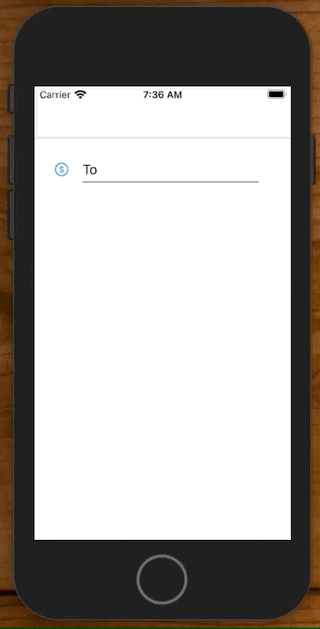
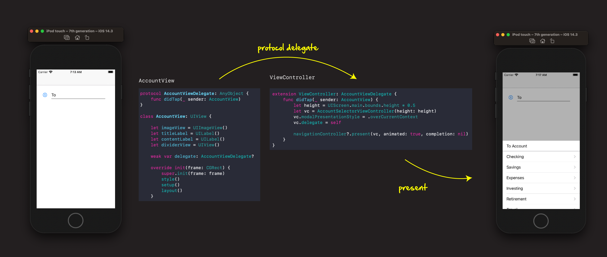
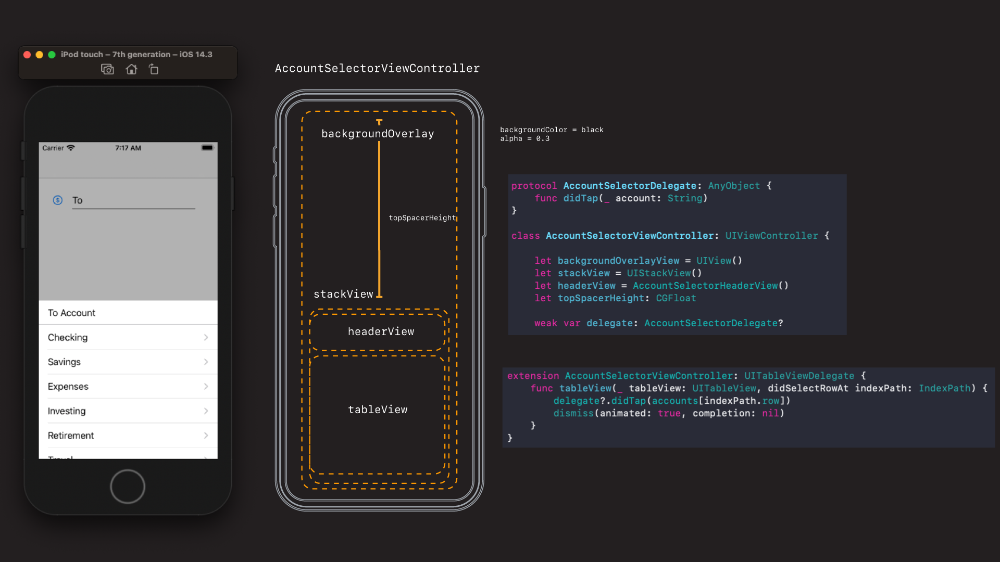

# Bottom Menu Popup



So the interesting thing about the way this is built is that the pop-up draw on the bottom is just a full screen take over with a large spacer constraint limitting everything to half screen.



The main view controller contains a custom `AccountView` which is tappable. When tapped it asks the main view controller to `present` another view controller with a specific height spacer on top of itself.

```swift
extension ViewController: AccountViewDelegate {
    func didTap(_ sender: AccountView) {
        let height = UIScreen.main.bounds.height * 0.5
        let vc = AccountSelectorViewController(height: height)
        vc.modalPresentationStyle = .overCurrentContext
        vc.delegate = self
        
        navigationController?.present(vc, animated: true, completion: nil)
    }
}
```



This newly presented `AccountSelectorViewController` has a back splash over lay set to an `alpha=0.3` for that nice dark effect.

Then the height spacer kicks in pushing the top of the stack and all it's contents down half-way. That's how we get the drawer effect.

Inside the stack we have a custom header view, a table view, which when tapped, passes back to the main view controller the selected account.

All in all a pretty cool little way to get a poppable drawer 🚀.

## Source

You can find a demo in this directory. Or view the source code below.

**ViewController.swift**

```swift
//
//  ViewController.swift
//  PopupFun
//
//  Created by jrasmusson on 2021-03-09.
//

import UIKit

class ViewController: UIViewController {
    
    let accountView = AccountView()
    
    override func viewDidLoad() {
        super.viewDidLoad()
        style()
        setup()
        layout()
    }
}

extension ViewController {
    
    func style() {
        accountView.translatesAutoresizingMaskIntoConstraints = false
    }
    
    func setup() {
        accountView.delegate = self
    }
    
    func layout() {
        view.addSubview(accountView)
        
        NSLayoutConstraint.activate([
            accountView.topAnchor.constraint(equalToSystemSpacingBelow: view.safeAreaLayoutGuide.topAnchor, multiplier: 3),
            accountView.leadingAnchor.constraint(equalToSystemSpacingAfter: view.leadingAnchor, multiplier: 3),
            view.trailingAnchor.constraint(equalToSystemSpacingAfter: accountView.trailingAnchor, multiplier: 3),
        ])
    }
}

// MARK: - AccountViewDelegate

extension ViewController: AccountViewDelegate {
    func didTap(_ sender: AccountView) {
        let height = UIScreen.main.bounds.height * 0.5
        let vc = AccountSelectorViewController(height: height)
        vc.modalPresentationStyle = .overCurrentContext
        vc.delegate = self
        
        navigationController?.present(vc, animated: true, completion: nil)
    }
}

// MARK: - AccountSelectorDelegate

extension ViewController: AccountSelectorDelegate {
    func didTap(_ account: String) {
        accountView.contentLabel.text = account
    }
}
```

**AccountView.swift**

```swift
//
//  AccountView.swift
//  PopupFun
//
//  Created by jrasmusson on 2021-03-09.
//

import Foundation
import UIKit

protocol AccountViewDelegate: AnyObject {
    func didTap(_ sender: AccountView)
}

class AccountView: UIView {
    
    let imageView = UIImageView()
    let titleLabel = UILabel()
    let contentLabel = UILabel()
    let dividerView = UIView()
    
    weak var delegate: AccountViewDelegate?
    
    override init(frame: CGRect) {
        super.init(frame: frame)
        style()
        setup()
        layout()
    }
    
    required init?(coder: NSCoder) {
        fatalError("init(coder:) has not been implemented")
    }
    
    override var intrinsicContentSize: CGSize {
        return CGSize(width: 200, height: 32)
    }
}

extension AccountView {
    
    func style() {
        translatesAutoresizingMaskIntoConstraints = false
        
        imageView.translatesAutoresizingMaskIntoConstraints = false
        imageView.image = UIImage(systemName: "dollarsign.circle")
        
        titleLabel.translatesAutoresizingMaskIntoConstraints = false
        titleLabel.text = "To"
        
        contentLabel.translatesAutoresizingMaskIntoConstraints = false
        
        dividerView.translatesAutoresizingMaskIntoConstraints = false
        dividerView.backgroundColor = .black
    }
    
    func setup() {
        let singleTap = UITapGestureRecognizer(target: self, action: #selector(tapped(_: )))
        addGestureRecognizer(singleTap)
    }
    
    @objc func tapped(_ recognizer: UITapGestureRecognizer) {
        delegate?.didTap(self)
    }
    
    func layout() {
        addSubview(imageView)
        addSubview(titleLabel)
        addSubview(contentLabel)
        addSubview(dividerView)
        
        NSLayoutConstraint.activate([
            imageView.centerYAnchor.constraint(equalTo: centerYAnchor),
            imageView.leadingAnchor.constraint(equalTo: leadingAnchor),
            titleLabel.centerYAnchor.constraint(equalTo: centerYAnchor),
            titleLabel.leadingAnchor.constraint(equalToSystemSpacingAfter: imageView.trailingAnchor, multiplier: 2),
            contentLabel.centerYAnchor.constraint(equalTo: centerYAnchor),
            contentLabel.leadingAnchor.constraint(equalToSystemSpacingAfter: titleLabel.trailingAnchor, multiplier: 2),
            trailingAnchor.constraint(equalToSystemSpacingAfter: contentLabel.trailingAnchor, multiplier: 2),
            dividerView.leadingAnchor.constraint(equalTo: titleLabel.leadingAnchor),
            dividerView.trailingAnchor.constraint(equalTo: contentLabel.trailingAnchor),
            dividerView.bottomAnchor.constraint(equalTo: bottomAnchor),
            dividerView.heightAnchor.constraint(equalToConstant: 1)
        ])
        
        imageView.setContentHuggingPriority(UILayoutPriority.defaultHigh, for: .horizontal)
        titleLabel.setContentHuggingPriority(UILayoutPriority.defaultHigh, for: .horizontal)
    }
}
```

**AccountSelectorViewController.swift**

```swift
//
//  AccountSelectorViewController.swift
//  PopupFun
//
//  Created by jrasmusson on 2021-03-09.
//

import UIKit

protocol AccountSelectorDelegate: AnyObject {
    func didTap(_ account: String)
}

class AccountSelectorViewController: UIViewController {
        
    let backgroundOverlayView = UIView()
    let stackView = UIStackView()
    let headerView = AccountSelectorHeaderView()
    let topSpacerHeight: CGFloat
    
    weak var delegate: AccountSelectorDelegate?
    
    // table view
    let accounts = [
        "Checking",
        "Savings",
        "Expenses",
        "Investing",
        "Retirement",
        "Travel"
    ]
    
    let cellId = "cellId"
    var tableView = UITableView()
    
    init(height: CGFloat) {
        self.topSpacerHeight = height
        super.init(nibName: nil, bundle: nil)
    }
    
    required init?(coder: NSCoder) {
        fatalError("init(coder:) has not been implemented")
    }
    
    override func viewDidLoad() {
        super.viewDidLoad()
        style()
        setup()
        layout()
    }
}

extension AccountSelectorViewController {
    
    func style() {
        backgroundOverlayView.translatesAutoresizingMaskIntoConstraints = false
        backgroundOverlayView.backgroundColor = .black
        backgroundOverlayView.alpha = 0.3
        
        stackView.translatesAutoresizingMaskIntoConstraints = false
        stackView.axis = .vertical
        
        headerView.translatesAutoresizingMaskIntoConstraints = false
        tableView.translatesAutoresizingMaskIntoConstraints = false
    }

    func setup() {
        let tap = UITapGestureRecognizer(target: self, action: #selector(tappedOverlay))
        backgroundOverlayView.addGestureRecognizer(tap)
        
        tableView.delegate = self
        tableView.dataSource = self
        tableView.register(UITableViewCell.self, forCellReuseIdentifier: cellId)
        tableView.tableFooterView = UIView()
    }
    
    func layout() {
        stackView.addArrangedSubview(headerView)
        stackView.addArrangedSubview(tableView)
        
        view.addSubview(backgroundOverlayView)
        view.addSubview(stackView)
        
        NSLayoutConstraint.activate([
            backgroundOverlayView.topAnchor.constraint(equalTo: view.topAnchor),
            backgroundOverlayView.leadingAnchor.constraint(equalTo: view.leadingAnchor),
            backgroundOverlayView.trailingAnchor.constraint(equalTo: view.trailingAnchor),
            backgroundOverlayView.bottomAnchor.constraint(equalTo: view.bottomAnchor),
            
            stackView.topAnchor.constraint(equalTo: view.topAnchor, constant: topSpacerHeight),
            stackView.leadingAnchor.constraint(equalTo: view.leadingAnchor),
            stackView.trailingAnchor.constraint(equalTo: view.trailingAnchor),
            stackView.bottomAnchor.constraint(equalTo: view.bottomAnchor),
        ])
    }
}

extension AccountSelectorViewController: UITableViewDelegate {
    func tableView(_ tableView: UITableView, didSelectRowAt indexPath: IndexPath) {
        delegate?.didTap(accounts[indexPath.row])
        dismiss(animated: true, completion: nil)
    }
}

extension AccountSelectorViewController: UITableViewDataSource {
    func tableView(_ tableView: UITableView, cellForRowAt indexPath: IndexPath) -> UITableViewCell {
        let cell = tableView.dequeueReusableCell(withIdentifier: cellId, for: indexPath)

        cell.textLabel?.text = accounts[indexPath.row]
        cell.accessoryType = UITableViewCell.AccessoryType.disclosureIndicator

        return cell
    }

    func tableView(_ tableView: UITableView, numberOfRowsInSection section: Int) -> Int {
        return accounts.count
    }
}

// MARK: - Actions

extension AccountSelectorViewController {
    @objc func tappedOverlay() {
        dismiss(animated: true, completion: nil)
    }
}
```

**AccountSelectorHeaderView.swift**

```swift
//
//  AccountSelectorHeaderView.swift
//  PopupFun
//
//  Created by jrasmusson on 2021-03-10.
//

import Foundation
import UIKit

class AccountSelectorHeaderView: UIView {
    
    let headerLabel = UILabel()
    let dividerView = UIView()
    
    override init(frame: CGRect) {
        super.init(frame: frame)
        
        style()
        layout()
    }
    
    required init?(coder: NSCoder) {
        fatalError("init(coder:) has not been implemented")
    }
    
    override var intrinsicContentSize: CGSize {
        return CGSize(width: 200, height: 44)
    }
}

extension AccountSelectorHeaderView {
    
    func style() {
        translatesAutoresizingMaskIntoConstraints = false
        backgroundColor = .white
        
        headerLabel.translatesAutoresizingMaskIntoConstraints = false
        headerLabel.text = "To Account"
        
        dividerView.translatesAutoresizingMaskIntoConstraints = false
        dividerView.backgroundColor = .systemGray
    }
    
    func layout() {
        addSubview(headerLabel)
        addSubview(dividerView)
        
        NSLayoutConstraint.activate([
            headerLabel.centerYAnchor.constraint(equalTo: centerYAnchor),
            headerLabel.leadingAnchor.constraint(equalToSystemSpacingAfter: leadingAnchor, multiplier: 2),
            dividerView.bottomAnchor.constraint(equalTo: bottomAnchor),
            dividerView.widthAnchor.constraint(equalTo: widthAnchor),
            dividerView.heightAnchor.constraint(equalToConstant: 1)
        ])
    }
}
```
