# Custom Badge

This tutorial will show you how to create your own custom badge and display on any `UIView`. 

## Simple Badge

### Auto Layout with UIKit

You can build a simple badge, using UIKit controls and Auto Layout just like this.

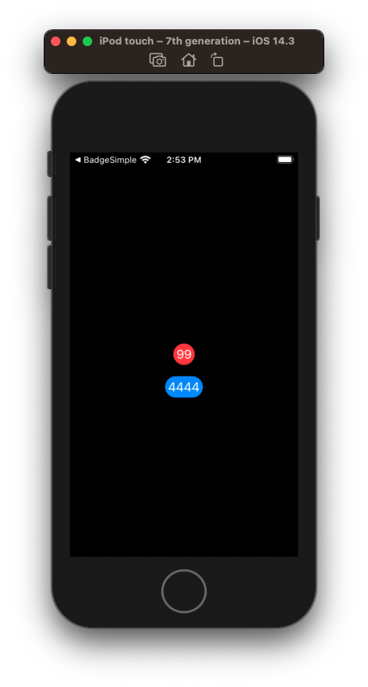

**ViewController.swift**

```swift
import UIKit

class ViewController1: UIViewController {

    let label = UILabel()
    let button = UIButton()
    
    let diameter: CGFloat = 30
    
    override func viewDidLoad() {
        super.viewDidLoad()
        
        label.translatesAutoresizingMaskIntoConstraints = false
        label.layer.cornerRadius = diameter / 2
        label.backgroundColor = .systemRed
        label.textAlignment = .center
        label.textColor = .white
        label.clipsToBounds = true
        label.text = "99" // Good for 2 digits
        
        button.translatesAutoresizingMaskIntoConstraints = false
        button.contentEdgeInsets = UIEdgeInsets(top: 0, left: 4, bottom: 0, right: 4)
        button.layer.cornerRadius = diameter / 2
        button.setTitleColor(.white, for: .normal)
        button.backgroundColor = .systemBlue
        button.setTitle("4444", for: .normal)
        
        view.addSubview(label)
        view.addSubview(button)
        
        NSLayoutConstraint.activate([
            label.centerXAnchor.constraint(equalTo: view.centerXAnchor),
            label.centerYAnchor.constraint(equalTo: view.centerYAnchor),
            label.heightAnchor.constraint(equalToConstant: diameter),
            label.widthAnchor.constraint(greaterThanOrEqualToConstant: diameter),

            button.topAnchor.constraint(equalToSystemSpacingBelow: label.bottomAnchor, multiplier: 2),
            button.centerXAnchor.constraint(equalTo: view.centerXAnchor),
            button.heightAnchor.constraint(equalToConstant: diameter),
            button.widthAnchor.constraint(greaterThanOrEqualToConstant: diameter),
        ])
    }
}
```

If you only need two digit numbers, `UILabel` with a rounded corner radius is all you might need. If you require three or more digits in your badge, try a `UIButton` with `UIEdgeInsets` as it enables you to add padding on the right and the left.

### Adding a protocol to any UIView

If you want to get a bit fancier, you can create a `protocol` on `UIView` and make so that any view can add a badge by going 

```swift
view.addSubview(imageView)
imageView.addBadge()
```

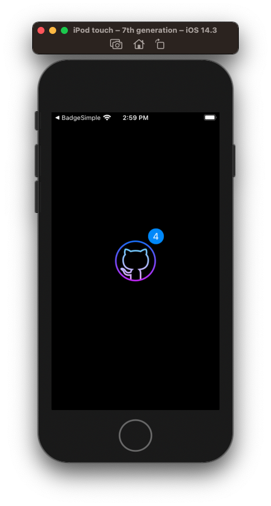

**ViewController.swift**

```swift
import UIKit

protocol Badgeable {}

extension UIView: Badgeable {
    func addBadge() {
        translatesAutoresizingMaskIntoConstraints = false
        
        let diameter: CGFloat = 30
        let badge = UIButton()

        badge.translatesAutoresizingMaskIntoConstraints = false
        badge.contentEdgeInsets = UIEdgeInsets(top: 0, left: 4, bottom: 0, right: 4)
        badge.layer.cornerRadius = diameter / 2
        badge.setTitleColor(.white, for: .normal)
        badge.backgroundColor = .systemBlue
        badge.setTitle("4", for: .normal)

        addSubview(badge)

        NSLayoutConstraint.activate([
            badge.heightAnchor.constraint(equalToConstant: diameter),
            badge.widthAnchor.constraint(greaterThanOrEqualToConstant: diameter),
            badge.leadingAnchor.constraint(equalTo: trailingAnchor, constant: -24),
            badge.bottomAnchor.constraint(equalTo: topAnchor, constant: 16),
        ])
    }
}

class ViewController2: UIViewController {
    
    let imageView = UIImageView()
    let diameter: CGFloat = 30
    
    override func viewDidLoad() {
        super.viewDidLoad()
        
        imageView.translatesAutoresizingMaskIntoConstraints = false
        imageView.image = UIImage(named: "github_color")
        imageView.addBadge()
        
        view.addSubview(imageView)
        imageView.addBadge()
        
        NSLayoutConstraint.activate([
            imageView.centerXAnchor.constraint(equalTo: view.centerXAnchor),
            imageView.centerYAnchor.constraint(equalTo: view.centerYAnchor),
        ])
    }
}
```


## Advanced Badge

If you need animations, and you'd like to reach for something more sophisticated and lower level, you can also solve this problem using Core Graphics and Core Animation by working directly with a `UIViews` frame.

Example based on source code of [BadgeHub](https://github.com/jogendra/BadgeHub).


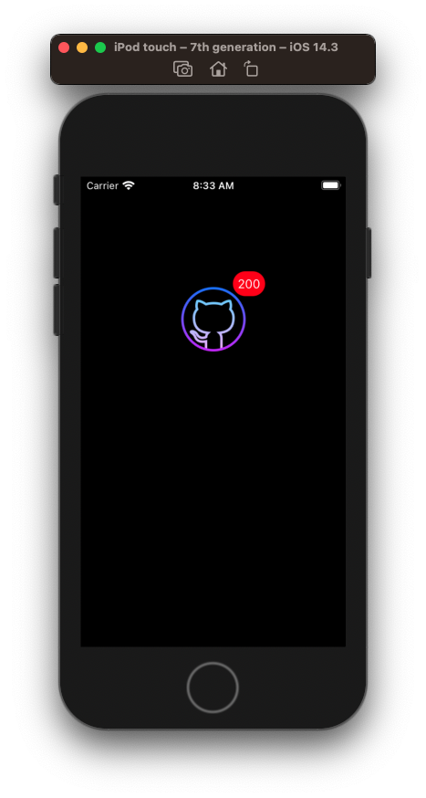


**ViewController.swift**

```swift
import UIKit

class ViewController: UIViewController {
    
    private var hub: BadgeHub?
    
    private lazy var imageView: UIImageView = {
        let iv = UIImageView()
        iv.frame = CGRect(x: view.frame.size.width / 2 - 48,
                          y: 80, width: 96, height: 96)
        iv.image = UIImage(named: "github_color")
        return iv
    }()
        
    override func viewDidLoad() {
        super.viewDidLoad()
        setupImageView()
    }
    
    private func setupImageView() {
        hub = BadgeHub(view: imageView)
        hub?.setCount(200)
        view.addSubview(imageView)
    }
}
```

You basically create the view you want to add the badge to (in this case a `UIImage`). And then you add the badge to the view by passing it into this object called `BadgeHub` and it takes care of the rest.

It will look at the frame of the view you pass it, create a red circle and label offset up and to the right, and that's basically it.

## How it works

### Placing the circle

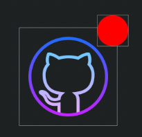

The circle is placed in the upper-righthand-corner by taking the frame of the passed in view, and creating a new view for the circle

```swift
fileprivate class BadgeView: UIView {
    
    func setBackgroundColor(_ backgroundColor: UIColor?) {
        super.backgroundColor = backgroundColor
    }
}

redCircle = BadgeView()
redCircle.backgroundColor = UIColor.red
```

And then setting that view's frame up and to the right by calculating a new x y coordinate.

```swift
let atFrame = CGRect(x: (frame?.size.width ?? 0.0) - ((Constants.notificHubDefaultDiameter) * 2 / 3),
                     y: (-Constants.notificHubDefaultDiameter) / 3,
                     width: CGFloat(Constants.notificHubDefaultDiameter),
                     height: CGFloat(Constants.notificHubDefaultDiameter))
setCircleAtFrame(atFrame)
```

The key to understanding this is that if we set the new circular frame to the origin

```swift
let atFrame = CGRect(x: 0,
                     y: 0,
                     width: ...,
                     height: ...)
```

Our badge would appear here.

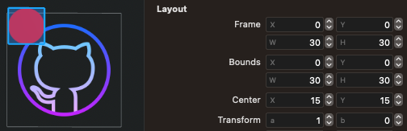

So in order to move it up and to the right we need take the original frame size, and subtract from it 2/3 of the circles diameter, nudging it just in from the far right.

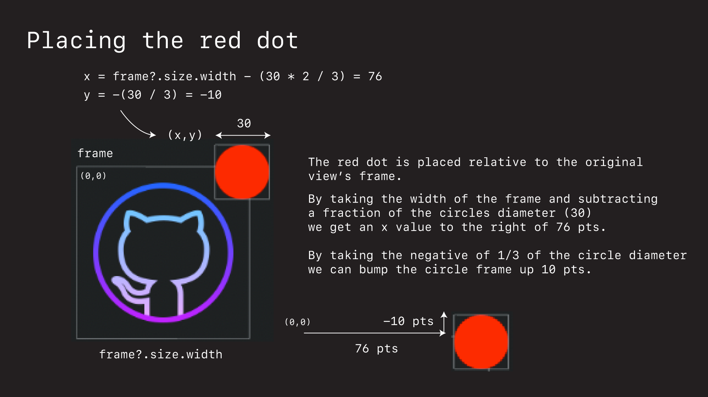

Here is the full source for just placing the circle.

```swift
import UIKit
import QuartzCore

fileprivate class BadgeView: UIView {
    
    func setBackgroundColor(_ backgroundColor: UIColor?) {
        super.backgroundColor = backgroundColor
    }
}

public class BadgeHub: NSObject {
    
    private var redCircle: BadgeView!
    var hubView: UIView?
    
    private struct Constants {
        static let notificHubDefaultDiameter: CGFloat = 30
    }
            
    public init(view: UIView) {
        super.init()
        
        setView(view)
    }
        
    public func setView(_ view: UIView?) {
        let frame: CGRect? = view?.frame
        
        redCircle = BadgeView()
        redCircle.backgroundColor = UIColor.red
        
        let atFrame = CGRect(x: (frame?.size.width ?? 0.0) - ((Constants.notificHubDefaultDiameter) * 2 / 3),
                             y: (-Constants.notificHubDefaultDiameter) / 3,
                             width: CGFloat(Constants.notificHubDefaultDiameter),
                             height: CGFloat(Constants.notificHubDefaultDiameter))
        setCircleAtFrame(atFrame)
        
        view?.addSubview(redCircle)
        view?.bringSubviewToFront(redCircle)
        hubView = view
    }
    
    /// Set the frame of the notification circle relative to the view.
    public func setCircleAtFrame(_ frame: CGRect) {
        redCircle.frame = frame
        redCircle.layer.cornerRadius = frame.size.height / 2
    }
}
```

### Adding the label

We can add a number to the badge by creating a `UILabel` 

```swift
private var countLabel: UILabel? {
    didSet {
        countLabel?.text = "\(count)"
        checkZero()
    }
}
```

and then setting the label's frame to be the same as the badge.

```swift
public func setView(_ view: UIView?, andCount startCount: Int) {
	// ...    
    let frame: CGRect? = view?.frame
    
    redCircle = BadgeView()
    
    countLabel = UILabel(frame: redCircle.frame)
    countLabel?.textAlignment = .center
    countLabel?.textColor = UIColor.white
    countLabel?.backgroundColor = UIColor.clear
    // ...
}
```

and then setting its frame to that of the badge.

### Dealing with order of magnitude numbers

So long as the label contains one or two digits, the circle around the label looks OK.

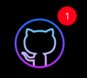

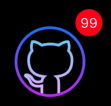

It's when we get to the third order of magnitude number or more that we need to adjust the width and x coordinate of our circle frame.

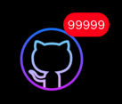

We can do that, by recalculating the width of the badge based on the number of digit's, as well as adjust its x-coordinate.

```swift
/// Resize the badge to fit the current digits.
/// This method is called everytime count value is changed.
func resizeToFitDigits() {
    guard count > 0 else { return }
    var orderOfMagnitude: Int = Int(log10(Double(count)))
    orderOfMagnitude = (orderOfMagnitude >= 2) ? orderOfMagnitude : 1
    
    var frame = initialFrame
    let newFrameWidth = CGFloat(initialFrame.size.width * (1 + 0.3 * CGFloat(orderOfMagnitude - 1)))
    
    frame.size.width = newFrameWidth
    frame.origin.x = initialFrame.origin.x - (newFrameWidth - initialFrame.size.width) / 2
    
    redCircle.frame = frame
    countLabel?.frame = redCircle.frame
    
    baseFrame = frame
    curOrderMagnitude = orderOfMagnitude
}
```

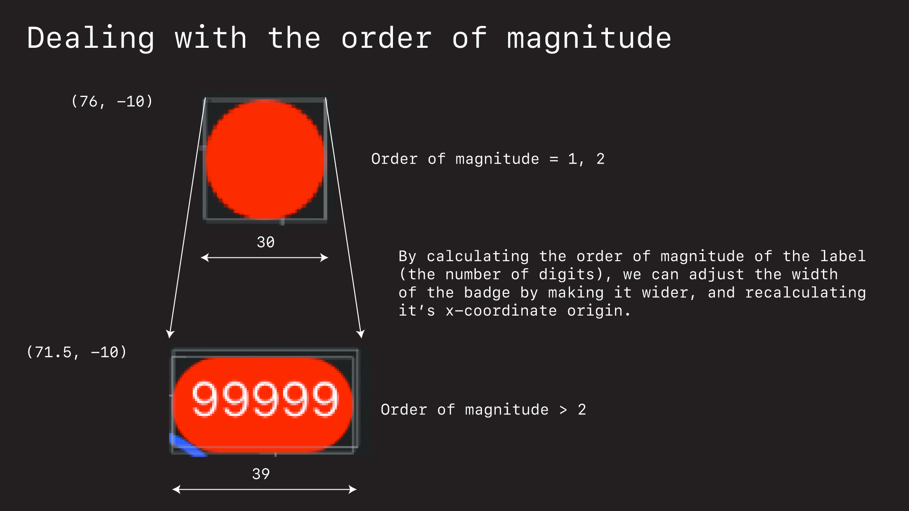

**ViewController.swift**

```swift
import UIKit

class ViewController: UIViewController {
    
    private var hub: BadgeHub?
    
    private lazy var imageView: UIImageView = {
        let iv = UIImageView()
        iv.frame = CGRect(x: view.frame.size.width / 2 - 48,
                          y: 80, width: 96, height: 96)
        iv.image = UIImage(named: "github_color")
        return iv
    }()
        
    override func viewDidLoad() {
        super.viewDidLoad()
        setupImageView()
    }
    
    private func setupImageView() {
        hub = BadgeHub(view: imageView)
        hub?.setCount(99999)
        view.addSubview(imageView)
    }
}
```

**BadgeHub.swift**

```swift
import UIKit
import QuartzCore

fileprivate class BadgeView: UIView {
    
    func setBackgroundColor(_ backgroundColor: UIColor?) {
        super.backgroundColor = backgroundColor
    }
}

public class BadgeHub: NSObject {
    
    private var curOrderMagnitude: Int = 0
    private var redCircle: BadgeView!
    private var baseFrame = CGRect.zero
    private var initialFrame = CGRect.zero
    
    var hubView: UIView?
    
    private struct Constants {
        static let notificHubDefaultDiameter: CGFloat = 30
        static let countMagnitudeAdaptationRatio: CGFloat = 0.3
    }

    var count: Int = 0 {
        didSet {
            countLabel?.text = "\(count)"
            checkZero()
            resizeToFitDigits()
        }
    }
        
    private var countLabel: UILabel? {
        didSet {
            countLabel?.text = "\(count)"
            checkZero()
        }
    }
    
    public init(view: UIView) {
        super.init()
        
        setView(view, andCount: 0)
    }
        
    public func setView(_ view: UIView?, andCount startCount: Int) {
        curOrderMagnitude = 0
        
        let frame: CGRect? = view?.frame
        
        redCircle = BadgeView()
        redCircle?.isUserInteractionEnabled = false
        redCircle.backgroundColor = UIColor.red
        
        countLabel = UILabel(frame: redCircle.frame)
        countLabel?.isUserInteractionEnabled = false
        count = startCount
        countLabel?.textAlignment = .center
        countLabel?.textColor = UIColor.white
        countLabel?.backgroundColor = UIColor.clear
        
        let atFrame = CGRect(x: (frame?.size.width ?? 0.0) - ((Constants.notificHubDefaultDiameter) * 2 / 3),
                             y: (-Constants.notificHubDefaultDiameter) / 3,
                             width: CGFloat(Constants.notificHubDefaultDiameter),
                             height: CGFloat(Constants.notificHubDefaultDiameter))
        setCircleAtFrame(atFrame)
        
        view?.addSubview(redCircle)
        view?.addSubview(countLabel!)
        view?.bringSubviewToFront(redCircle)
        view?.bringSubviewToFront(countLabel!)
        hubView = view
        checkZero()
    }
    
    /// Set the frame of the notification circle relative to the view.
    public func setCircleAtFrame(_ frame: CGRect) {
        redCircle.frame = frame
        baseFrame = frame
        initialFrame = frame
        
        countLabel?.frame = redCircle.frame
        redCircle.layer.cornerRadius = frame.size.height / 2
        countLabel?.font = UIFont.systemFont(ofSize: frame.size.width / 2)
    }
            
    public func moveCircleBy(x: CGFloat, y: CGFloat) {
        var frame: CGRect = redCircle.frame
        frame.origin.x += x
        frame.origin.y += y
        self.setCircleAtFrame(frame)
    }
                            
    public func setCount(_ newCount: Int) {
        self.count = newCount
        countLabel?.text = "\(count)"
        checkZero()
    }
            
    public func checkZero() {
        if count <= 0 {
            redCircle.isHidden = true
            countLabel?.isHidden = true
        } else {
            redCircle.isHidden = false
            countLabel?.isHidden = false
        }
    }
    
    /// Resize the badge to fit the current digits.
    /// This method is called everytime count value is changed.
    func resizeToFitDigits() {
        guard count > 0 else { return }
        var orderOfMagnitude: Int = Int(log10(Double(count)))
        orderOfMagnitude = (orderOfMagnitude >= 2) ? orderOfMagnitude : 1
        
        var frame = initialFrame
        let newFrameWidth = CGFloat(initialFrame.size.width * (1 + 0.3 * CGFloat(orderOfMagnitude - 1)))
        
        frame.size.width = newFrameWidth
        frame.origin.x = initialFrame.origin.x - (newFrameWidth - initialFrame.size.width) / 2
        
        redCircle.frame = frame
        countLabel?.frame = redCircle.frame
        
        baseFrame = frame
        curOrderMagnitude = orderOfMagnitude
    }
}
```

## Animations

Animations can be added to badges using Core Animation along with Core Graphics.

### Pop


**BadgeHub.swift**

```swift
    public func pop() {
        let height = baseFrame.size.height
        let width = baseFrame.size.width
        let popStartHeight: Float = Float(height * Constants.popStartRatio)
        let popStartWidth: Float = Float(width * Constants.popStartRatio)
        let timeStart: Float = 0.05
        let popOutHeight: Float = Float(height * Constants.popOutRatio)
        let popOutWidth: Float = Float(width * Constants.popOutRatio)
        let timeOut: Float = 0.2
        let popInHeight: Float = Float(height * Constants.popInRatio)
        let popInWidth: Float = Float(width * Constants.popInRatio)
        let timeIn: Float = 0.05
        let popEndHeight: Float = Float(height)
        let popEndWidth: Float = Float(width)
        let timeEnd: Float = 0.05
        
        let startSize = CABasicAnimation(keyPath: "cornerRadius")
        startSize.duration = CFTimeInterval(timeStart)
        startSize.beginTime = 0
        startSize.fromValue = NSNumber(value: popEndHeight / 2)
        startSize.toValue = NSNumber(value: popStartHeight / 2)
        startSize.isRemovedOnCompletion = false
        
        let outSize = CABasicAnimation(keyPath: "cornerRadius")
        outSize.duration = CFTimeInterval(timeOut)
        outSize.beginTime = CFTimeInterval(timeStart)
        outSize.fromValue = startSize.toValue
        outSize.toValue = NSNumber(value: popOutHeight / 2)
        outSize.isRemovedOnCompletion = false
        
        let inSize = CABasicAnimation(keyPath: "cornerRadius")
        inSize.duration = CFTimeInterval(timeIn)
        inSize.beginTime = CFTimeInterval(timeStart + timeOut)
        inSize.fromValue = outSize.toValue
        inSize.toValue = NSNumber(value: popInHeight / 2)
        inSize.isRemovedOnCompletion = false
        
        let endSize = CABasicAnimation(keyPath: "cornerRadius")
        endSize.duration = CFTimeInterval(timeEnd)
        endSize.beginTime = CFTimeInterval(timeIn + timeOut + timeStart)
        endSize.fromValue = inSize.toValue
        endSize.toValue = NSNumber(value: popEndHeight / 2)
        endSize.isRemovedOnCompletion = false
        
        let group = CAAnimationGroup()
        group.duration = CFTimeInterval(timeStart + timeOut + timeIn + timeEnd)
        group.animations = [startSize, outSize, inSize, endSize]
        
        redCircle.layer.add(group, forKey: nil)
        
        UIView.animate(withDuration: TimeInterval(timeStart), animations: {
            var frame: CGRect = self.redCircle.frame
            let center: CGPoint = self.redCircle.center
            frame.size.height = CGFloat(popStartHeight)
            frame.size.width = CGFloat(popStartWidth)
            self.redCircle.frame = frame
            self.redCircle.center = center
        }) { complete in
            UIView.animate(withDuration: TimeInterval(timeOut), animations: {
                var frame: CGRect = self.redCircle.frame
                let center: CGPoint = self.redCircle.center
                frame.size.height = CGFloat(popOutHeight)
                frame.size.width = CGFloat(popOutWidth)
                self.redCircle.frame = frame
                self.redCircle.center = center
            }) { complete in
                UIView.animate(withDuration: TimeInterval(timeIn), animations: {
                    var frame: CGRect = self.redCircle.frame
                    let center: CGPoint = self.redCircle.center
                    frame.size.height = CGFloat(popInHeight)
                    frame.size.width = CGFloat(popInWidth)
                    self.redCircle.frame = frame
                    self.redCircle.center = center
                }) { complete in
                    UIView.animate(withDuration: TimeInterval(timeEnd), animations: {
                        var frame: CGRect = self.redCircle.frame
                        let center: CGPoint = self.redCircle.center
                        frame.size.height = CGFloat(popEndHeight)
                        frame.size.width = CGFloat(popEndWidth)
                        self.redCircle.frame = frame
                        self.redCircle.center = center
                    })
                }
            }
        }
    }
```

### Bump

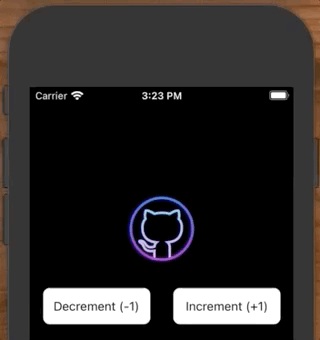

**BadgeHub.swift**

```swift
    /// Animation that jumps similar to macOS dock icons.
    public func bump() {
        if !initialCenter.equalTo(redCircle.center) {
            // cancel previous animation
        }
        
        bumpCenterY(yVal: 0)
        UIView.animate(withDuration: TimeInterval(Constants.bumpTimeSeconds), animations: {
            self.bumpCenterY(yVal: Constants.firstBumpDistance)
        }) { complete in
            UIView.animate(withDuration: TimeInterval(Constants.bumpTimeSeconds), animations: {
                self.bumpCenterY(yVal: 0)
            }) { complete in
                UIView.animate(withDuration: TimeInterval(Constants.bumpTimeSeconds2), animations: {
                    self.bumpCenterY(yVal: Constants.secondBumpDist)
                }) { complete in
                    UIView.animate(withDuration: TimeInterval(Constants.bumpTimeSeconds2), animations: {
                        self.bumpCenterY(yVal: 0)
                    })
                }
            }
        }
    }
```

**ViewController.swift**

```swift
import UIKit

class ViewController2: UIViewController {
    
    private var hub: BadgeHub?
    
    private lazy var imageView: UIImageView = {
        let iv = UIImageView()
        iv.frame = CGRect(x: view.frame.size.width / 2 - 48,
                          y: 80, width: 96, height: 96)
        iv.image = UIImage(named: "github_color")
        return iv
    }()
    
    private lazy var decrementButton: UIButton = {
        let button = UIButton(type: .system)
        button.frame = CGRect(x: 16, y: 200, width: 130, height: 44)
        button.setTitle("Decrement (-1)", for: .normal)
        button.backgroundColor = .white
        button.layer.cornerRadius = 8
        button.setTitleColor(.black, for: .normal)
        return button
    }()
    
    private lazy var incrementButton: UIButton = {
        let button = UIButton(type: .system)
        button.frame = CGRect(x: UIScreen.main.bounds.width - 16 - 130,
                              y: 200, width: 130, height: 44)
        button.setTitle("Increment (+1)", for: .normal)
        button.backgroundColor = .white
        button.layer.cornerRadius = 8
        button.setTitleColor(.black, for: .normal)
        return button
    }()
    
    override func viewDidLoad() {
        super.viewDidLoad()
        setupButtons()
        setupImageView()
    }
    
    private func setupButtons() {
        view.addSubview(incrementButton)
        view.addSubview(decrementButton)
        incrementButton.addTarget(self,
                                  action: #selector(self.testIncrement),
                                  for: .touchUpInside)
        decrementButton.addTarget(self,
                                  action: #selector(self.testDecrement),
                                  for: .touchUpInside)
    }
    
    private func setupImageView() {
        hub = BadgeHub(view: imageView)
        hub?.moveCircleBy(x: -15, y: 15)
        view.addSubview(imageView)
    }
    
    @objc private func testIncrement() {
        hub?.increment()
        hub?.pop()
//        hub?.bump()
    }
    
    @objc private func testDecrement() {
        hub?.decrement()
    }
}
```

**BadgeHub.swift**

```swift
import UIKit
import QuartzCore

fileprivate class BadgeView: UIView {
    
    func setBackgroundColor(_ backgroundColor: UIColor?) {
        super.backgroundColor = backgroundColor
    }
}

public class BadgeHub: NSObject {
    
    private var curOrderMagnitude: Int = 0
    private var redCircle: BadgeView!
    private var initialCenter = CGPoint.zero
    private var baseFrame = CGRect.zero
    private var initialFrame = CGRect.zero
    
    var hubView: UIView?
    
    private struct Constants {
        static let notificHubDefaultDiameter: CGFloat = 30
        static let countMagnitudeAdaptationRatio: CGFloat = 0.3
        // Pop values
        static let popStartRatio: CGFloat = 0.85
        static let popOutRatio: CGFloat = 1.05
        static let popInRatio: CGFloat = 0.95
        // Blink values
        static let blinkDuration: CGFloat = 0.1
        static let blinkAlpha: CGFloat = 0.1
        // Bump values
        static let firstBumpDistance: CGFloat = 8.0
        static let bumpTimeSeconds: CGFloat = 0.13
        static let secondBumpDist: CGFloat = 4.0
        static let bumpTimeSeconds2: CGFloat = 0.1
    }

    var count: Int = 0 {
        didSet {
            countLabel?.text = "\(count)"
            checkZero()
            resizeToFitDigits()
        }
    }
        
    private var countLabel: UILabel? {
        didSet {
            countLabel?.text = "\(count)"
            checkZero()
        }
    }
    
    public init(view: UIView) {
        super.init()
        
        setView(view, andCount: 0)
    }
        
    public func setView(_ view: UIView?, andCount startCount: Int) {
        curOrderMagnitude = 0
        
        let frame: CGRect? = view?.frame
        
        redCircle = BadgeView()
        redCircle?.isUserInteractionEnabled = false
        redCircle.backgroundColor = UIColor.red
        
        countLabel = UILabel(frame: redCircle.frame)
        countLabel?.isUserInteractionEnabled = false
        count = startCount
        countLabel?.textAlignment = .center
        countLabel?.textColor = UIColor.white
        countLabel?.backgroundColor = UIColor.clear
        
        let atFrame = CGRect(x: (frame?.size.width ?? 0.0) - ((Constants.notificHubDefaultDiameter) * 2 / 3),
                             y: (-Constants.notificHubDefaultDiameter) / 3,
                             width: CGFloat(Constants.notificHubDefaultDiameter),
                             height: CGFloat(Constants.notificHubDefaultDiameter))
        setCircleAtFrame(atFrame)
        
        view?.addSubview(redCircle)
        view?.addSubview(countLabel!)
        view?.bringSubviewToFront(redCircle)
        view?.bringSubviewToFront(countLabel!)
        hubView = view
        checkZero()
    }
    
    /// Set the frame of the notification circle relative to the view.
    public func setCircleAtFrame(_ frame: CGRect) {
        redCircle.frame = frame
        baseFrame = frame
        initialFrame = frame
        
        countLabel?.frame = redCircle.frame
        redCircle.layer.cornerRadius = frame.size.height / 2
        countLabel?.font = UIFont.systemFont(ofSize: frame.size.width / 2)
    }
            
    public func moveCircleBy(x: CGFloat, y: CGFloat) {
        var frame: CGRect = redCircle.frame
        frame.origin.x += x
        frame.origin.y += y
        self.setCircleAtFrame(frame)
    }
                            
    public func setCount(_ newCount: Int) {
        self.count = newCount
        countLabel?.text = "\(count)"
        checkZero()
    }
            
    public func checkZero() {
        if count <= 0 {
            redCircle.isHidden = true
            countLabel?.isHidden = true
        } else {
            redCircle.isHidden = false
            countLabel?.isHidden = false
        }
    }
    
    /// Resize the badge to fit the current digits.
    /// This method is called everytime count value is changed.
    func resizeToFitDigits() {
        guard count > 0 else { return }
        var orderOfMagnitude: Int = Int(log10(Double(count)))
        orderOfMagnitude = (orderOfMagnitude >= 2) ? orderOfMagnitude : 1
        
        var frame = initialFrame
        print("frame before: \(frame)")
        frame.size.width = CGFloat(initialFrame.size.width * (1 + 0.3 * CGFloat(orderOfMagnitude - 1)))
        frame.origin.x = initialFrame.origin.x - (frame.size.width - initialFrame.size.width) / 2
        print("frame after: \(frame)")
        
        redCircle.frame = frame
        baseFrame = frame
        countLabel?.frame = redCircle.frame
        curOrderMagnitude = orderOfMagnitude
    }
    
    func setAlpha(alpha: CGFloat) {
        redCircle.alpha = alpha
        countLabel?.alpha = alpha
    }

    /// Bump badge up or down.
    /// - Parameter yVal: `Y` coordinate for bumps.
    func bumpCenterY(yVal: CGFloat) {
        var center: CGPoint = redCircle.center
        center.y = initialCenter.y - yVal
        redCircle.center = center
        countLabel?.center = center
    }

    func increment() {
        increment(by: 1)
    }
    
    func increment(by amount: Int) {
        count += amount
    }

    func decrement() {
        decrement(by: 1)
    }

    func decrement(by amount: Int) {
        if amount >= count {
            count = 0
            return
        }
        count -= amount
        checkZero()
    }

    public func pop() {
        let height = baseFrame.size.height
        let width = baseFrame.size.width
        let popStartHeight: Float = Float(height * Constants.popStartRatio)
        let popStartWidth: Float = Float(width * Constants.popStartRatio)
        let timeStart: Float = 0.05
        let popOutHeight: Float = Float(height * Constants.popOutRatio)
        let popOutWidth: Float = Float(width * Constants.popOutRatio)
        let timeOut: Float = 0.2
        let popInHeight: Float = Float(height * Constants.popInRatio)
        let popInWidth: Float = Float(width * Constants.popInRatio)
        let timeIn: Float = 0.05
        let popEndHeight: Float = Float(height)
        let popEndWidth: Float = Float(width)
        let timeEnd: Float = 0.05
        
        let startSize = CABasicAnimation(keyPath: "cornerRadius")
        startSize.duration = CFTimeInterval(timeStart)
        startSize.beginTime = 0
        startSize.fromValue = NSNumber(value: popEndHeight / 2)
        startSize.toValue = NSNumber(value: popStartHeight / 2)
        startSize.isRemovedOnCompletion = false
        
        let outSize = CABasicAnimation(keyPath: "cornerRadius")
        outSize.duration = CFTimeInterval(timeOut)
        outSize.beginTime = CFTimeInterval(timeStart)
        outSize.fromValue = startSize.toValue
        outSize.toValue = NSNumber(value: popOutHeight / 2)
        outSize.isRemovedOnCompletion = false
        
        let inSize = CABasicAnimation(keyPath: "cornerRadius")
        inSize.duration = CFTimeInterval(timeIn)
        inSize.beginTime = CFTimeInterval(timeStart + timeOut)
        inSize.fromValue = outSize.toValue
        inSize.toValue = NSNumber(value: popInHeight / 2)
        inSize.isRemovedOnCompletion = false
        
        let endSize = CABasicAnimation(keyPath: "cornerRadius")
        endSize.duration = CFTimeInterval(timeEnd)
        endSize.beginTime = CFTimeInterval(timeIn + timeOut + timeStart)
        endSize.fromValue = inSize.toValue
        endSize.toValue = NSNumber(value: popEndHeight / 2)
        endSize.isRemovedOnCompletion = false
        
        let group = CAAnimationGroup()
        group.duration = CFTimeInterval(timeStart + timeOut + timeIn + timeEnd)
        group.animations = [startSize, outSize, inSize, endSize]
        
        redCircle.layer.add(group, forKey: nil)
        
        UIView.animate(withDuration: TimeInterval(timeStart), animations: {
            var frame: CGRect = self.redCircle.frame
            let center: CGPoint = self.redCircle.center
            frame.size.height = CGFloat(popStartHeight)
            frame.size.width = CGFloat(popStartWidth)
            self.redCircle.frame = frame
            self.redCircle.center = center
        }) { complete in
            UIView.animate(withDuration: TimeInterval(timeOut), animations: {
                var frame: CGRect = self.redCircle.frame
                let center: CGPoint = self.redCircle.center
                frame.size.height = CGFloat(popOutHeight)
                frame.size.width = CGFloat(popOutWidth)
                self.redCircle.frame = frame
                self.redCircle.center = center
            }) { complete in
                UIView.animate(withDuration: TimeInterval(timeIn), animations: {
                    var frame: CGRect = self.redCircle.frame
                    let center: CGPoint = self.redCircle.center
                    frame.size.height = CGFloat(popInHeight)
                    frame.size.width = CGFloat(popInWidth)
                    self.redCircle.frame = frame
                    self.redCircle.center = center
                }) { complete in
                    UIView.animate(withDuration: TimeInterval(timeEnd), animations: {
                        var frame: CGRect = self.redCircle.frame
                        let center: CGPoint = self.redCircle.center
                        frame.size.height = CGFloat(popEndHeight)
                        frame.size.width = CGFloat(popEndWidth)
                        self.redCircle.frame = frame
                        self.redCircle.center = center
                    })
                }
            }
        }
    }
    
    /// Animation that jumps similar to macOS dock icons.
    public func bump() {
        if !initialCenter.equalTo(redCircle.center) {
            // cancel previous animation
        }
        
        bumpCenterY(yVal: 0)
        UIView.animate(withDuration: TimeInterval(Constants.bumpTimeSeconds), animations: {
            self.bumpCenterY(yVal: Constants.firstBumpDistance)
        }) { complete in
            UIView.animate(withDuration: TimeInterval(Constants.bumpTimeSeconds), animations: {
                self.bumpCenterY(yVal: 0)
            }) { complete in
                UIView.animate(withDuration: TimeInterval(Constants.bumpTimeSeconds2), animations: {
                    self.bumpCenterY(yVal: Constants.secondBumpDist)
                }) { complete in
                    UIView.animate(withDuration: TimeInterval(Constants.bumpTimeSeconds2), animations: {
                        self.bumpCenterY(yVal: 0)
                    })
                }
            }
        }
    }
}
```

### Links the help

- [BadgeHub - source code for example](https://github.com/jogendra/BadgeHub)