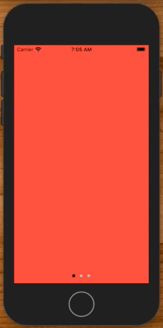
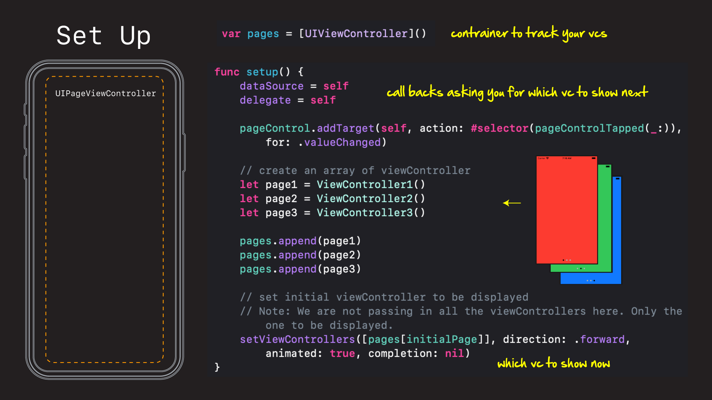
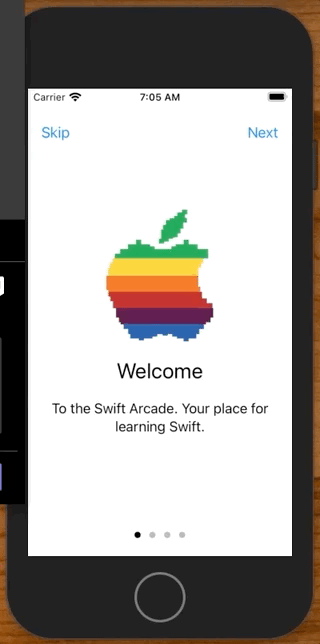
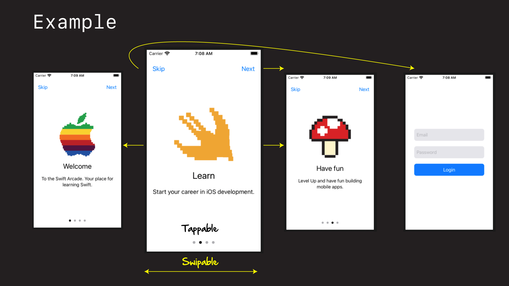
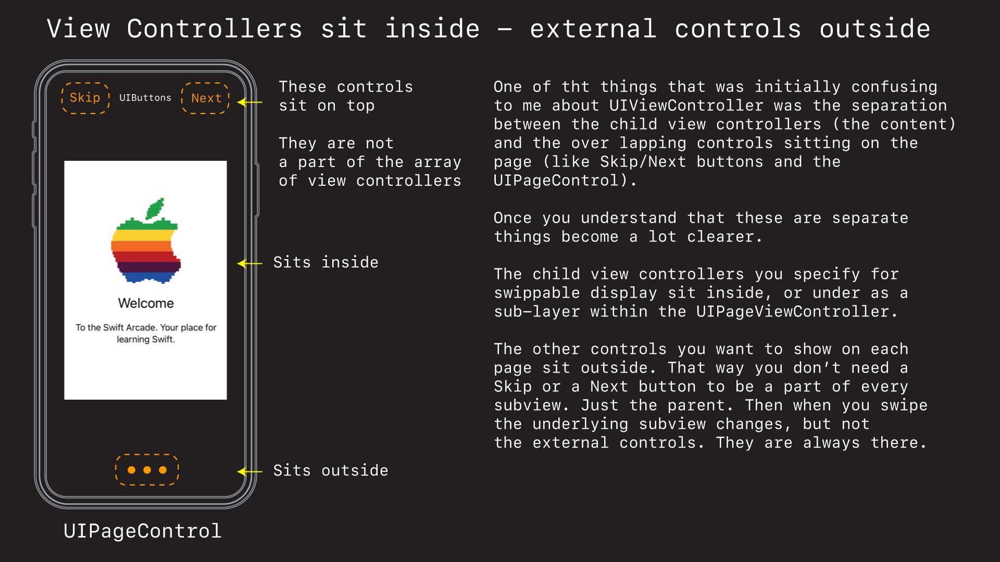
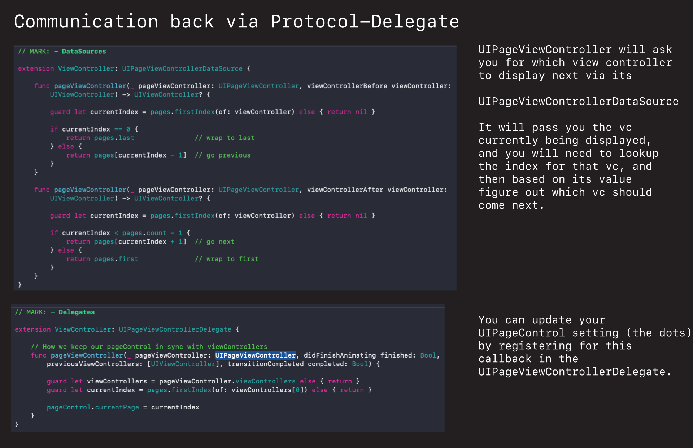

# Onboarding

Onboarding is the term used to onboard or explain to users how to use your app. It usually appears the first time they open it, and lots of companies use this as a way to showcase to users how the app can make their lives easier.

## Create via UIPageViewController

One simple control Apple provides for building onboarding experiences is the `UIPageViewController`.



The way it works is you create a regular old `UIViewController`, make it extend `UIPageViewController`, and then tell the page view controller which view controller to show via a `setViewControllers` method.



### Source

```swift
//
//  ViewController.swift
//  SimpleOnboardingDemo
//
//  Created by jrasmusson on 2021-01-08.
//

import UIKit

/*
 Simple example of UIPageViewController.
*/

class ViewController: UIPageViewController {

    var pages = [UIViewController]()
    let pageControl = UIPageControl() // external - not part of underlying pages
    let initialPage = 0
    
    override func viewDidLoad() {
        super.viewDidLoad()
        
        setup()
        style()
        layout()
    }
}

extension ViewController {
    
    func setup() {
        dataSource = self
        delegate = self
        
        pageControl.addTarget(self, action: #selector(pageControlTapped(_:)), for: .valueChanged)

        // create an array of viewController
        let page1 = ViewController1()
        let page2 = ViewController2()
        let page3 = ViewController3()

        pages.append(page1)
        pages.append(page2)
        pages.append(page3)
        
        // set initial viewController to be displayed
        // Note: We are not passing in all the viewControllers here. Only the one to be displayed.
        setViewControllers([pages[initialPage]], direction: .forward, animated: true, completion: nil)
    }
    
    func style() {
        pageControl.translatesAutoresizingMaskIntoConstraints = false
        pageControl.currentPageIndicatorTintColor = .black
        pageControl.pageIndicatorTintColor = .systemGray2
        pageControl.numberOfPages = pages.count
        pageControl.currentPage = initialPage
    }
    
    func layout() {
        view.addSubview(pageControl)
        
        NSLayoutConstraint.activate([
            pageControl.widthAnchor.constraint(equalTo: view.widthAnchor),
            pageControl.heightAnchor.constraint(equalToConstant: 20),
            view.bottomAnchor.constraint(equalToSystemSpacingBelow: pageControl.bottomAnchor, multiplier: 1),
        ])
    }
}

// MARK: - Actions

extension ViewController {
    
    // How we change page when pageControl tapped.
    // Note - Can only skip ahead on page at a time.
    @objc func pageControlTapped(_ sender: UIPageControl) {
        setViewControllers([pages[sender.currentPage]], direction: .forward, animated: true, completion: nil)
    }
}

// MARK: - DataSources

extension ViewController: UIPageViewControllerDataSource {
    
    func pageViewController(_ pageViewController: UIPageViewController, viewControllerBefore viewController: UIViewController) -> UIViewController? {
        
        guard let currentIndex = pages.firstIndex(of: viewController) else { return nil }
        
        if currentIndex == 0 {
            return pages.last               // wrap to last
        } else {
            return pages[currentIndex - 1]  // go previous
        }
    }
    
    func pageViewController(_ pageViewController: UIPageViewController, viewControllerAfter viewController: UIViewController) -> UIViewController? {
        
        guard let currentIndex = pages.firstIndex(of: viewController) else { return nil }

        if currentIndex < pages.count - 1 {
            return pages[currentIndex + 1]  // go next
        } else {
            return pages.first              // wrap to first
        }
    }
}

// MARK: - Delegates

extension ViewController: UIPageViewControllerDelegate {
    
    // How we keep our pageControl in sync with viewControllers
    func pageViewController(_ pageViewController: UIPageViewController, didFinishAnimating finished: Bool, previousViewControllers: [UIViewController], transitionCompleted completed: Bool) {
        
        guard let viewControllers = pageViewController.viewControllers else { return }
        guard let currentIndex = pages.firstIndex(of: viewControllers[0]) else { return }
        
        pageControl.currentPage = currentIndex
    }
}

// MARK: - ViewControllers

class ViewController1: UIViewController {
    override func viewDidLoad() {
        super.viewDidLoad()
        view.backgroundColor = .systemRed
    }
}

class ViewController2: UIViewController {
    override func viewDidLoad() {
        super.viewDidLoad()
        view.backgroundColor = .systemGreen
    }
}

class ViewController3: UIViewController {
    override func viewDidLoad() {
        super.viewDidLoad()
        view.backgroundColor = .systemBlue
    }
}
```

## A more complex example

Of course you can do more complex things like this.



Here we are swiping through a series of view controllers, but we have added some more controls to the page.



You will note there is a tappable `UIPageControl` at the bottom that stays in sync with the pages as they are swipped.

You will also see a `Skip` and `Next` button at the top. These are regular `UIButtons` that skip the rest of the onboarding process and jump directly to the login screen or go to the next page in the onboarding process.

On important thing to note is that these controls are separate from the underlying onboarding view controllers. In other words they sit in the parent, and are not built into each underlying view controller. 



Communication to you is done back via the `UIPageViewControllerDataSource` and `UIPageViewControllerDelegate`.



The `dataSource` will ask you which view controller should come next when someone swipes. You need to figure this out yourself by consulting your array with the currently displayed viewController index and then return the next viewController in line.

```swift
extension ViewController: UIPageViewControllerDataSource {
    
    func pageViewController(_ pageViewController: UIPageViewController, viewControllerBefore viewController: UIViewController) -> UIViewController? {
        
        guard let currentIndex = pages.firstIndex(of: viewController) else { return nil }
        
        if currentIndex == 0 {
            return pages.last               // wrap to last
        } else {
            return pages[currentIndex - 1]  // go previous
        }
    }
    
    func pageViewController(_ pageViewController: UIPageViewController, viewControllerAfter viewController: UIViewController) -> UIViewController? {
        
        guard let currentIndex = pages.firstIndex(of: viewController) else { return nil }

        if currentIndex < pages.count - 1 {
            return pages[currentIndex + 1]  // go next
        } else {
            return pages.first              // wrap to first
        }
    }
}
```

The `delegate` is how we keep our `pageControl` up-to-date. We get a callback when the view controller finished animating, and then used the passed in viewController to figure out which index is currently being displayed, and then use that update the control.

```swift
// MARK: - Delegates

extension ViewController: UIPageViewControllerDelegate {
    
    // How we keep our pageControl in sync with viewControllers
    func pageViewController(_ pageViewController: UIPageViewController, didFinishAnimating finished: Bool, previousViewControllers: [UIViewController], transitionCompleted completed: Bool) {
        
        guard let viewControllers = pageViewController.viewControllers else { return }
        guard let currentIndex = pages.firstIndex(of: viewControllers[0]) else { return }
        
        pageControl.currentPage = currentIndex
    }
}
```

## Source Code

You can find a running example within this repos directory. Your you can browse the full source here below.

**DemoViewController.swift**

```swift
//
//  DemoViewController.swift
//  SimpleOnboardingDemo
//
//  Created by jrasmusson on 2021-01-08.
//

import UIKit

class DemoViewController: UIPageViewController {

    var pages = [UIViewController]()
    
    let skipButton = UIButton()
    let nextButton = UIButton()
    let pageControl = UIPageControl()
    let initialPage = 0

    // animations
    var pageControlBottomAnchor: NSLayoutConstraint?
    var skipButtonTopAnchor: NSLayoutConstraint?
    var nextButtonTopAnchor: NSLayoutConstraint?
    
    override func viewDidLoad() {
        super.viewDidLoad()
        
        setup()
        style()
        layout()
    }
}

extension DemoViewController {
    
    func setup() {
        dataSource = self
        delegate = self
        
        pageControl.addTarget(self, action: #selector(pageControlTapped(_:)), for: .valueChanged)

        let page1 = OnboardingViewController(imageName: "logo",
                                             titleText: "Welcome",
                                             subtitleText: "To the Swift Arcade. Your place for learning Swift.")
        let page2 = OnboardingViewController(imageName: "swift",
                                             titleText: "Learn",
                                             subtitleText: "Start your career in iOS development.")
        let page3 = OnboardingViewController(imageName: "level-up",
                                             titleText: "Have fun",
                                             subtitleText: "Level Up and have fun building mobile apps.")
        let page4 = LoginViewController()
        
        pages.append(page1)
        pages.append(page2)
        pages.append(page3)
        pages.append(page4)
        
        setViewControllers([pages[initialPage]], direction: .forward, animated: true, completion: nil)
    }
    
    func style() {
        pageControl.translatesAutoresizingMaskIntoConstraints = false
        pageControl.currentPageIndicatorTintColor = .black
        pageControl.pageIndicatorTintColor = .systemGray2
        pageControl.numberOfPages = pages.count
        pageControl.currentPage = initialPage

        skipButton.translatesAutoresizingMaskIntoConstraints = false
        skipButton.setTitleColor(.systemBlue, for: .normal)
        skipButton.setTitle("Skip", for: .normal)
        skipButton.addTarget(self, action: #selector(skipTapped(_:)), for: .primaryActionTriggered)

        nextButton.translatesAutoresizingMaskIntoConstraints = false
        nextButton.setTitleColor(.systemBlue, for: .normal)
        nextButton.setTitle("Next", for: .normal)
        nextButton.addTarget(self, action: #selector(nextTapped(_:)), for: .primaryActionTriggered)
    }
    
    func layout() {
        view.addSubview(pageControl)
        view.addSubview(nextButton)
        view.addSubview(skipButton)
        
        NSLayoutConstraint.activate([
            pageControl.widthAnchor.constraint(equalTo: view.widthAnchor),
            pageControl.heightAnchor.constraint(equalToConstant: 20),
            pageControl.centerXAnchor.constraint(equalTo: view.centerXAnchor),

            
            skipButton.leadingAnchor.constraint(equalToSystemSpacingAfter: view.leadingAnchor, multiplier: 2),

            
            view.trailingAnchor.constraint(equalToSystemSpacingAfter: nextButton.trailingAnchor, multiplier: 2),
        ])
        
        // for animations
        pageControlBottomAnchor = view.bottomAnchor.constraint(equalToSystemSpacingBelow: pageControl.bottomAnchor, multiplier: 2)
        skipButtonTopAnchor = skipButton.topAnchor.constraint(equalToSystemSpacingBelow: view.safeAreaLayoutGuide.topAnchor, multiplier: 2)
        nextButtonTopAnchor = nextButton.topAnchor.constraint(equalToSystemSpacingBelow: view.safeAreaLayoutGuide.topAnchor, multiplier: 2)
        
        pageControlBottomAnchor?.isActive = true
        skipButtonTopAnchor?.isActive = true
        nextButtonTopAnchor?.isActive = true
    }
}

// MARK: - DataSource

extension DemoViewController: UIPageViewControllerDataSource {
    
    func pageViewController(_ pageViewController: UIPageViewController, viewControllerBefore viewController: UIViewController) -> UIViewController? {

        guard let currentIndex = pages.firstIndex(of: viewController) else { return nil }
        
        if currentIndex == 0 {
            return pages.last               // wrap last
        } else {
            return pages[currentIndex - 1]  // go previous
        }
    }
        
    func pageViewController(_ pageViewController: UIPageViewController, viewControllerAfter viewController: UIViewController) -> UIViewController? {
        
        guard let currentIndex = pages.firstIndex(of: viewController) else { return nil }

        if currentIndex < pages.count - 1 {
            return pages[currentIndex + 1]  // go next
        } else {
            return pages.first              // wrap first
        }
    }
}

// MARK: - Delegates

extension DemoViewController: UIPageViewControllerDelegate {
    
    // How we keep our pageControl in sync with viewControllers
    func pageViewController(_ pageViewController: UIPageViewController, didFinishAnimating finished: Bool, previousViewControllers: [UIViewController], transitionCompleted completed: Bool) {
        
        guard let viewControllers = pageViewController.viewControllers else { return }
        guard let currentIndex = pages.firstIndex(of: viewControllers[0]) else { return }
        
        pageControl.currentPage = currentIndex
        animateControlsIfNeeded()
    }
    
    private func animateControlsIfNeeded() {
        let lastPage = pageControl.currentPage == pages.count - 1
        
        if lastPage {
            hideControls()
        } else {
            showControls()
        }

        UIViewPropertyAnimator.runningPropertyAnimator(withDuration: 0.5, delay: 0, options: [.curveEaseOut], animations: {
            self.view.layoutIfNeeded()
        }, completion: nil)
    }
    
    private func hideControls() {
        pageControlBottomAnchor?.constant = -80
        skipButtonTopAnchor?.constant = -80
        nextButtonTopAnchor?.constant = -80
    }

    private func showControls() {
        pageControlBottomAnchor?.constant = 16
        skipButtonTopAnchor?.constant = 16
        nextButtonTopAnchor?.constant = 16
    }
}

// MARK: - Actions

extension DemoViewController {

    @objc func pageControlTapped(_ sender: UIPageControl) {
        setViewControllers([pages[sender.currentPage]], direction: .forward, animated: true, completion: nil)
        animateControlsIfNeeded()
    }

    @objc func skipTapped(_ sender: UIButton) {
        let lastPage = pages.count - 1
        pageControl.currentPage = lastPage
        
        goToSpecificPage(index: lastPage, ofViewControllers: pages)
        animateControlsIfNeeded()
    }
    
    @objc func nextTapped(_ sender: UIButton) {
        pageControl.currentPage += 1
        goToNextPage()
        animateControlsIfNeeded()
    }
}

// MARK: - Extensions

extension UIPageViewController {

    func goToNextPage(animated: Bool = true, completion: ((Bool) -> Void)? = nil) {
        guard let currentPage = viewControllers?[0] else { return }
        guard let nextPage = dataSource?.pageViewController(self, viewControllerAfter: currentPage) else { return }
        
        setViewControllers([nextPage], direction: .forward, animated: animated, completion: completion)
    }
    
    func goToPreviousPage(animated: Bool = true, completion: ((Bool) -> Void)? = nil) {
        guard let currentPage = viewControllers?[0] else { return }
        guard let prevPage = dataSource?.pageViewController(self, viewControllerBefore: currentPage) else { return }
        
        setViewControllers([prevPage], direction: .forward, animated: animated, completion: completion)
    }
    
    func goToSpecificPage(index: Int, ofViewControllers pages: [UIViewController]) {
        setViewControllers([pages[index]], direction: .forward, animated: true, completion: nil)
    }
}
```

**OnboardingViewController.swift**

```swift
//
//  OnboardingViewController.swift
//  SimpleOnboardingDemo
//
//  Created by jrasmusson on 2021-01-08.
//

import UIKit

class OnboardingViewController: UIViewController {
    
    let stackView = UIStackView()
    
    let imageView = UIImageView()
    let titleLabel = UILabel()
    let subtitleLabel = UILabel()
    
    init(imageName: String, titleText: String, subtitleText: String) {
        super.init(nibName: nil, bundle: nil)
        imageView.image = UIImage(named: imageName)
        titleLabel.text = titleText
        subtitleLabel.text = subtitleText
    }
    
    required init?(coder: NSCoder) {
        fatalError("init(coder:) has not been implemented")
    }
    
    override func viewDidLoad() {
        super.viewDidLoad()
        style()
        layout()
    }
}

extension OnboardingViewController {
    
    func style() {
        stackView.translatesAutoresizingMaskIntoConstraints = false
        stackView.axis = .vertical
        stackView.alignment = .center
        stackView.spacing = 20
        
        imageView.translatesAutoresizingMaskIntoConstraints = false
        imageView.contentMode = .scaleAspectFit
        
        titleLabel.translatesAutoresizingMaskIntoConstraints = false
        titleLabel.font = UIFont.preferredFont(forTextStyle: .title1)
        
        subtitleLabel.translatesAutoresizingMaskIntoConstraints = false
        subtitleLabel.font = UIFont.preferredFont(forTextStyle: .body)
        subtitleLabel.textAlignment = .center
        
        subtitleLabel.numberOfLines = 0
    }
        
    func layout() {
        stackView.addArrangedSubview(imageView)
        stackView.addArrangedSubview(titleLabel)
        stackView.addArrangedSubview(subtitleLabel)
        
        view.addSubview(stackView)
        
        NSLayoutConstraint.activate([
            stackView.centerXAnchor.constraint(equalTo: view.centerXAnchor),
            stackView.centerYAnchor.constraint(equalTo: view.centerYAnchor),
            
            imageView.heightAnchor.constraint(equalTo: view.widthAnchor, multiplier: 0.5),
            
            subtitleLabel.leadingAnchor.constraint(equalToSystemSpacingAfter: view.leadingAnchor, multiplier: 2),
            view.trailingAnchor.constraint(equalToSystemSpacingAfter: subtitleLabel.trailingAnchor, multiplier: 2),
        ])
    }
}
```

**LoginViewController.swift**

```swift
//
//  LoginViewController.swift
//  SimpleOnboardingDemo
//
//  Created by jrasmusson on 2021-01-09.
//

import UIKit

class LoginViewController: UIViewController {
    
    let stackView = UIStackView()
    let emailTextField = UITextField()
    let passwordTextField = UITextField()
    let loginButton = makeButton(withText: "Login")
    
    override func viewDidLoad() {
        super.viewDidLoad()
        style()
        layout()
    }
}

extension LoginViewController {
    func style() {
        stackView.translatesAutoresizingMaskIntoConstraints = false
        stackView.axis = .vertical
        stackView.spacing = 20
        
        styleTextField(emailTextField, withText: "  Email")
        styleTextField(passwordTextField, withText: "  Password")
    }
    
    private func styleTextField(_ textField: UITextField, withText text: String) {
        textField.translatesAutoresizingMaskIntoConstraints = false
        textField.backgroundColor = .systemGray5
        textField.placeholder = text
        textField.layer.cornerRadius = 8
    }
    
    func layout() {
        stackView.addArrangedSubview(emailTextField)
        stackView.addArrangedSubview(passwordTextField)
        stackView.addArrangedSubview(loginButton)
        
        view.addSubview(stackView)
        
        NSLayoutConstraint.activate([
            stackView.centerXAnchor.constraint(equalTo: view.centerXAnchor),
            stackView.centerYAnchor.constraint(equalTo: view.centerYAnchor),
            
            emailTextField.widthAnchor.constraint(equalTo: view.widthAnchor, multiplier: 0.8),
            emailTextField.heightAnchor.constraint(equalToConstant: 44),
            
            passwordTextField.widthAnchor.constraint(equalTo: emailTextField.widthAnchor),
            passwordTextField.heightAnchor.constraint(equalTo: emailTextField.heightAnchor),
            
            loginButton.widthAnchor.constraint(equalTo: emailTextField.widthAnchor),
            loginButton.heightAnchor.constraint(equalTo: emailTextField.heightAnchor),
        ])
    }
}

func makeButton(withText text: String) -> UIButton {
    let button = UIButton()
    button.translatesAutoresizingMaskIntoConstraints = false
    button.setTitle(text, for: .normal)
    button.titleLabel?.adjustsFontSizeToFitWidth = true
    button.contentEdgeInsets = UIEdgeInsets(top: 8, left: 16, bottom: 8, right: 16)
    button.backgroundColor = .systemBlue
    button.layer.cornerRadius = 8
    return button
}
```


