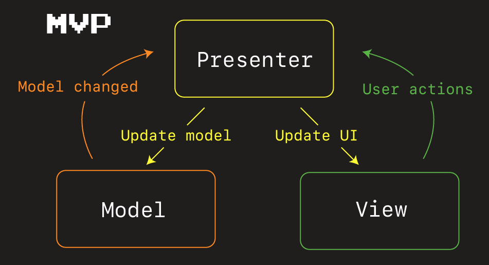
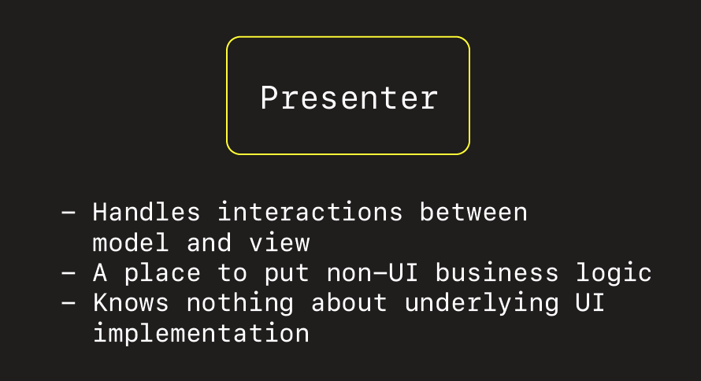

# Model View Presenter







## Simple Example


```swift
//
//  ViewController.swift
//  TargetActionUnitTests
//
//  Created by Jonathan Rasmusson (Contractor) on 2020-05-08.
//  Copyright © 2020 Jonathan Rasmusson. All rights reserved.
//

import UIKit

///
/// Model - Application data the is view agnostic.
///
///     This is business data. That has no concept of any particular view or how it will be used.
///     Account, User, Game. Often retrieved and populated from external service.
///
struct Game {
    let name: String
    let year: String
    let author: String
}

///
/// View - What the user sees. `UIView` and `UIViewController` in iOS.
///

/// A UI friendly version of our Model data for this view.
struct GameViewData {
    let name: String
}

class ViewController: UIViewController {

    var button = makeButton(withText: "Start Game")
    var label = makeLabel(withTitle: "Paused")

    lazy var presenter = Presenter(with: self)

    override func viewDidLoad() {
        super.viewDidLoad()
        layout()
    }

    func layout() {
        button.addTarget(self, action: #selector(startGame(sender:)), for: .primaryActionTriggered)

        view.addSubview(button)
        view.addSubview(label)

        button.centerXAnchor.constraint(equalTo: view.centerXAnchor).isActive = true
        button.centerYAnchor.constraint(equalTo: view.centerYAnchor).isActive = true

        label.centerXAnchor.constraint(equalTo: view.centerXAnchor).isActive = true
        label.topAnchor.constraint(equalToSystemSpacingBelow: button.bottomAnchor, multiplier: 3).isActive = true
    }

    @objc func startGame(sender: Any?) {
        presenter.startGame()
    }
}

///
///  Presenter - A mediator between the model the view.
///
///         The presenter takes events from the model and the view, and translates them
///     each into actions the other can understand. For example, business data may need to be
///     translated into view specific data the UI can understand (i.e. Game -> GameViewData).

class Presenter {

    weak var view: PresenterView?

    init(with view: PresenterView) {
        self.view = view
    }

    let spaceInvaders = Game(name: "Space Invaders", year: "1978", author: "Tomohiro Nishikado")

    @objc func startGame() {
        let game = GameViewData(name: spaceInvaders.name)
        view?.updateGame(game)
    }
}

///
/// A UIKit agnostic protocol to talk back to the view.
///
///     The Presenter needs a way to talk back to the View and issue it commands.
///     This protocol is purposefully UIKit agnostic. So it has no dependencies
///     on underlying UI implementations.
///
protocol PresenterView: AnyObject {
    func updateGame(_ model: GameViewData)
}

extension ViewController: PresenterView {

    func updateGame(_ model: GameViewData) {
        label.text = model.name
        self.view.backgroundColor = .yellow
    }

}

///
/// Factories
///

func makeButton(withText text: String) -> UIButton {
    let button = UIButton()
    button.translatesAutoresizingMaskIntoConstraints = false
    button.setTitle(text, for: .normal)
    button.titleLabel?.adjustsFontSizeToFitWidth = true
    button.contentEdgeInsets = UIEdgeInsets(top: 8, left: 16, bottom: 8, right: 16)
    button.backgroundColor = .systemBlue
    button.layer.cornerRadius = 8
    return button
}

func makeSymbolButton(systemName: String, target: Any, selector: Selector) -> UIButton {
    let configuration = UIImage.SymbolConfiguration(scale: .large)
    let image = UIImage(systemName: systemName, withConfiguration: configuration)

    let button = UIButton()
    button.translatesAutoresizingMaskIntoConstraints = false
    button.addTarget(target, action: selector, for: .primaryActionTriggered)
    button.setImage(image, for: .normal)
    button.imageView?.contentMode = .scaleAspectFit

    return button
}

func makeLabel() -> UILabel {
    return makeLabel(withTitle: "")
}

func makeLabel(withTitle title: String) -> UILabel {
    let label = UILabel()
    label.translatesAutoresizingMaskIntoConstraints = false
    label.text = title
    label.textAlignment = .center
    label.textColor = .black
    label.numberOfLines = 0
    label.adjustsFontSizeToFitWidth = true

    return label
}
```

## More Complex

This example shows one of two screens depending on how many users are created in the `UserService` class.


```swift
import UIKit

///
/// Model
///
struct User {
    let firstName: String
    let lastName: String
    let age: Int
}

class UserService {

    func getUsers(callBack: @escaping ([User]) -> Void){
//        let users = [User(firstName: "Kevin", lastName: "Flynn", age: 36),
//                     User(firstName: "Alan", lastName: "Bradley", age: 24),
//                     User(firstName: "Ed", lastName: "Dilinger", age: 39)
//                    ]
        let users = [User]()

        let dispatchTime = DispatchTime.now() + Double(Int64(0.1 * Double(NSEC_PER_SEC))) / Double(NSEC_PER_SEC)
        DispatchQueue.main.asyncAfter(deadline: dispatchTime, execute: {
            callBack(users)
        })
    }
}

///
/// View
///

class ViewController: UIViewController {

    lazy var userPresenter = UserPresenter(userService: UserService(), userView: self)

    let cellId = "mvpCellId"
    var tableView = UITableView()
    var usersToDisplay = [UserViewData]()

    override func viewDidLoad() {
        super.viewDidLoad()

        tableView.dataSource = self
        tableView.register(UITableViewCell.self, forCellReuseIdentifier: cellId)

        userPresenter.getUsers()
    }

    override func loadView() {
        view = tableView
    }
}

extension ViewController: UITableViewDataSource {

    func tableView(_ tableView: UITableView, cellForRowAt indexPath: IndexPath) -> UITableViewCell {
        let cell = UITableViewCell(style: UITableViewCell.CellStyle.subtitle, reuseIdentifier: cellId)

        let userViewData = usersToDisplay[indexPath.row]
        cell.textLabel?.text = userViewData.name
        cell.detailTextLabel?.text = userViewData.age

        return cell
    }

    func tableView(_ tableView: UITableView, numberOfRowsInSection section: Int) -> Int {
        return usersToDisplay.count
    }
}

extension ViewController: UserView {

    func setUsers(users: [UserViewData]) {
        usersToDisplay = users
        tableView.reloadData()
    }

    func setEmptyUsers() {
        view.backgroundColor = .systemRed
    }
}


///
/// Presenter
///

// UI friendly model for the view.
struct UserViewData {
    let name: String
    let age: String
}

// A UIKit agnostic protocol to talk to the View.
protocol UserView: AnyObject {
    func setUsers(users: [UserViewData])
    func setEmptyUsers()
}

class UserPresenter {

    private let userService: UserService
    weak var userView: UserView?

    init(userService: UserService, userView: UserView) {
        self.userService = userService
        self.userView = userView
    }

    func getUsers(){

        userService.getUsers{ [weak self] users in
            if users.count == 0 {
                self?.userView?.setEmptyUsers()
            } else {
                let mappedUsers = users.map {
                    return UserViewData(name: "\($0.firstName) \($0.lastName)", age: "\($0.age) years")
                }
                self?.userView?.setUsers(users: mappedUsers)
            }
        }
    }
}
```