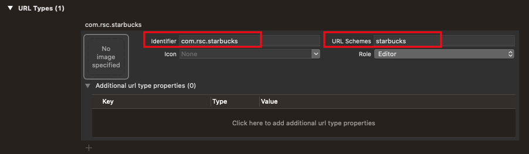
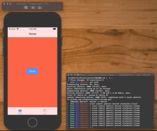

# Deep Linking

Deep Links are how external users deep can navigate into your app with a URL. The steps for enabling deep linking in your app are to:

1. Add a URL scheme.
2. Define your deep links.
3. Handle them.
4. Test

## Adding a URL scheme

Open up your project and go to Target > Info > URL Types and add the following:



## Define your deep links

We are going to support two deep links into the app:

- starbucks://scan
- starbucks://home

And we will represent the `host` part of the URL in an `enum`.

**DeepLink.swift**

```swift
import Foundation

enum DeepLink: String {
    case home
    case scan
}
```

## Handle URLs

To handle the URL we need to go into our `AppDelegate.swift` and parse the incoming request, and convert it into a `DeepLink` that we can hand off to our `MainViewController` for processing.

**AppDelegate.swift**

```swift
    func application(_ app: UIApplication, open url: URL, options: [UIApplication.OpenURLOptionsKey : Any] = [:]) -> Bool {
        /*
         <scheme>://<host>
         starbucks://home
         starbucks://scan
         */
    
        // Process the URL.
        guard let components = NSURLComponents(url: url, resolvingAgainstBaseURL: true),
              let host = components.host else {
            print("Invalid URL")
            return false
        }
                
        print("components: \(components)")
        
        // Create the deep link
        guard let deeplink = DeepLink(rawValue: host) else {
            print("Deeplink not found: \(host)")
            return false
        }

        // Hand off to mainViewController
        mainViewController.handleDeepLink(deeplink)
        
        return true
    }
```

Once in the `MainViewController` with the deeplink we can do whatever we want. Here we just manually navigate to the view controller in the tab bar we want to present.

**MainViewController.swift**

```swift
// MARK: Deep Link

extension MainViewController {
    
    /*
     Could fire up the responder chain, or navigate manually.
     */
    func handleDeepLink(_ deepLink: DeepLink) {
        switch deepLink {
        case .home:
            presentTabBar(withIndex: 0)
        case .scan:
            presentTabBar(withIndex: 1)

        }
    }
}
```

## Test

You can try deeplinking into your app by firing up Safari in your simulator and enter your URL in there (i.e. `starbucks://home`).

Or an even better way is to execute deeplinks from the command line while your simulator is running with this command here:

`xcrun simctl openurl booted starbucks://home`
`xcrun simctl openurl booted starbucks://scan`



## Example

See Demo directory for full source.

### Links that help

- [Defining URL Schemes Apple](https://developer.apple.com/documentation/xcode/allowing_apps_and_websites_to_link_to_your_content/defining_a_custom_url_scheme_for_your_apps)
- [Universal Links](https://developer.apple.com/ios/universal-links/)
- [Deep Links vs Universal Links](https://medium.com/wolox/ios-deep-linking-url-scheme-vs-universal-links-50abd3802f97)

