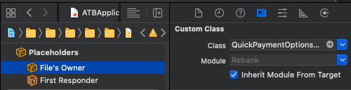
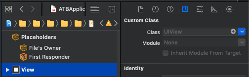
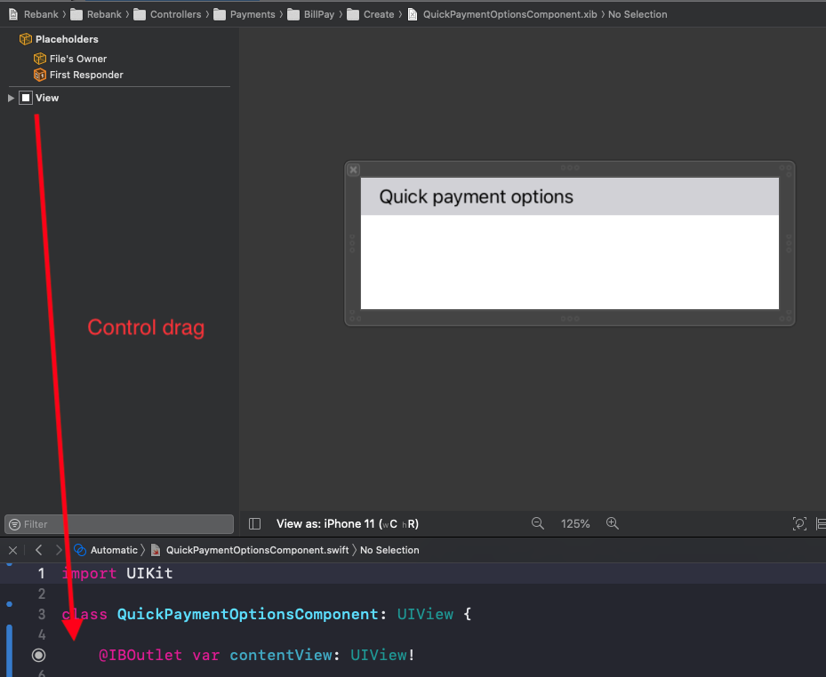

# Working with Nibs

Nibs (.nib) are views Interface builder uses to design and layout views in Xcode. The name is a bit confusing because the 'N' stands for Next as in Steve Jobs old company that Apple bought, but there are represented in XCode today as .xib where the 'X' stands for XML which is how they are represented in Xcode today. 

## Loading Nib into View Controller

Simplest thing you can do is create a nib and then associated it with a View Controller.

- Create the nib (same name as view controller).
- Set it's File's Owner to the `ViewController`.
- Point the File's Owner `view` to the nib view


## Making a Nib IBDesignable

You can make a Nib appear in Interface Builder (IB) with designable attributes by doing the following.
Create your new nib

- Create nib (i.e. `RedView.xib`).
- Create nib view (i.e. `RedView.swift`).
- Associate nib with view.

Then add it to your parent nib as a view by:

- Adding a plain `View` control to the parent
- Associate the plan `View` to your newly create nib view 

### Create your new nib

Create a plain old nib.


Create the view backing the nib. Make it `IBDesignable` and give it an intrinsic content size to simplify Auto Layout constraints.


```swift
import UIKit

@IBDesignable
class RedView: UIView {
    
    @IBInspectable var myColor: UIColor = .systemRed
    
    override func awakeFromNib() {
        super.awakeFromNib()
        backgroundColor = myColor
    }
    
    override var intrinsicContentSize: CGSize {
        return CGSize(width: 100, height: 100)
    }
}
```


Associate the view with the nib.


Your nib is now good to go.

### Add it your your parent

To add your newly created nib to your parent, drag out a plain old `View` onto your parent nib canvas. Give it some constraints (but don't worry about size).


Then associate this view with the newly created nib view created above.


This will automatically detect that it is `@IBDesignable`, use it's intrinsic content size, and layout it out.


## How to load a nib programmatically

When you want to compose nibs into other nibs, you need to load them manually. Going through the same steps we went through before to create a `RedView`, let's create a `InnerView` and add it programmatically to the `RedView`.

Create a `InnerView.xib` and hook it up to it's `InnerView.swift`.

```swift
import UIKit

class InnerView: UIView {
        
    override func awakeFromNib() {
        super.awakeFromNib()
    }
    
    override var intrinsicContentSize: CGSize {
        return CGSize(width: 200, height: 100)
    }
}
```


Then modify `RedView.swift` to load the `InnerView.xib` manually and lay it out using Auto Layout.

**RedView.swift**

```swift
import UIKit

@IBDesignable
class RedView: UIView {
    
    @IBInspectable var myColor: UIColor = .systemRed
    
    var innerView: InnerView!
    
    override func awakeFromNib() {
        super.awakeFromNib()
        backgroundColor = myColor
        
        innerView = Bundle(for: InnerView.self).loadNibNamed("\(InnerView.self)", owner: self)![0] as? InnerView
        
        translatesAutoresizingMaskIntoConstraints = false
        innerView.translatesAutoresizingMaskIntoConstraints = false
        
        addSubview(innerView)
        
        NSLayoutConstraint.activate([
            innerView.widthAnchor.constraint(equalTo: widthAnchor),
            innerView.topAnchor.constraint(equalToSystemSpacingBelow: bottomAnchor, multiplier: 2),
        ])
    }
    
    override var intrinsicContentSize: CGSize {
        return CGSize(width: 100, height: 100)
    }
}
```

Now we have a nib within a nib loaded and laid out programmatically.


## Another way to add a Nib programmatically

### The Nib 

- Create your nib
- Create your backing view
- Associate the view with the xib
 - File’s Owner
 - Custom Class

Then add the xib’s view as a contentView outlet to the backing view. And lay it out like any view (going to the edges) in the backing view

```swift
import UIKit
 
@IBDesignable class AwesomeView: UIView {
    
    @IBOutlet var contentView: UIView!
    
    override init(frame: CGRect) {
        super.init(frame: frame)
        initNib()
    }
    
    required init?(coder aDecoder: NSCoder) {
        super.init(coder: aDecoder)
        initNib()
    }
    
    func initNib() {
        let bundle = Bundle(for: AwesomeView.self)
        bundle.loadNibNamed("AwesomeView", owner: self, options: nil)
        
        addSubview(contentView)
 
        // auto layout
        contentView.translatesAutoresizingMaskIntoConstraints = false
        contentView.topAnchor.constraint(equalTo: self.topAnchor).isActive = true
        contentView.rightAnchor.constraint(equalTo: self.rightAnchor).isActive = true
        contentView.bottomAnchor.constraint(equalTo: self.bottomAnchor).isActive = true
        contentView.leftAnchor.constraint(equalTo: self.leftAnchor).isActive = true
 
        // autoresize mask
        // contentView.frame = bounds
        // contentView.autoresizingMask = [.flexibleHeight, .flexibleWidth]
        
        backgroundColor = .systemRed
    }
    
    override var intrinsicContentSize: CGSize {
        return CGSize(width: 100, height: 100)
    }
}
``` 

Nib is now ready to go.

### The Parent Nib / ViewController

To add the nib to the parent nib / view controller:

- Drag a View onto VC storyboard
- Set its constraints
- Associate UIView with xib via Custom Class
- Create outlet for xib into ViewController via control drag

```swift
import UIKit

class ViewController: UIViewController {

    @IBOutlet weak var awesomeView: AwesomeView!
    
    override func viewDidLoad() {
        super.viewDidLoad()
        // Do any additional setup after loading the view.
    }
}
```

Run 


## Apple Documentation notes

Xibs

- designed for working with Views
- is an object graph 
- containing views and relationships

File's Owner

- this is a placeholder that you set when you load your nib
- it is the controller for the nib and it receives all the events
- typically you use outlets in the File's Owner to reference objects in the nib

Each View Controllers Manages its Own Nib File

- UIViewController support the automatically loading of their own associated nib file

Loading Nib Files Programmatically

- NSBundle supports loading of nib files
- loadNibNamed:owner:options: instance method

## Another way to load a nib in a View Controller

### The nib

- Create your nib
- Create your backing view
- Associated the view with the xib via its `File's Owner`



- Make sure the class on the root is the default `UIView`



Then add the xib’s view as a contentView outlet



And lay it out like any view (going to the edges) in the backing view

```swift
import UIKit
 
@IBDesignable class QuickPaymentOptionsComponent: UIView {
    
    @IBOutlet var contentView: UIView!
    
    override init(frame: CGRect) {
        super.init(frame: frame)
        initNib()
    }
    
    required init?(coder aDecoder: NSCoder) {
        super.init(coder: aDecoder)
        initNib()
    }
    
    func initNib() {
        let bundle = Bundle(for: QuickPaymentOptionsComponent.self)
        bundle.loadNibNamed("QuickPaymentOptionsComponent", owner: self, options: nil)
        
        addSubview(contentView)
 
        // auto layout
        contentView.translatesAutoresizingMaskIntoConstraints = false
        contentView.topAnchor.constraint(equalTo: self.topAnchor).isActive = true
        contentView.rightAnchor.constraint(equalTo: self.rightAnchor).isActive = true
        contentView.bottomAnchor.constraint(equalTo: self.bottomAnchor).isActive = true
        contentView.leftAnchor.constraint(equalTo: self.leftAnchor).isActive = true
 
        // autoresize mask
        // contentView.frame = bounds
        // contentView.autoresizingMask = [.flexibleHeight, .flexibleWidth]
        
        backgroundColor = .systemRed
    }
    
    override var intrinsicContentSize: CGSize {
        return CGSize(width: 100, height: 100)
    }
}
```

Nib is now ready to go.

### Parent xib / View Controller

To hook up your custom nib into a parent view controller:

- Drag a `UIView` onto VC storyboard
- Set its constraints
- Associate UIView with xib via Custom Class
- Drag an outlet for xib into ViewController via control drag

## TableViewCells

There are some gotchas with `UITableViewCells` I don't completely understand. But the following works.

**QuickPaymentCell.swift**

```swift
import UIKit

class QuickPaymentCell: UITableViewCell {

    @IBOutlet var titleLabel: UILabel!
    
    override func awakeFromNib() {
        super.awakeFromNib()
        setupStyle()
    }

    func setupStyle() {
        titleLabel.textColor = .reBankGrey
    }
}
```

**ParentView/ViewController**

```swift
tableView.register(QuickPaymentCell.self) // Note: No cell resuseIdentifier used

func tableView(_ tableView: UITableView, cellForRowAt indexPath: IndexPath) -> UITableViewCell {
    let cell: QuickPaymentCell = tableView.dequeueResuableCell(for: indexPath)
    cell.titleLabel.text = games[indexPath.row]
    return cell
}
```

This method is key to triggering `awakeFromNib` but is nice because it saves a tonne of code.

### Trouble Shooting

- [Stack Overflow - EXC_BAD_ACCESS on custom UIView with custom XIB](https://stackoverflow.com/questions/19355104/exc-bad-access-on-custom-uiview-with-custom-xib)
- [Custom xibs](https://cheesecakelabs.com/blog/building-custom-ui-controls-xcodes-interface-builder/)

### Links that help
* [Apple Docs Nib Files](https://developer.apple.com/library/archive/documentation/Cocoa/Conceptual/LoadingResources/CocoaNibs/CocoaNibs.html)
