# Working with Nibs

Nibs (.nib) are views Interface builder uses to design and layout views in Xcode. The name is a bit confusing because the 'N' stands for Next as in Steve Jobs old company that Apple bought, but there are represented in XCode today as .xib where the 'X' stands for XML which is how they are represented in Xcode today. 

## Nibs into a View Controller

Simplest thing you can do is create a nib and then associated it with a View Controller.

- Create the nib (same name as view controller).
- Set it's File's Owner to the `ViewController`.
- Point the File's Owner `view` to the nib view
- Load the `ViewController` in the AppDelate like any other programatic view controller.


## Nibs into a View

### Load view in the nib

- Create a nib
- Create a class
- Make nib free form

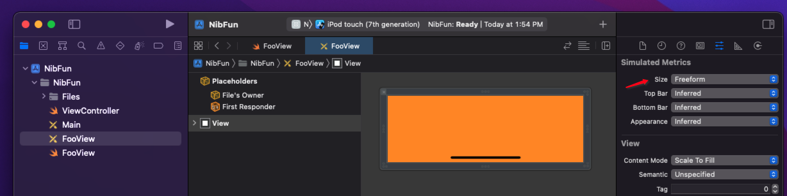

- Add this code to the class

```swift
import UIKit

class FooView: UIView {

    @IBOutlet var contentView: UIView!

    override init(frame: CGRect) {
        super.init(frame: frame)
        commonInit()
    }

    required init?(coder aDecoder: NSCoder) {
        super.init(coder: aDecoder)
        commonInit()
    }

    private func commonInit() {
        let bundle = Bundle(for: FooView.self)
        bundle.loadNibNamed(String(describing: FooView), owner: self, options: nil)
        addSubview(contentView)

        contentView.translatesAutoresizingMaskIntoConstraints = false
        contentView.topAnchor.constraint(equalTo: topAnchor).isActive = true
        contentView.rightAnchor.constraint(equalTo: rightAnchor).isActive = true
        contentView.bottomAnchor.constraint(equalTo: bottomAnchor).isActive = true
        contentView.leftAnchor.constraint(equalTo: leftAnchor).isActive = true
    }
}
```

Set the nib `Fileowner` to the class.

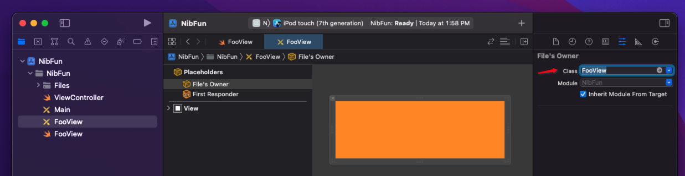

- Add the content view.

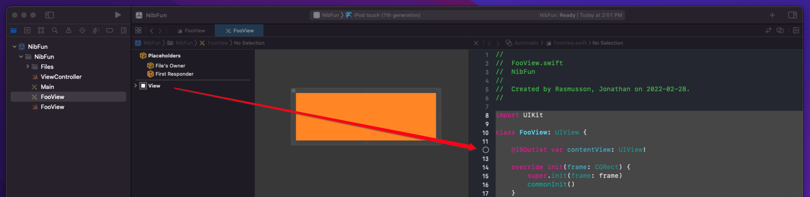

With this method, the nib is hosting the view. Can now load in a view controller by dragging out a plain view, and assigning it’s custom class to the nib.

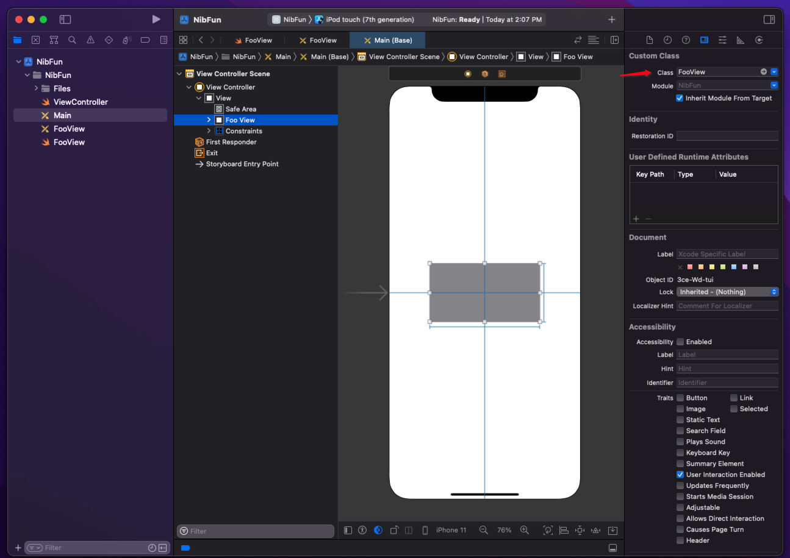

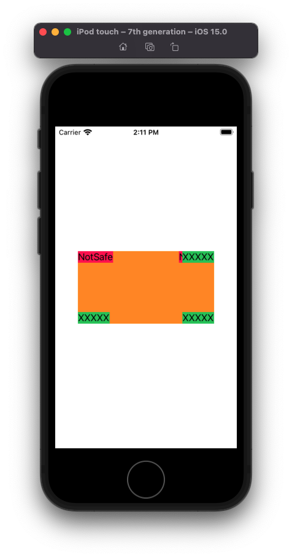

Original nib with safe area and nonsafe area labels.

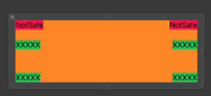

### Discussion

#### Pin the content view

If you don't pin the inner `contentView` the nib won't work with auto layout. It will use its native nib size to show on screen. And you don't be able to lay it out nicely with others.

#### Safe Area guide don't matter

Notice how when it layed out the nib it smushed the safe and non-safe labels together. Just be mindful when doing layout whether you are pinning to a safe or non-safe area.

It may not matter, but you will be confused if you are counting in certain behavior and may find it is not there

## Nibs Programatically

- Create the nib.
- Create the class.
- Set the File's Owner
- Set the Custom Class on the View
- Load in view controller programmatically

Create the nib and the class.


- Then also set the type on the view in the nib to the custom class.

When creating the class **don't use a contentView**. Instead load like this.

```swift
class PaymentMethodTile: UIView {

    @IBOutlet var headerLabel: UILabel!
    
    override func awakeFromNib() {
        super.awakeFromNib()
    }
}
```

Set the `Custom Class` on the `View` in the nib too.


When dragging outlets out into your nib, make sure you set the `IBOutlet` property to the view and not the file owner when control dragging outlets into the file. If you don't do this you will get keycode non-compliance errors.


Programmatically load in view controller like this.

```swift
import UIKit

class ViewController: UIViewController {

    lazy var tile: PaymentMethodTile! = { ViewController.makePaymentMethodTile() }()

    override func viewDidLoad() {
        super.viewDidLoad()
    }
    
    override func viewWillAppear(_ animated: Bool) {
        super.viewWillAppear(animated)
        view.addSubview(tile)
        
        NSLayoutConstraint.activate([
            tile.centerXAnchor.constraint(equalTo: view.centerXAnchor),
            tile.centerYAnchor.constraint(equalTo: view.centerYAnchor),
        ])
    }

    static func makePaymentMethodTile() -> PaymentMethodTile? {
        let bundle = Bundle(for: PaymentMethodTile.self)
        let tile = bundle.loadNibNamed("PaymentMethodTile", owner: nil, options: nil)?.first as! PaymentMethodTile
        tile.translatesAutoresizingMaskIntoConstraints = false

        return tile
    }
}
```


## Making a Nib IBDesignable

You can make a Nib appear in Interface Builder (IB) with designable attributes by doing the following.
Create your new nib

- Create nib (i.e. `RedView.xib`).
- Create nib view (i.e. `RedView.swift`).
- Associate nib with view.

Then add it to your parent nib as a view by:

- Adding a plain `View` control to the parent
- Associate the plan `View` to your newly create nib view 

### Create your new nib

Create a plain old nib.


Create the view backing the nib. Make it `IBDesignable` and give it an intrinsic content size to simplify Auto Layout constraints.


```swift
import UIKit

@IBDesignable
class RedView: UIView {
    
    @IBInspectable var myColor: UIColor = .systemRed
    
    override func awakeFromNib() {
        super.awakeFromNib()
        backgroundColor = myColor
    }
    
    override var intrinsicContentSize: CGSize {
        return CGSize(width: 100, height: 100)
    }
}
```


Associate the view with the nib.


Your nib is now good to go.

### Add it your your parent

To add your newly created nib to your parent, drag out a plain old `View` onto your parent nib canvas. Give it some constraints (but don't worry about size).


Then associate this view with the newly created nib view created above.


This will automatically detect that it is `@IBDesignable`, use it's intrinsic content size, and layout it out.


## TableViewCells

There are some gotchas with `UITableViewCells`. Using the following code you can more conveniently load nibs and access their reuse identifiers as follows.

Create the nib as a `UITableViewCell`:

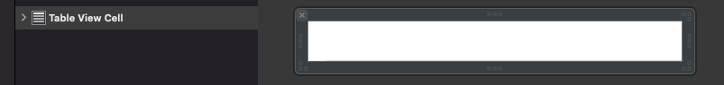

Set its `FileOwner`:

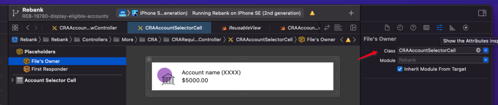

Set its `Classname`:

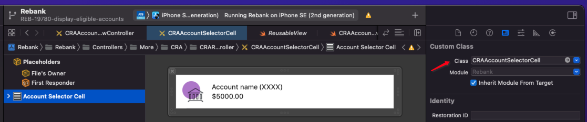

Create the class:

```swift
import UIKit

class CRAAccountSelectorCell: UITableViewCell {

    override func awakeFromNib() {
        super.awakeFromNib()
        setupStyle()
    }

    func setupStyle() {
    }
}
```

Import the following reuse helper:

**ReusableView.swift**

```swift
import UIKit

protocol ReusableView: class {}
protocol NibLoadableView: class {}

extension ReusableView {
    static var reuseID: String { return "\(self)" }
}

extension NibLoadableView {
    static var nibName: String { return "\(self)" }
}

extension UITableViewCell: ReusableView, NibLoadableView {}
extension UICollectionViewCell: ReusableView, NibLoadableView {}
extension UITableViewHeaderFooterView: ReusableView, NibLoadableView {}

extension UITableView {
    func dequeueResuableCell<T: UITableViewCell>(for indexPath: IndexPath) -> T {
        guard let cell = dequeueReusableCell(withIdentifier: T.reuseID, for: indexPath) as? T else {
            fatalError("Could not dequeue cell with identifier: \(T.reuseID)")
        }
        return cell
    }

    func dequeueResuableHeaderFooter<T: UITableViewHeaderFooterView>() -> T {
        guard let headerFooter = dequeueReusableHeaderFooterView(withIdentifier: T.reuseID) as? T else {
            fatalError("Could not dequeue header footer view with identifier: \(T.reuseID)")
        }
        return headerFooter
    }

    func register<T: ReusableView & NibLoadableView>(_: T.Type) {
        let nib = UINib(nibName: T.nibName, bundle: nil)
        register(nib, forCellReuseIdentifier: T.reuseID)
    }

    func registerHeaderFooter<T: ReusableView & NibLoadableView>(_: T.Type) {
        let nib = UINib(nibName: T.nibName, bundle: nil)
        register(nib, forHeaderFooterViewReuseIdentifier: T.reuseID)
    }
}
```

Use it in a view controller like this:


```swift
tableView.register(QuickPaymentCell.self) // Note: No cell resuseIdentifier used

func tableView(_ tableView: UITableView, cellForRowAt indexPath: IndexPath) -> UITableViewCell {
    let cell: QuickPaymentCell = tableView.dequeueResuableCell(for: indexPath)
    cell.titleLabel.text = games[indexPath.row]
    return cell
}
```

## Loading TableCell nib in a unit test

Load it via the bundle like this - will load and setup all the outlets.

```swift
    let bundle = Bundle(for: ReceivedTableCell.self)
    cell = bundle.loadNibNamed("ReceivedTableCell", owner: nil, options: nil)?.first as! ReceivedTableCell

```

## Different ways to load nibs

Both these work. Not sure which one is better.

```swift
override func awakeFromNib() {
    super.awakeFromNib()
    let bundle = Bundle(for: BadgeLabel.self)
    bundle.loadNibNamed(String(describing: BadgeLabel.self), owner: self, options: nil)
    addSubview(contentView)
}

override func awakeFromNib() {
    super.awakeFromNib()
    let bundle = Bundle.init(for: BadgeLabel.self)
    bundle.loadNibNamed("BadgeLabel", owner: self, options: nil)
    addSubview(contentView)
}
```

## Other things to know

How you size your nib in interface builder matters. If you give your nib a frame size of 113x115, that is how it is going to draw it on screen (regardless of auto layout).

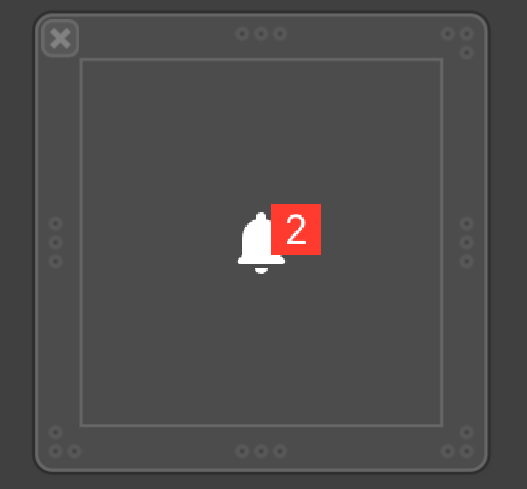


If you want your nib to appear the right size, you need to draw it to the size your want (i.e. 48x48).

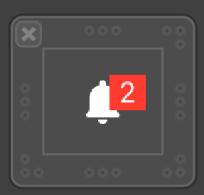
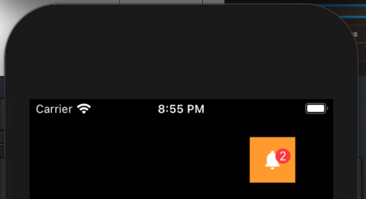


### Trouble Shooting

- [Stack Overflow - EXC_BAD_ACCESS on custom UIView with custom XIB](https://stackoverflow.com/questions/19355104/exc-bad-access-on-custom-uiview-with-custom-xib)
- [Custom xibs](https://cheesecakelabs.com/blog/building-custom-ui-controls-xcodes-interface-builder/)

### Links that help
* [Apple Docs Nib Files](https://developer.apple.com/library/archive/documentation/Cocoa/Conceptual/LoadingResources/CocoaNibs/CocoaNibs.html)
