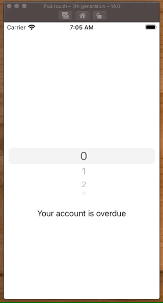
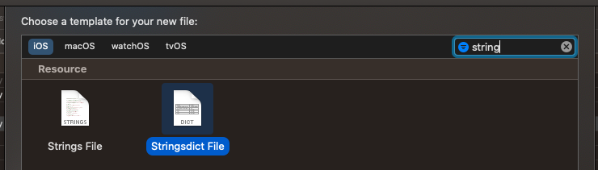
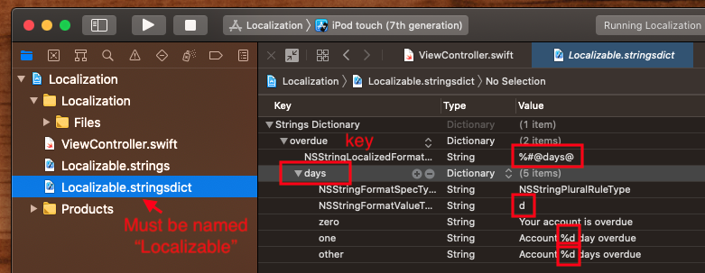

# Pluralization

Pluralization gives you the ability to pluralize certain phrases based on the number of items that appear in that phrase.



It works by creating a `Localizable.stringsdict` where you configure a `key` to be localized in the app, along with the pluralization rules around how you would like the phrase to appear.

For example, if we wanted to pluralize the number of days an account was overdue, we would create and configure a `Localizable.stringsdict` (it has to be named `Localizable`).



Configure it's pluralization keys. You don't need all the keys. But other is required.



And then call from the app specifying the `key` along with the dynamic parameters that appear in the message.

```swift
label.text = String.localizedStringWithFormat(NSLocalizedString("overdue", comment: "Overdue warning message"), 0)
// or
let localized = NSLocalizedString("overdue", comment: "xxx")
let formatted = String(format: localized, days[row])
label.text = formatted
```

## Example

**ViewController.swift**

```swift
//
//  ViewController.swift
//  Localization
//
//  Created by jrasmusson on 2020-12-16.
//

import UIKit

class ViewController: UIViewController {

    let stackView = UIStackView()
    let picker = UIPickerView()
    let label = UILabel()
    
    let days = [0, 1, 2, 3]
    
    override func viewDidLoad() {
        super.viewDidLoad()
        style()
        layout()
    }
}

extension ViewController {
    
    func style() {
        stackView.translatesAutoresizingMaskIntoConstraints = false
        stackView.axis = .vertical
        stackView.alignment = .center
        
        picker.translatesAutoresizingMaskIntoConstraints = false
        self.picker.delegate = self
        self.picker.dataSource = self
        
        label.translatesAutoresizingMaskIntoConstraints = false
        label.text = String.localizedStringWithFormat(NSLocalizedString("overdue", comment: "Overdue warning message"), 0)
        
        //        label.text = NSLocalizedString("overdue", comment: "Overdue warning message") // regular localized string
    }
    
    func layout() {
        stackView.addArrangedSubview(picker)
        stackView.addArrangedSubview(label)
        view.addSubview(stackView)
        
        NSLayoutConstraint.activate([
            view.centerXAnchor.constraint(equalTo: stackView.centerXAnchor),
            view.centerYAnchor.constraint(equalTo: stackView.centerYAnchor),
        ])
    }
}

extension ViewController: UIPickerViewDelegate, UIPickerViewDataSource {

    func numberOfComponents(in pickerView: UIPickerView) -> Int {
        return 1
    }

    func pickerView(_ pickerView: UIPickerView, numberOfRowsInComponent component: Int) -> Int {
        return days.count
    }

    func pickerView(_ pickerView: UIPickerView, titleForRow row: Int, forComponent component: Int) -> String? {
        return String(days[row])
    }
    
    func pickerView(_ pickerView: UIPickerView, didSelectRow row: Int, inComponent component: Int) {
        let localized = NSLocalizedString("overdue", comment: "xxx")
        let formatted = String(format: localized, days[row])
        label.text = formatted
        print(formatted)
    }
}
```

The key thing to notice here is that when you create your localized string:

```swift
let localized = NSLocalizedString("overdue", comment: "xxx")
let formatted = String(format: localized, days[row])
```

The `key` is `overdue` and that returns the entire sentences from the dictionary:

- `0` = `Your account is overdue`
- `1` = `Account %d day overdue`
- `other` = `Account %d days overdue`

So the whole sentence gets retured from the dict. Not just the word `day` or `days`.

**Localizable.stringsdict**

```swift
<?xml version="1.0" encoding="UTF-8"?>
<!DOCTYPE plist PUBLIC "-//Apple//DTD PLIST 1.0//EN" "http://www.apple.com/DTDs/PropertyList-1.0.dtd">
<plist version="1.0">
<dict>
	<key>overdue</key>
	<dict>
		<key>NSStringLocalizedFormatKey</key>
		<string>%#@days@</string>
		<key>days</key>
		<dict>
			<key>NSStringFormatSpecTypeKey</key>
			<string>NSStringPluralRuleType</string>
			<key>NSStringFormatValueTypeKey</key>
			<string>d</string>
			<key>zero</key>
			<string>Your account is overdue</string>
			<key>one</key>
			<string>Account %d day overdue</string>
			<key>other</key>
			<string>Account %d days overdue</string>
		</dict>
	</dict>
</dict>
</plist>
```


### Links that help

- [Video](https://youtu.be/djvG2RVUeBA)
- [Apple docs](https://help.apple.com/xcode/mac/current/#/deve2bc11fab)
- [Another example](https://www.hackingwithswift.com/example-code/uikit/how-to-localize-your-ios-app)

