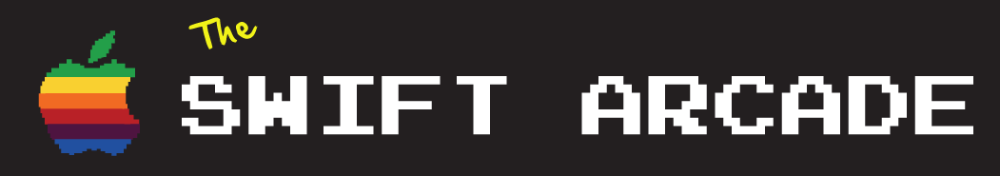

Collection of demos from the [Swift Arcade YouTube channel.](https://www.youtube.com/channel/UCxnCA5FBYRCFgIZWD0CKCVg?view_as=subscriber)

## Animations 🍄

- [Constraint Based](Animation/Constraint-Based/README.md)
- [Core Graphics Intro](Animation/CoreGraphicsIntro/README.md)
- [Core Animation Intro](Animation/CoreAnimation/Intro/README.md)
- [Gradients](Animation/CoreAnimation/Gradients/README.md)
- [Shadows](Animation/CoreAnimation/Shadows/README.md)
- [Login Form Field](Animation/Login/README.md)
- [Skeleton Loader](Animation/Shimmer/README.md)
- [Shakey Bell](Animation/ShakeyBell/README.md)

## Weathery 🌦

- [Weathery App](Weathery/README.md)

## Starbucks ☕

- [Starbucks App](Starbucks/README.md)

## Spotify 🎵

- [Spotify Playlist](Spotify/SpotifyPlaylist/README.md)
- [Spotify Album](Spotify/SpotifyAlbum/README.md)

## Communication Patterns 🔈

- [Protocol Delegate Pattern](Communication/Protocol-Delegate.md)
- [Closures](Communication/Closures.md)
- [Responder Chain](Communication/Responder-Chain.md)
- [Key-Value Observing (KVO)](Communication/KVO.md)

## Navigation Patterns ⚓️

- [MainViewController](NavigationPatterns/MainViewController.md)

## Architecture 🏠

- [Default UIKit](Architecture/Default-UIKit.md)

## CoreData 🏢

- [Getting Started](CoreData/1-GettingStarted.md)
- [NSFetchedResultsController](CoreData/2-NSFetchedResultsController.md)
- [Codegen](CoreData/3-Codegen.md)
- [Background threads](CoreData/4-Background-Threads.md)
- [Unit Tests](CoreData/5-Unit-Tests.md)

## Design 🎨

- [Load & Retry Screens](https://github.com/jrasmusson/swift-arcade/blob/master/Design/LoadAndRetry/1-Load-And-Retry.md)
- [Bottom Sheet 1](https://github.com/jrasmusson/swift-arcade/tree/master/Design/PopupMenu)
- [Bottom Sheet 2](Design/ButtomMenuPopup/README.md)
- [Onboarding](Design/SimpleOnboarding/README.md)
- [Custom Badge](Design/CustomBadge/README.md)

## Foundation 🧱

- [NSAttributedStrings](Foundation/NSAttributedStrings/README.md)
- [Pluralization](Foundation/Pluralization/README.md)
- [Deep Linking](Foundation/Deeplink/README.md)
- [Working with Nibs](Foundation/Nibs/README.md)

## Swift 🎮

- [Functions as Variables](Swift/Funcs-as-Variables/README.md)
- [Currency Formatting](Swift/Currency-Formatting/README.md)

## UIKit 🏗

### Misc

- [UIPanGestureRecognizer](https://github.com/jrasmusson/swift-arcade/tree/master/UIKit/UIPanGestureRecognizer)

### UICollectionView

- [Flow Layout](https://github.com/jrasmusson/swift-arcade/blob/master/UIKit/UICollectionView/FlowLayout/README.md)
- [Compositional Layout](https://github.com/jrasmusson/swift-arcade/blob/master/UIKit/UICollectionView/CompositionalLayout/README.md)

### UINavigationController

- [Navigation Patterns](UIKit/UINavigationController/NavigationPatterns/Navigation-Patterns.md)
- [Large Titles](UIKit/UINavigationController/LargeTitles/README.md)

### UIScrollView

- [Understanding UIScrollView](UIKit/UIScrollView/UnderstandingUIScrollView/README.md)
- [Custom ScrollableTabView](UIKit/UIScrollView/CustomScrollTabView/README.md)

### UITableView

- [Header Footer Sections Nib](UIKit/UITableView/HeaderFooterNib/README.md)
- [Inserting Cells](UIKit/UITableView/InsertingCells/README.md)
- [Diffable Data Source](UIKit/UITableView/DiffableDataSource/README.md)
- [Moveable Cells](UIKit/UITableView/MoveableCells/README.md)
- [Swipeable Cells](UIKit/UITableView/SwipeableCells/README.md)

### UITextView

- [Emoji Blocker](UIKit/UITextView/EmojiBlocker/README.md)

### UIViewController

#### Large ViewController Strategies

- [Model View Presenter (MVP)](https://github.com/jrasmusson/swift-arcade/blob/master/UIKit/LargeViewController/MVP/README.md)

## Interview Prep

- [Cheat sheet](InterviewPrep/CheatSheet.md)
