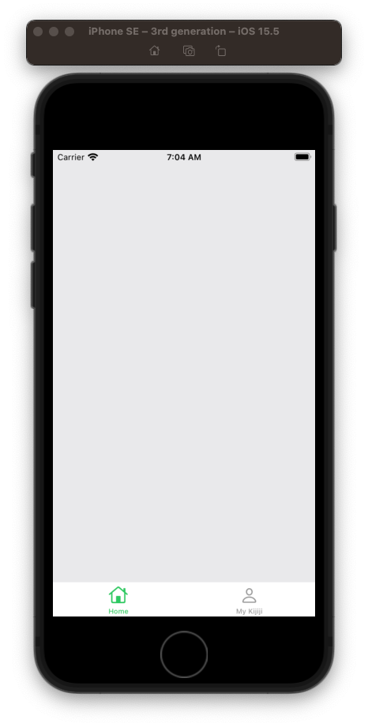
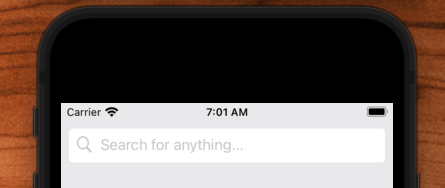
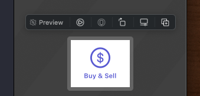
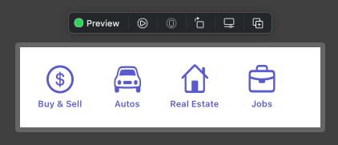
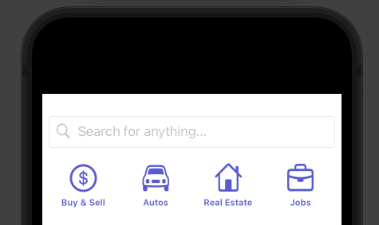
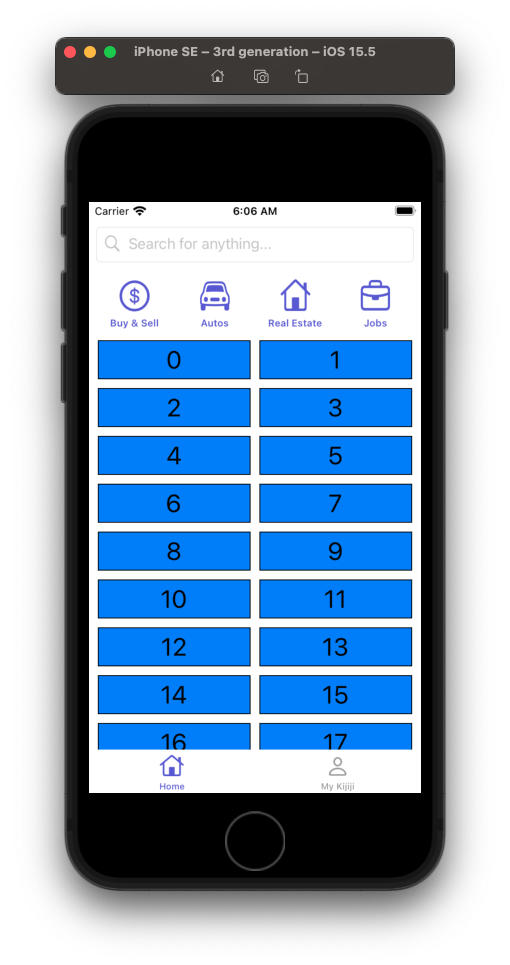
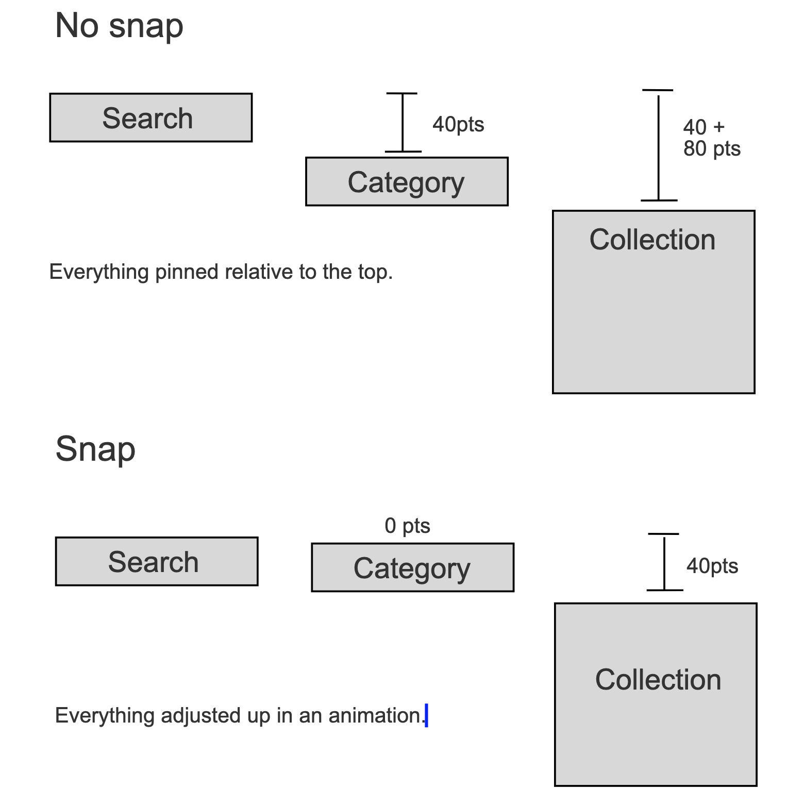
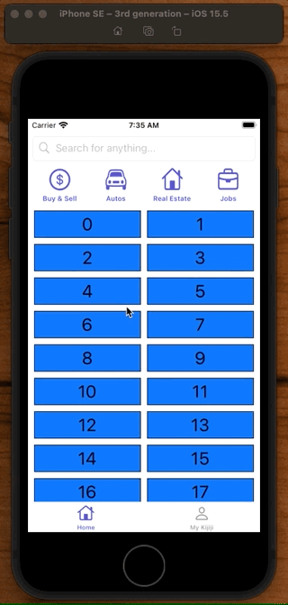

# Kijiji

## TabBar



**AppDelegate**

```swift
import UIKit

@main
class AppDelegate: UIResponder, UIApplicationDelegate {

    var window: UIWindow?

    let mainViewController = MainViewController()

    func application(_ application: UIApplication, didFinishLaunchingWithOptions launchOptions: [UIApplication.LaunchOptionsKey: Any]?) -> Bool {

        window = UIWindow(frame: UIScreen.main.bounds)
        window?.makeKeyAndVisible()
        window?.backgroundColor = .systemBackground

        window?.rootViewController = mainViewController

        return true
    }
}
```

**MainViewController**

```swift
import UIKit

class MainViewController: UITabBarController {

    override func viewDidLoad() {
        super.viewDidLoad()
        setupViews()
        setupTabBar()
    }

    private func setupViews() {
        let homeVC = HomeViewController()
        let myVC = MyKijijiViewController()

        homeVC.setTabBarItem(imageName: "house", title: "Home")
        myVC.setTabBarItem(imageName: "person", title: "My Kijiji")

        let tabBarList = [homeVC, myVC]

        viewControllers = tabBarList
    }

    private func hideNavigationBarLine(_ navigationBar: UINavigationBar) {
        let img = UIImage()
        navigationBar.shadowImage = img
        navigationBar.setBackgroundImage(img, for: .default)
        navigationBar.isTranslucent = false
    }

    private func setupTabBar() {
        tabBar.tintColor = appColor
        tabBar.isTranslucent = false
    }
}
```

**UIKit+Ext**

```swift
import UIKit

let appColor: UIColor = .systemIndigo

extension UIViewController {
    func setStatusBar() {
        let navBarAppearance = UINavigationBarAppearance()
        navBarAppearance.configureWithTransparentBackground() // to hide Navigation Bar Line also
        navBarAppearance.backgroundColor = appColor
        UINavigationBar.appearance().standardAppearance = navBarAppearance
        UINavigationBar.appearance().scrollEdgeAppearance = navBarAppearance
    }

    func setTabBarItem(imageName: String, title: String) {
        let configuration = UIImage.SymbolConfiguration(scale: .large)
        let image = UIImage(systemName: imageName, withConfiguration: configuration)
        tabBarItem = UITabBarItem(title: title, image: image, tag: 0)
    }
}
```

## SearchBar



**SearchBarView**

```swift
//
//  SearchBarView.swift
//  Kijiji
//
//  Created by jrasmusson on 2022-05-28.
//

import Foundation
import UIKit

class SearchBarView: UIView {

    let stackView = UIStackView()
    let imageView = UIImageView()
    let textField = UITextField()

    override init(frame: CGRect) {
        super.init(frame: frame)

        style()
        layout()
    }

    required init?(coder: NSCoder) {
        fatalError("init(coder:) has not been implemented")
    }

    override var intrinsicContentSize: CGSize {
        return CGSize(width: UIView.noIntrinsicMetric, height: 40)
    }
}

extension SearchBarView {

    func style() {
        translatesAutoresizingMaskIntoConstraints = false
        backgroundColor = .systemBackground
        layer.borderWidth = 1
        layer.borderColor = UIColor.secondarySystemFill.cgColor

        stackView.translatesAutoresizingMaskIntoConstraints = false
        stackView.axis = .horizontal
        stackView.spacing = 8
        stackView.backgroundColor = .systemBackground

        imageView.translatesAutoresizingMaskIntoConstraints = false
        let image = UIImage(systemName: "magnifyingglass")!.withTintColor(.tertiaryLabel, renderingMode: .alwaysOriginal)
        imageView.image = image

        textField.translatesAutoresizingMaskIntoConstraints = false
        textField.placeholder = "Search for anything..."

        layer.cornerRadius = 5
        clipsToBounds = true
    }

    func layout() {
        imageView.setContentHuggingPriority(.defaultHigh, for: .horizontal)

        stackView.addArrangedSubview(imageView)
        stackView.addArrangedSubview(textField)

        addSubview(stackView)

        NSLayoutConstraint.activate([
            stackView.topAnchor.constraint(equalToSystemSpacingBelow: topAnchor, multiplier: 1),
            stackView.leadingAnchor.constraint(equalToSystemSpacingAfter: leadingAnchor, multiplier: 1),
            trailingAnchor.constraint(equalToSystemSpacingAfter: stackView.trailingAnchor, multiplier: 1)
        ])
    }
}
```

**UIKit+Ext**

```swift
extension UIImageView {
    func addImageWith(systemName: String, tintColor: UIColor) {
        let image = UIImage(systemName: systemName)!.withTintColor(tintColor, renderingMode: .alwaysOriginal)
        self.image = image
    }
}
```

## CategoryView

Started using SwiftUI previews for quicker iterations on design:

**Preview+Ext**

```swift
//
//  PreviewExtentions.swift
//  Kijiji
//
//  Created by jrasmusson on 2022-05-29.
//

import UIKit
import SwiftUI

struct UIViewControllerPreview<ViewController: UIViewController>: UIViewControllerRepresentable {
    let viewController: ViewController

    init(_ builder: @escaping () -> ViewController) {
        viewController = builder()
    }

    // MARK: - UIViewControllerRepresentable
    func makeUIViewController(context: Context) -> ViewController {
        viewController
    }

    func updateUIViewController(_ uiViewController: ViewController, context: UIViewControllerRepresentableContext<UIViewControllerPreview<ViewController>>) {
        return
    }
}

@available(iOS 13, *)
public struct UIViewPreview<View: UIView>: UIViewRepresentable {
    public let view: View

    public init(_ builder: @escaping () -> View) {
        view = builder()
    }

    // MARK: - UIViewRepresentable
    public func makeUIView(context: Context) -> UIView {
        return view
    }

    public func updateUIView(_ view: UIView, context: Context) {
        view.setContentHuggingPriority(.defaultHigh, for: .horizontal)
        view.setContentHuggingPriority(.defaultHigh, for: .vertical)
    }
}

let deviceNames: [String] = [
    "iPhone SE",
    "iPhone 11 Pro Max",
    "iPad Pro (11-inch)"
]

//struct ViewController_Preview: PreviewProvider {
//  static var previews: some View {
//    ForEach(deviceNames, id: \.self) { deviceName in
//      UIViewControllerPreview {
//        ViewController()
//      }.previewDevice(PreviewDevice(rawValue: deviceName))
//        .previewDisplayName(deviceName)
//    }
//  }
//}

//import SwiftUI
//
//struct SimpleView_Preview: PreviewProvider {
//  static var previews: some View {
//    UIViewPreview {
//      let button = SimpleView()
//      return button
//    }.previewLayout(.sizeThatFits)
//     .padding(10)
//  }
//}
```

Stack views always want to stretch. Layed this out manually:



**CategoryItemView**

```swift
//
//  CategoryItemView.swift
//  Kijiji
//
//  Created by jrasmusson on 2022-05-29.
//

import UIKit
import SwiftUI

class CategoryItemView: UIView {

    let imageView = UIImageView()
    let label = UILabel()

    let imageName: String
    let text: String

    let width: CGFloat = 40

    init(imageName: String, text: String) {
        self.imageName = imageName
        self.text = text

        super.init(frame: .zero)

        style()
        layout()
    }

    required init?(coder: NSCoder) {
        fatalError("init(coder:) has not been implemented")
    }

    override var intrinsicContentSize: CGSize {
        return CGSize(width: width * 2, height: 60)
    }
}

extension CategoryItemView {

    func style() {
        translatesAutoresizingMaskIntoConstraints = false

        imageView.translatesAutoresizingMaskIntoConstraints = false
        imageView.addImageWith(systemName: imageName, tintColor: appColor)

        label.translatesAutoresizingMaskIntoConstraints = false
        label.textAlignment = .center
        label.font = UIFont.preferredFont(forTextStyle: .caption2).bold()
        label.adjustsFontForContentSizeCategory = true
        label.textColor = appColor
        label.text = text
    }

    func layout() {
        addSubview(imageView)
        addSubview(label)

        // imageView
        NSLayoutConstraint.activate([
            imageView.topAnchor.constraint(equalTo: topAnchor),
            imageView.centerXAnchor.constraint(equalTo: centerXAnchor),
            imageView.widthAnchor.constraint(equalToConstant: width),
            imageView.heightAnchor.constraint(equalToConstant: width)
        ])

        // label
        NSLayoutConstraint.activate([
            label.topAnchor.constraint(equalTo: imageView.bottomAnchor, constant: 4),
            label.centerXAnchor.constraint(equalTo: centerXAnchor),
            label.leadingAnchor.constraint(equalTo: leadingAnchor, constant: 4),
            trailingAnchor.constraint(equalTo: label.trailingAnchor, constant: 4)
        ])
    }
}

struct CategoryItemView_Preview: PreviewProvider {
  static var previews: some View {
    UIViewPreview {
      let view = CategoryItemView(imageName: "dollarsign.circle", text: "Buy & Sell")
      return view
    }.previewLayout(.sizeThatFits)
     .padding(10)
  }
}
```



**CategoryView**

```swift
//
//  CategoryView.swift
//  Kijiji
//
//  Created by jrasmusson on 2022-05-29.
//

import UIKit
import SwiftUI

class CategoryView: UIView {

    let stackView = UIStackView()
    let categories = [
        CategoryItemView(imageName: "dollarsign.circle", text: "Buy & Sell"),
        CategoryItemView(imageName: "car", text: "Autos"),
        CategoryItemView(imageName: "house", text: "Real Estate"),
        CategoryItemView(imageName: "briefcase", text: "Jobs"),
    ]

    override init(frame: CGRect) {
        super.init(frame: frame)

        style()
        layout()
    }

    required init?(coder: NSCoder) {
        fatalError("init(coder:) has not been implemented")
    }

    override var intrinsicContentSize: CGSize {
        return CGSize(width: UIView.noIntrinsicMetric, height: 80)
    }
}

extension CategoryView {

    func style() {
        translatesAutoresizingMaskIntoConstraints = false

        stackView.translatesAutoresizingMaskIntoConstraints = false
        stackView.axis = .horizontal
        stackView.spacing = 4
        stackView.distribution = .fillEqually
        stackView.alignment = .center

        categories.forEach { $0.translatesAutoresizingMaskIntoConstraints = false }
    }

    func layout() {
        addSubview(stackView)

        categories.forEach { stackView.addArrangedSubview($0) }

        NSLayoutConstraint.activate([
            stackView.topAnchor.constraint(equalTo: topAnchor),
            stackView.leadingAnchor.constraint(equalTo: leadingAnchor),
            stackView.trailingAnchor.constraint(equalTo: trailingAnchor),
            stackView.bottomAnchor.constraint(equalTo: bottomAnchor)
        ])
    }
}

struct CategorView_Preview: PreviewProvider {
  static var previews: some View {
    UIViewPreview {
      let view = CategoryView()
      return view
    }.previewLayout(.sizeThatFits)
     .padding(10)
  }
}
```



**HomeViewController**

```swift
//
//  HomeViewController.swift
//  Kijiji
//
//  Created by jrasmusson on 2022-05-26.
//

import UIKit
import SwiftUI

class HomeViewController: UIViewController {

    let searchBarView = SearchBarView()
    let categoryView = CategoryView()

    override func viewDidLoad() {
        super.viewDidLoad()
        style()
        layout()
    }
}

extension HomeViewController {

    func style() {
        searchBarView.translatesAutoresizingMaskIntoConstraints = false
        categoryView.translatesAutoresizingMaskIntoConstraints = false
    }

    func layout() {
        view.addSubview(searchBarView)
        view.addSubview(categoryView)

        // SearchBar
        NSLayoutConstraint.activate([
            searchBarView.topAnchor.constraint(equalToSystemSpacingBelow: view.safeAreaLayoutGuide.topAnchor, multiplier: 1),
            searchBarView.leadingAnchor.constraint(equalToSystemSpacingAfter: view.leadingAnchor, multiplier: 1),
            view.trailingAnchor.constraint(equalToSystemSpacingAfter: searchBarView.trailingAnchor, multiplier: 1)
        ])

        // CategoryView
        NSLayoutConstraint.activate([
            categoryView.topAnchor.constraint(equalToSystemSpacingBelow: searchBarView.bottomAnchor, multiplier: 1),
            categoryView.leadingAnchor.constraint(equalToSystemSpacingAfter: view.leadingAnchor, multiplier: 1),
            view.trailingAnchor.constraint(equalToSystemSpacingAfter: categoryView.trailingAnchor, multiplier: 1)
        ])
    }
}

struct HomeViewController_Preview: PreviewProvider {
    static var previews: some View {
        UIViewControllerPreview {
            HomeViewController()
        }
    }
}
```

## CollectionView

Multicolum layout is nice with collection view.



**HomeViewController**

```swift
import UIKit
import SwiftUI

class HomeViewController: UIViewController {

    enum Section {
        case main
    }

    let searchBarView = SearchBarView()
    let categoryView = CategoryView()
    var collectionView: UICollectionView! = nil

    override func viewDidLoad() {
        super.viewDidLoad()
        style()
        layout()
    }
}

extension HomeViewController {

    func style() {
        searchBarView.translatesAutoresizingMaskIntoConstraints = false
        categoryView.translatesAutoresizingMaskIntoConstraints = false

        collectionView = UICollectionView(frame: .zero, collectionViewLayout: createLayout())
        collectionView.translatesAutoresizingMaskIntoConstraints = false
        collectionView.dataSource = self
        collectionView.delegate = self
        collectionView.backgroundColor = .systemBackground
        collectionView.register(TextCell.self, forCellWithReuseIdentifier: TextCell.reuseIdentifier)
    }

    func layout() {
        view.addSubview(searchBarView)
        view.addSubview(categoryView)
        view.addSubview(collectionView)

        // SearchBar
        NSLayoutConstraint.activate([
            searchBarView.topAnchor.constraint(equalToSystemSpacingBelow: view.safeAreaLayoutGuide.topAnchor, multiplier: 1),
            searchBarView.leadingAnchor.constraint(equalToSystemSpacingAfter: view.leadingAnchor, multiplier: 1),
            view.trailingAnchor.constraint(equalToSystemSpacingAfter: searchBarView.trailingAnchor, multiplier: 1)
        ])

        // CategoryView
        NSLayoutConstraint.activate([
            categoryView.topAnchor.constraint(equalToSystemSpacingBelow: searchBarView.bottomAnchor, multiplier: 1),
            categoryView.leadingAnchor.constraint(equalToSystemSpacingAfter: view.leadingAnchor, multiplier: 1),
            view.trailingAnchor.constraint(equalToSystemSpacingAfter: categoryView.trailingAnchor, multiplier: 1)
        ])

        // CollectionView
        NSLayoutConstraint.activate([
            collectionView.topAnchor.constraint(equalTo: categoryView.bottomAnchor),
            collectionView.leadingAnchor.constraint(equalTo: view.leadingAnchor),
            view.trailingAnchor.constraint(equalTo: collectionView.trailingAnchor),
            collectionView.bottomAnchor.constraint(equalTo: view.safeAreaLayoutGuide.bottomAnchor)
        ])
    }
}

struct HomeViewController_Preview: PreviewProvider {
    static var previews: some View {
        UIViewControllerPreview {
            HomeViewController()
        }
    }
}

// MARK: - CollectionView

extension HomeViewController {
    func createLayout() -> UICollectionViewLayout {
        let itemSize = NSCollectionLayoutSize(widthDimension: .fractionalWidth(1.0),
                                             heightDimension: .fractionalHeight(1.0))
        let item = NSCollectionLayoutItem(layoutSize: itemSize)
        let groupSize = NSCollectionLayoutSize(widthDimension: .fractionalWidth(1.0),
                                              heightDimension: .absolute(44))
        let group = NSCollectionLayoutGroup.horizontal(layoutSize: groupSize, subitem: item, count: 2)
        let spacing = CGFloat(10)
        group.interItemSpacing = .fixed(spacing)

        let section = NSCollectionLayoutSection(group: group)
        section.interGroupSpacing = spacing

        section.contentInsets = NSDirectionalEdgeInsets(top: 0, leading: 10, bottom: 0, trailing: 10)

        let layout = UICollectionViewCompositionalLayout(section: section)
        return layout
    }
}

extension HomeViewController: UICollectionViewDataSource {
    func collectionView(_ collectionView: UICollectionView, numberOfItemsInSection section: Int) -> Int {
        return 20
    }

    func collectionView(_ collectionView: UICollectionView, cellForItemAt indexPath: IndexPath) -> UICollectionViewCell {
        guard let cell = collectionView.dequeueReusableCell(
            withReuseIdentifier: TextCell.reuseIdentifier,
            for: indexPath) as? TextCell else { fatalError("Could not create new cell") }

        cell.label.text = "\(indexPath.row)"
        cell.contentView.backgroundColor = .systemBlue
        cell.layer.borderColor = UIColor.black.cgColor
        cell.layer.borderWidth = 1
        cell.label.textAlignment = .center
        cell.label.font = UIFont.preferredFont(forTextStyle: .title1)

        return cell
    }
}

extension HomeViewController: UICollectionViewDelegate {
    func collectionView(_ collectionView: UICollectionView, didSelectItemAt indexPath: IndexPath) {
        print(indexPath.row)
    }

    func scrollViewDidScroll(_ scrollView: UIScrollView) {
        let y = scrollView.contentOffset.y
        print(y)
    }
}

class TextCell: UICollectionViewCell {
    let label = UILabel()
    static let reuseIdentifier = "text-cell-reuse-identifier"

    override init(frame: CGRect) {
        super.init(frame: frame)
        configure()
    }
    required init?(coder: NSCoder) {
        fatalError("not implemnted")
    }
}

extension TextCell {
    func configure() {
        label.translatesAutoresizingMaskIntoConstraints = false
        label.adjustsFontForContentSizeCategory = true
        contentView.addSubview(label)
        label.font = UIFont.preferredFont(forTextStyle: .caption1)
        let inset = CGFloat(10)
        NSLayoutConstraint.activate([
            label.leadingAnchor.constraint(equalTo: contentView.leadingAnchor, constant: inset),
            label.trailingAnchor.constraint(equalTo: contentView.trailingAnchor, constant: -inset),
            label.topAnchor.constraint(equalTo: contentView.topAnchor, constant: inset),
            label.bottomAnchor.constraint(equalTo: contentView.bottomAnchor, constant: -inset)
        ])
    }
}
```

## Snapping Header


The way the snapping header works is we lay everything out relative pinned to the top, and then when a snap gesture is detected with animation everything up to its new position.



### Define top constraints

```swift
    // heights
    let searchBarHeight = 40.0
    let categoryHeight = 80.0

    // snap height
    let categoryAdjustmentNoSnap = 40.0 + 8.0
    let categoryAdjustmentWithSnap = 0.0

    let collectionAdjustmentNoSnap = 40.0 + 8.0 + 80
    let collectionAdjustmentWithSnap = 40.0 + 8.0

    var categoryTopConstraint: NSLayoutConstraint?
    var collectionTopConstraint: NSLayoutConstraint?
```

### Detect snap and animate

```swift
// MARK: - UICollectionViewDelegate
extension HomeViewController: UICollectionViewDelegate {
    // Snap to position
    func scrollViewDidScroll(_ scrollView: UIScrollView) {
        let y = scrollView.contentOffset.y
        print(y)

        let swipingUp = y > 0
        let shouldSnap = y > 20

        UIViewPropertyAnimator.runningPropertyAnimator(withDuration: 0.3, delay: 0, options: [], animations: {
            self.categoryView.alpha = swipingUp ? 0.0 : 1.0

            self.categoryTopConstraint?.constant = shouldSnap ? self.categoryAdjustmentWithSnap : self.categoryAdjustmentNoSnap
            self.collectionTopConstraint?.constant = shouldSnap ? self.collectionAdjustmentWithSnap : self.collectionAdjustmentNoSnap
            self.view.layoutIfNeeded()
        })
    }
}
```



**HomeViewController**

```swift
//
//  HomeViewController.swift
//  Kijiji
//
//  Created by jrasmusson on 2022-05-26.
//

import UIKit
import SwiftUI

class HomeViewController: UIViewController {

    enum Section {
        case main
    }

    let searchBarView = SearchBarView()
    let categoryView = CategoryView()
    var collectionView: UICollectionView! = nil

    override func viewDidLoad() {
        super.viewDidLoad()
        style()
        layout()
    }

    // heights
    let searchBarHeight = 40.0
    let categoryHeight = 80.0

    // snap heights
    let categoryAdjustmentNoSnap = 40.0 + 8.0
    let categoryAdjustmentWithSnap = 0.0

    let collectionAdjustmentNoSnap = 40.0 + 8.0 + 80
    let collectionAdjustmentWithSnap = 40.0 + 8.0

    var categoryTopConstraint: NSLayoutConstraint?
    var collectionTopConstraint: NSLayoutConstraint?
}

// MARK: - Style and Layout
extension HomeViewController {

    func style() {
        searchBarView.translatesAutoresizingMaskIntoConstraints = false
        categoryView.translatesAutoresizingMaskIntoConstraints = false

        collectionView = UICollectionView(frame: .zero, collectionViewLayout: createLayout())
        collectionView.translatesAutoresizingMaskIntoConstraints = false
        collectionView.dataSource = self
        collectionView.delegate = self
        collectionView.backgroundColor = .systemBackground
        collectionView.register(TextCell.self, forCellWithReuseIdentifier: TextCell.reuseIdentifier)
    }

    func layout() {
        view.addSubview(searchBarView)
        view.addSubview(categoryView)
        view.addSubview(collectionView)

        // SearchBar
        NSLayoutConstraint.activate([
            searchBarView.topAnchor.constraint(equalToSystemSpacingBelow: view.safeAreaLayoutGuide.topAnchor, multiplier: 1),
            searchBarView.leadingAnchor.constraint(equalToSystemSpacingAfter: view.leadingAnchor, multiplier: 1),
            view.trailingAnchor.constraint(equalToSystemSpacingAfter: searchBarView.trailingAnchor, multiplier: 1)
        ])

        // CategoryView
        categoryTopConstraint = categoryView.topAnchor.constraint(equalTo: view.safeAreaLayoutGuide.topAnchor,
                                                                  constant: categoryAdjustmentNoSnap)

        NSLayoutConstraint.activate([
            categoryTopConstraint!,
            categoryView.leadingAnchor.constraint(equalToSystemSpacingAfter: view.leadingAnchor, multiplier: 1),
            view.trailingAnchor.constraint(equalToSystemSpacingAfter: categoryView.trailingAnchor, multiplier: 1)
        ])

        // CollectionView
        collectionTopConstraint = collectionView.topAnchor.constraint(equalTo: view.safeAreaLayoutGuide.topAnchor,
                                                                      constant: collectionAdjustmentNoSnap)

        NSLayoutConstraint.activate([
            collectionTopConstraint!,
            collectionView.leadingAnchor.constraint(equalTo: view.leadingAnchor),
            view.trailingAnchor.constraint(equalTo: collectionView.trailingAnchor),
            collectionView.bottomAnchor.constraint(equalTo: view.safeAreaLayoutGuide.bottomAnchor)
        ])
    }
}

// MARK: - UICollectionViewDelegate
extension HomeViewController: UICollectionViewDelegate {
    func collectionView(_ collectionView: UICollectionView, didSelectItemAt indexPath: IndexPath) {
        print(indexPath.row)
    }

    // Snap to position
    func scrollViewDidScroll(_ scrollView: UIScrollView) {
        let y = scrollView.contentOffset.y
        print(y)

        let swipingUp = y > 0
        let shouldSnap = y > 20

        UIViewPropertyAnimator.runningPropertyAnimator(withDuration: 0.3, delay: 0, options: [], animations: {
            self.categoryView.alpha = swipingUp ? 0.0 : 1.0

            self.categoryTopConstraint?.constant = shouldSnap ? self.categoryAdjustmentWithSnap : self.categoryAdjustmentNoSnap
            self.collectionTopConstraint?.constant = shouldSnap ? self.collectionAdjustmentWithSnap : self.collectionAdjustmentNoSnap
            self.view.layoutIfNeeded()
        })
    }
}

// MARK: - CollectionView
extension HomeViewController {
    func createLayout() -> UICollectionViewLayout {
        let itemSize = NSCollectionLayoutSize(widthDimension: .fractionalWidth(1.0),
                                             heightDimension: .fractionalHeight(1.0))
        let item = NSCollectionLayoutItem(layoutSize: itemSize)
        let groupSize = NSCollectionLayoutSize(widthDimension: .fractionalWidth(1.0),
                                              heightDimension: .absolute(44))
        let group = NSCollectionLayoutGroup.horizontal(layoutSize: groupSize, subitem: item, count: 2)
        let spacing = CGFloat(10)
        group.interItemSpacing = .fixed(spacing)

        let section = NSCollectionLayoutSection(group: group)
        section.interGroupSpacing = spacing

        section.contentInsets = NSDirectionalEdgeInsets(top: 0, leading: 10, bottom: 0, trailing: 10)

        let layout = UICollectionViewCompositionalLayout(section: section)
        return layout
    }
}

// MARK: - UICollectionViewDataSource
extension HomeViewController: UICollectionViewDataSource {
    func collectionView(_ collectionView: UICollectionView, numberOfItemsInSection section: Int) -> Int {
        return 40
    }

    func collectionView(_ collectionView: UICollectionView, cellForItemAt indexPath: IndexPath) -> UICollectionViewCell {
        guard let cell = collectionView.dequeueReusableCell(
            withReuseIdentifier: TextCell.reuseIdentifier,
            for: indexPath) as? TextCell else { fatalError("Could not create new cell") }

        cell.label.text = "\(indexPath.row)"
        cell.contentView.backgroundColor = .systemBlue
        cell.layer.borderColor = UIColor.black.cgColor
        cell.layer.borderWidth = 1
        cell.label.textAlignment = .center
        cell.label.font = UIFont.preferredFont(forTextStyle: .title1)

        return cell
    }
}

// MARK: - Cell
class TextCell: UICollectionViewCell {
    let label = UILabel()
    static let reuseIdentifier = "text-cell-reuse-identifier"

    override init(frame: CGRect) {
        super.init(frame: frame)
        configure()
    }
    required init?(coder: NSCoder) {
        fatalError("not implemnted")
    }
}

extension TextCell {
    func configure() {
        label.translatesAutoresizingMaskIntoConstraints = false
        label.adjustsFontForContentSizeCategory = true
        contentView.addSubview(label)
        label.font = UIFont.preferredFont(forTextStyle: .caption1)
        let inset = CGFloat(10)
        NSLayoutConstraint.activate([
            label.leadingAnchor.constraint(equalTo: contentView.leadingAnchor, constant: inset),
            label.trailingAnchor.constraint(equalTo: contentView.trailingAnchor, constant: -inset),
            label.topAnchor.constraint(equalTo: contentView.topAnchor, constant: inset),
            label.bottomAnchor.constraint(equalTo: contentView.bottomAnchor, constant: -inset)
        ])
    }
}

struct HomeViewController_Preview: PreviewProvider {
    static var previews: some View {
        UIViewControllerPreview {
            HomeViewController()
        }
    }
}
```