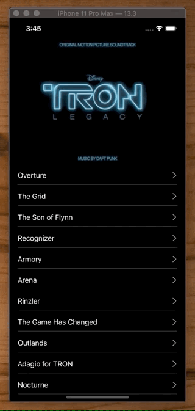
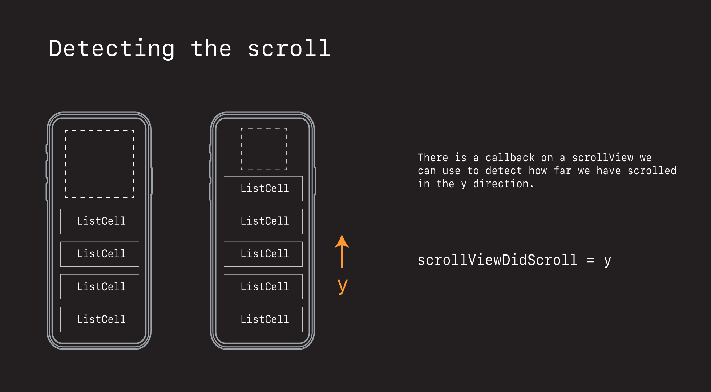
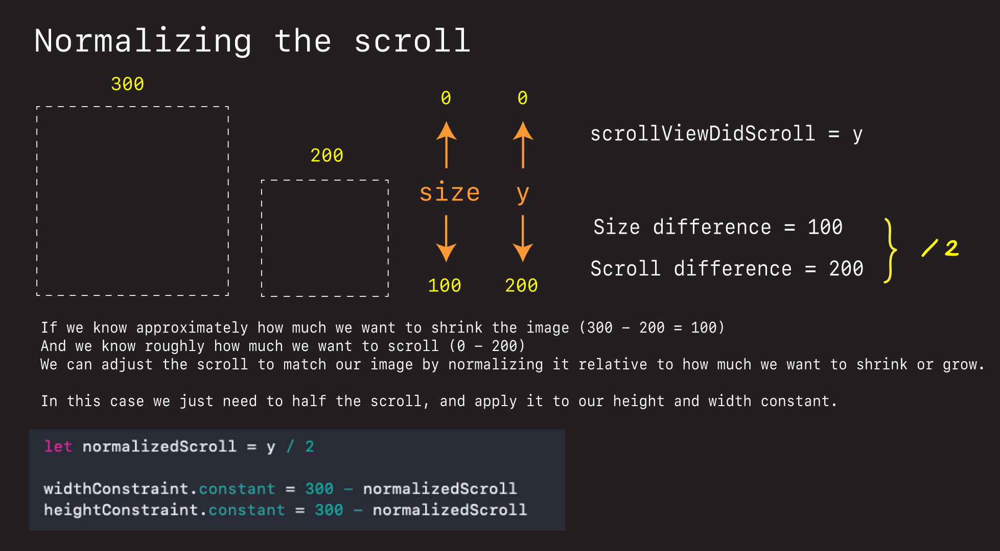
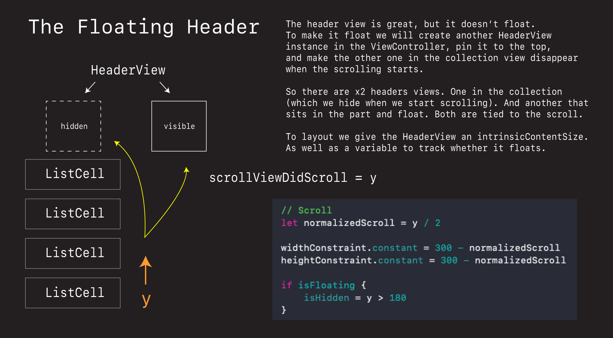
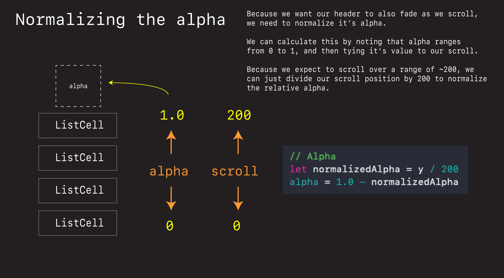

# Spotify Album 🕹

This read me shows the architecture and thought that when into building the Spotify Playlist App.



## Theory







## Code

**ViewController.swift** 

```swift
import UIKit

class ViewController: UIViewController {

    let songs = ["Overture",
                 "The Grid",
                 "The Son of Flynn",
                 "Recognizer",
                 "Armory",
                 "Arena",
                 "Rinzler",
                 "The Game Has Changed",
                 "Outlands",
                 "Adagio for TRON",
                 "Nocturne",
                 "End of Line",
                 "Derezzed",
                 "Fall",
                 "Solar Sailer",
                 "Rectifier",
                 "Disc Wars",
                 "C.L.U.",
                 "Arrival",
                 "Flynn Lives",
                 "TRON Legacy (End Titles)",
                 "Finale",
    ]
    
    static let headerKind = "header-element-kind"

    var collectionView: UICollectionView! = nil
    
    var headerView: HeaderView?
    var floatingHeaderView = HeaderView()

    override func viewDidLoad() {
        super.viewDidLoad()
        layout()
    }

}

// MARK: Layout
extension ViewController {
    
    func layout() {
        // Collection View
        collectionView = UICollectionView(frame: .zero, collectionViewLayout: createLayout())
        collectionView.translatesAutoresizingMaskIntoConstraints = false
        collectionView.backgroundColor = .systemBackground
        
        view.addSubview(collectionView)
        
        NSLayoutConstraint.activate([
            collectionView.topAnchor.constraint(equalTo: view.safeAreaLayoutGuide.topAnchor),
            collectionView.leadingAnchor.constraint(equalTo: view.leadingAnchor),
            collectionView.trailingAnchor.constraint(equalTo: view.trailingAnchor),
            collectionView.bottomAnchor.constraint(equalTo: view.bottomAnchor),
        ])
        
        collectionView.register(ListCell.self, forCellWithReuseIdentifier: ListCell.reuseIdentifier)
        collectionView.register(HeaderView.self,
                                forSupplementaryViewOfKind: ViewController.headerKind,
                                withReuseIdentifier: HeaderView.reuseIdentifier)
        
        collectionView.dataSource = self
        collectionView.delegate = self
        
        // Floating header view
        floatingHeaderView.translatesAutoresizingMaskIntoConstraints = false

        view.addSubview(floatingHeaderView)

        floatingHeaderView.track = Track(imageName: "tron")
        floatingHeaderView.isFloating = true

        NSLayoutConstraint.activate([
            floatingHeaderView.topAnchor.constraint(equalTo: view.safeAreaLayoutGuide.topAnchor),
            floatingHeaderView.centerXAnchor.constraint(equalTo: view.centerXAnchor),
        ])


    }
    
    func createLayout() -> UICollectionViewLayout {

        // ListCell layout
        let itemSize = NSCollectionLayoutSize(widthDimension: .fractionalWidth(1.0),
                                             heightDimension: .fractionalHeight(1.0))
        let item = NSCollectionLayoutItem(layoutSize: itemSize)

        let groupSize = NSCollectionLayoutSize(widthDimension: .fractionalWidth(1.0),
                                              heightDimension: .absolute(44))
        let group = NSCollectionLayoutGroup.horizontal(layoutSize: groupSize, subitems: [item])

        let section = NSCollectionLayoutSection(group: group)
        section.interGroupSpacing = 5
        section.contentInsets = NSDirectionalEdgeInsets(top: 0, leading: 10, bottom: 0, trailing: 10)

        // Header layout
        let headerFooterSize = NSCollectionLayoutSize(widthDimension: .fractionalWidth(1.0),
                                                     heightDimension: .estimated(300))
        let sectionHeader = NSCollectionLayoutBoundarySupplementaryItem(
            layoutSize: headerFooterSize,
            elementKind: ViewController.headerKind, alignment: .top)

        section.boundarySupplementaryItems = [sectionHeader]

        let layout = UICollectionViewCompositionalLayout(section: section)
        return layout
    }
}

extension ViewController: UICollectionViewDataSource {
    func collectionView(_ collectionView: UICollectionView, numberOfItemsInSection section: Int) -> Int {
        return songs.count
    }
    
    // ListCell
    func collectionView(_ collectionView: UICollectionView, cellForItemAt indexPath: IndexPath) -> UICollectionViewCell {
        let cell = collectionView.dequeueReusableCell(
            withReuseIdentifier: ListCell.reuseIdentifier,
            for: indexPath) as! ListCell
        
        cell.label.text = songs[indexPath.item]
        
        return cell
    }
    
    // HeaderView
    func collectionView(_ collectionView: UICollectionView, viewForSupplementaryElementOfKind kind: String, at indexPath: IndexPath) -> UICollectionReusableView {
        let headerView = collectionView.dequeueReusableSupplementaryView(
            ofKind: kind,
            withReuseIdentifier: HeaderView.reuseIdentifier,
            for: indexPath) as! HeaderView

        let track = Track(imageName: "tron")
        headerView.track = track
        
        self.headerView = headerView
        self.headerView?.isHidden = true

        return headerView
    }
}

extension ViewController: UICollectionViewDelegateFlowLayout {
    
    func scrollViewDidScroll(_ scrollView: UIScrollView) {
        headerView?.scrollViewDidScroll(scrollView)
        floatingHeaderView.scrollViewDidScroll(scrollView)
    }
}
```

**ListCell.swift**

```swift
import UIKit

class ListCell: UICollectionViewCell {
    static let reuseIdentifier = "list-cell-reuse-identifier"
    let label = UILabel()
    let accessoryImageView = UIImageView()
    let seperatorView = UIView()

    override init(frame: CGRect) {
        super.init(frame: frame)
        layout()
    }
    required init?(coder: NSCoder) {
        fatalError("not implemented")
    }
}

extension ListCell {
    func layout() {
        seperatorView.translatesAutoresizingMaskIntoConstraints = false
        seperatorView.backgroundColor = .systemGray
        contentView.addSubview(seperatorView)

        label.translatesAutoresizingMaskIntoConstraints = false
        label.adjustsFontForContentSizeCategory = true
        label.font = UIFont.preferredFont(forTextStyle: .body)
        label.textColor = .label
        label.adjustsFontSizeToFitWidth = true
        
        contentView.addSubview(label)

        accessoryImageView.translatesAutoresizingMaskIntoConstraints = false
        contentView.addSubview(accessoryImageView)

        let rtl = effectiveUserInterfaceLayoutDirection == .rightToLeft
        let chevronImageName = rtl ? "chevron.left" : "chevron.right"
        let chevronImage = UIImage(systemName: chevronImageName)
        accessoryImageView.image = chevronImage
        accessoryImageView.tintColor = .systemGray

        let inset = CGFloat(10)
        NSLayoutConstraint.activate([
            label.topAnchor.constraint(equalTo: contentView.topAnchor, constant: inset),
            label.leadingAnchor.constraint(equalTo: contentView.leadingAnchor, constant: inset),
            label.bottomAnchor.constraint(equalTo: contentView.bottomAnchor, constant: -inset),
            label.trailingAnchor.constraint(equalTo: accessoryImageView.leadingAnchor, constant: -inset),

            accessoryImageView.centerYAnchor.constraint(equalTo: contentView.centerYAnchor),
            accessoryImageView.widthAnchor.constraint(equalToConstant: 13),
            accessoryImageView.heightAnchor.constraint(equalToConstant: 20),
            accessoryImageView.trailingAnchor.constraint(equalTo: contentView.trailingAnchor, constant: -inset),

            seperatorView.leadingAnchor.constraint(equalTo: contentView.leadingAnchor, constant: inset),
            seperatorView.bottomAnchor.constraint(equalTo: contentView.bottomAnchor),
            seperatorView.trailingAnchor.constraint(equalTo: contentView.trailingAnchor, constant: -inset),
            seperatorView.heightAnchor.constraint(equalToConstant: 0.5)
            ])
    }
}
```

**HeaderView.swift**

```swift
import UIKit

struct Track {
    let imageName: String
}

class HeaderView: UICollectionReusableView {
    
    static let reuseIdentifier = "header-supplementary-reuse-identifier"
    
    var imageView = UIImageView()
    
    var widthConstraint: NSLayoutConstraint?
    var heightConstraint: NSLayoutConstraint?
    
    var isFloating = false

    var track: Track? {
        didSet {
            guard let track = track else { return }
            let image = UIImage(named: track.imageName) ?? UIImage(named: "placeholder")!

            imageView.image = image
        }
    }

    override init(frame: CGRect) {
        super.init(frame: frame)
        layout()
    }
    
    required init?(coder: NSCoder) {
        fatalError()
    }

}

extension HeaderView {

    func layout() {
        addSubview(imageView)

        imageView.translatesAutoresizingMaskIntoConstraints = false

        widthConstraint = imageView.widthAnchor.constraint(equalToConstant: 300)
        heightConstraint = imageView.heightAnchor.constraint(equalToConstant: 300)

        NSLayoutConstraint.activate([
            imageView.centerXAnchor.constraint(equalTo: centerXAnchor),
            imageView.centerYAnchor.constraint(equalTo: centerYAnchor),
            widthConstraint!,
            heightConstraint!
        ])
    }

    override var intrinsicContentSize: CGSize {
        return CGSize(width: 300, height: 300)
    }

}

extension HeaderView {
    func scrollViewDidScroll(_ scrollView: UIScrollView) {
        let y = scrollView.contentOffset.y
        
        guard
            let widthConstraint = widthConstraint,
            let heightConstraint = heightConstraint else { return }

        // Scroll
        let normalizedScroll = y / 2

        widthConstraint.constant = 300 - normalizedScroll
        heightConstraint.constant = 300 - normalizedScroll
        
        if isFloating {
            isHidden = y > 180
        }
        
        // Alpha
        let normalizedAlpha = y / 200
        alpha = 1.0 - normalizedAlpha
    }
}
```


### Links that help

- [Navigation Patterns](https://www.youtube.com/watch?v=qJjZsLpGOnQ)


