# Spotify Playlist 🕹

This read me shows the architecture and thought that when into building the Spotify Playlist App.

## Title Bar Menu

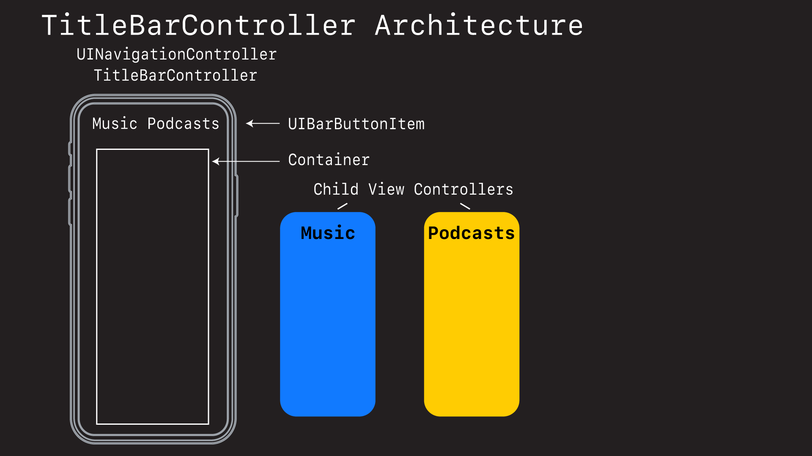
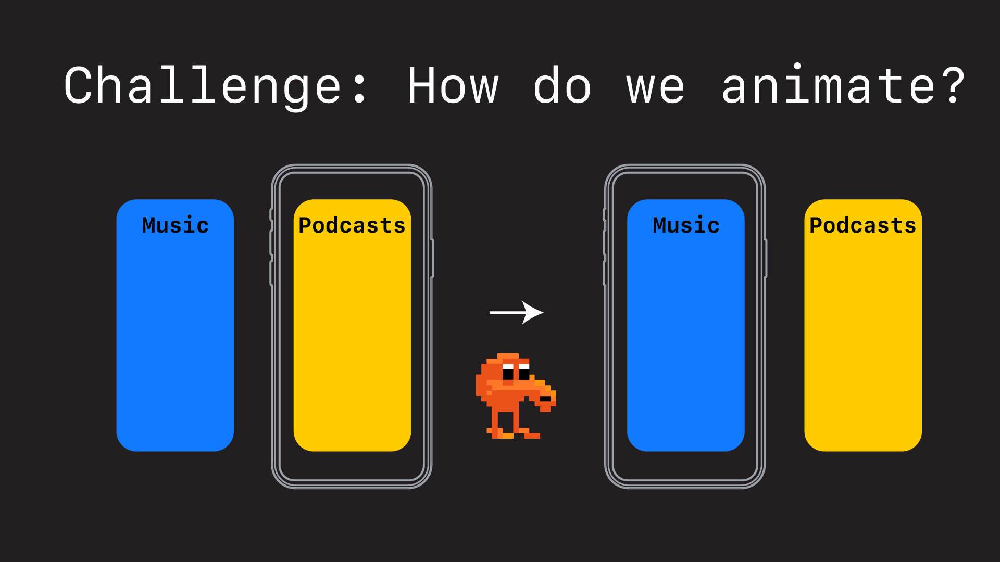
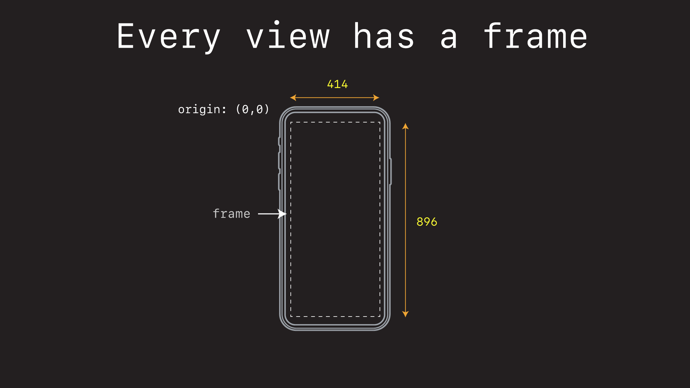
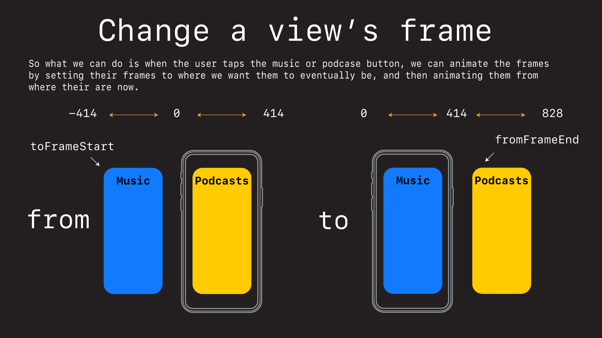
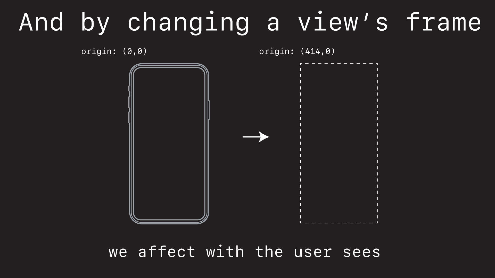
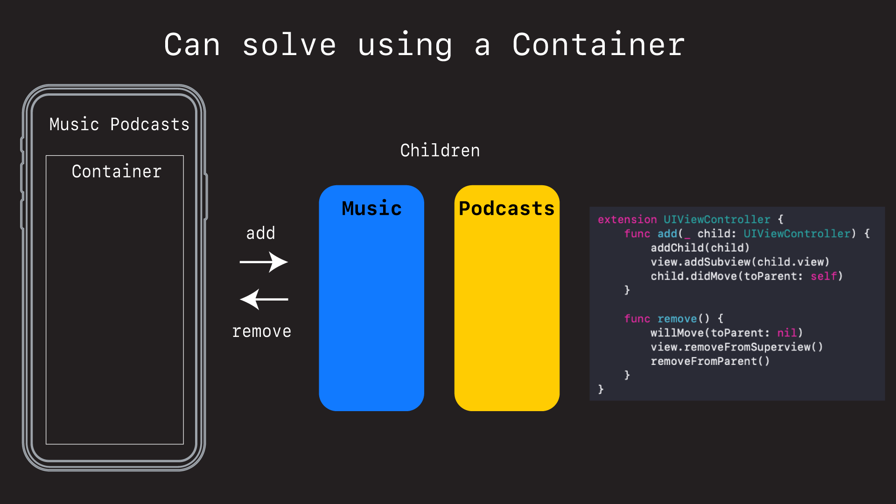

## Menu Bar

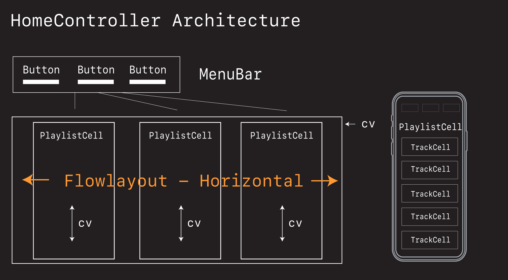
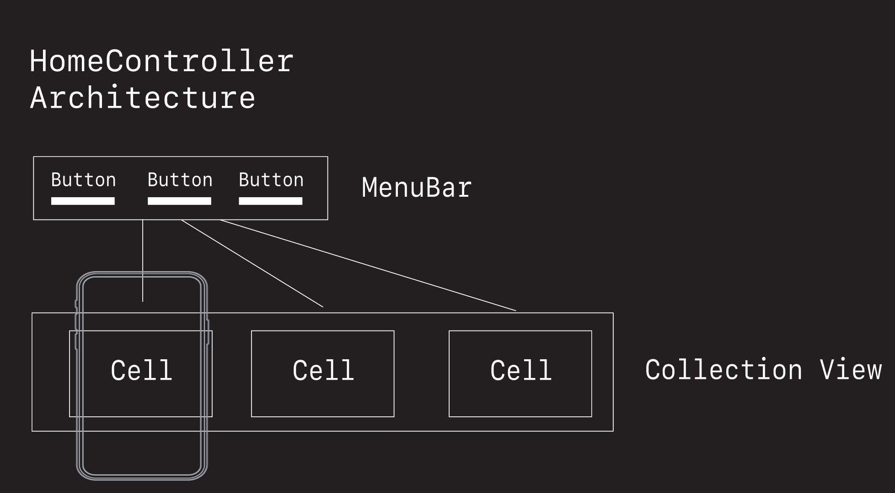
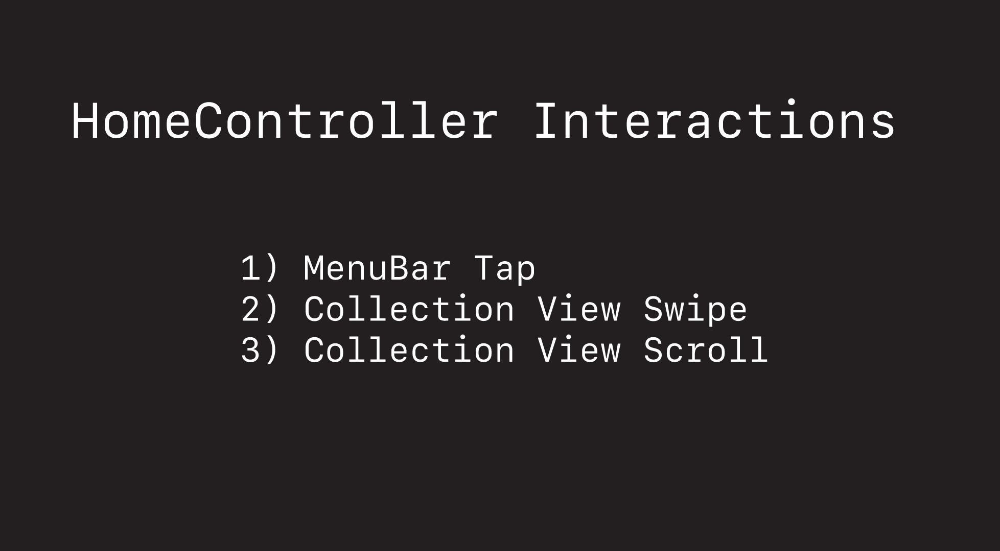

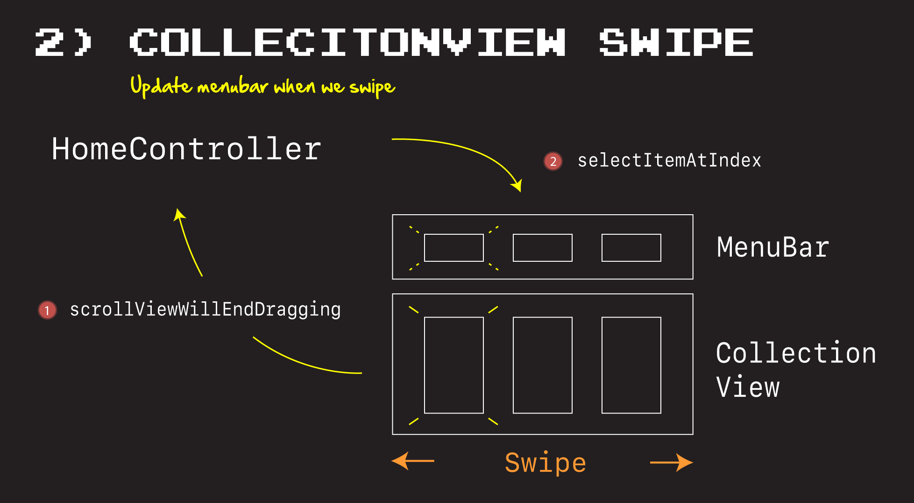
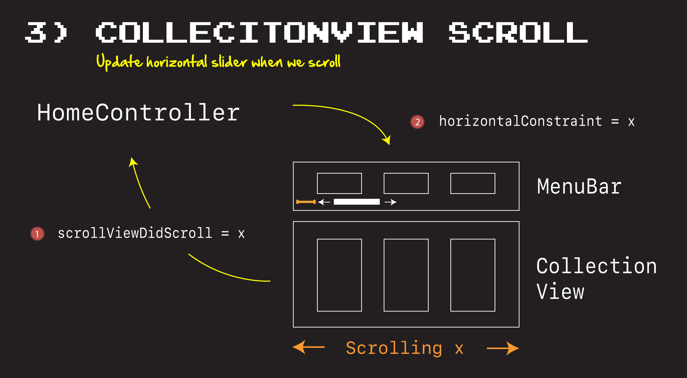
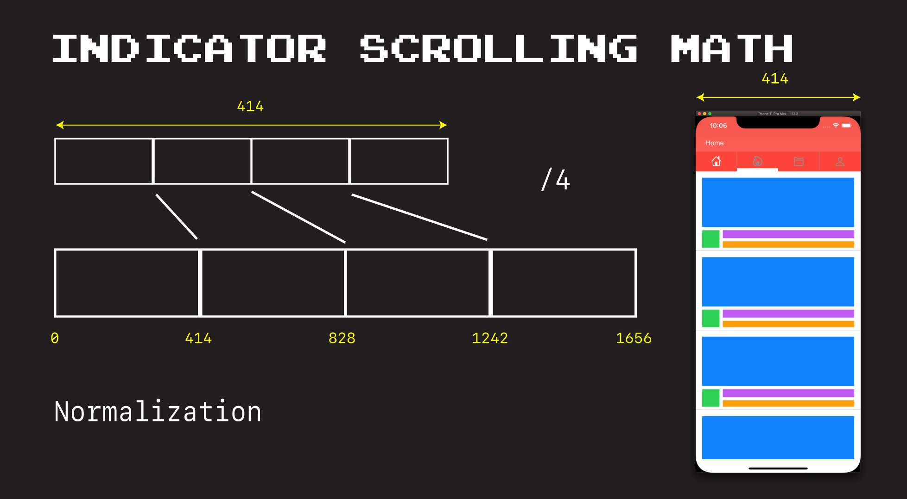
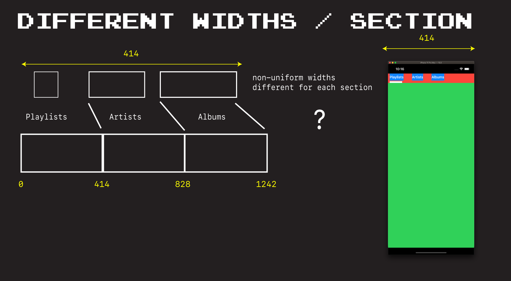
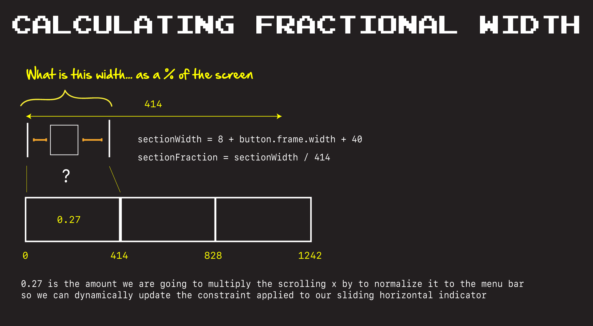
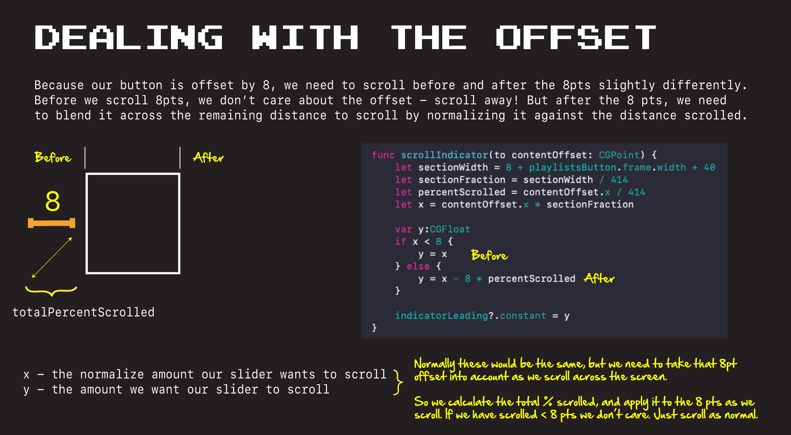
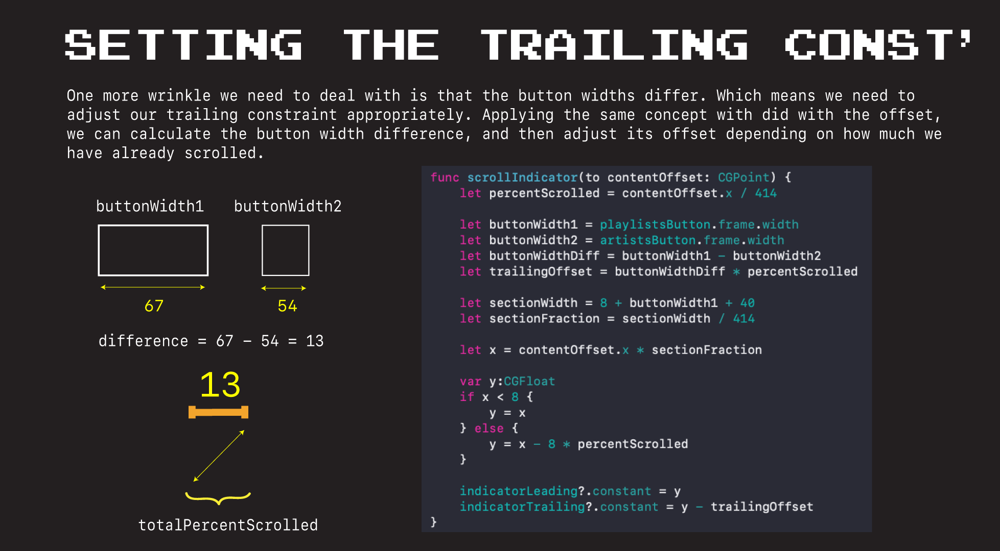

### Links that help

- [Episode #1](https://youtu.be/ez4cQWx-q9o)
- [Episode #2](https://youtu.be/QBkJDwOaFEY)
- [Episode #2](https://youtu.be/9U9I4NWf9P8)
- [Episode #4](https://youtu.be/8GDxT-vzqhI)

