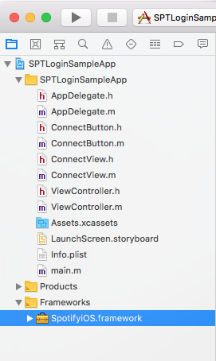

# Spotify iOS SDK

## Overview

The Spotify iOS framework allows your application to interact with the Spotify app running in the background on a user's device. Capabilities include authorizing, getting metadata for the currently playing track and context, as well as issuing playback commands.

**Please Note:** By using Spotify developer tools you accept our [Developer Terms of Use](https://beta.developer.spotify.com/terms/).

The Spotify iOS SDK is a set of lightweight objects that connect with the Spotify app and let you control it while all the heavy lifting of playback is offloaded to the Spotify app itself. The Spotify app takes care of playback, networking, offline caching and OS music integration, leaving you to focus on your user experience.  Moving from your app to the Spotify app and vice versa is a streamlined experience where playback and metadata always stay in sync.

[Key Features](#key-features)

[Filing Bugs](#filing-bugs)

[Components](#components)

[How Do App Remote Calls Work?](#how-do-app-remote-calls-work)

[Terms of Use](#terms-of-use)

[Tutorial](#tutorial)

[Frequently Asked Questions](#frequently-asked-questions)

### Key Features

* Playback is always in sync with Spotify app
* Playback, networking, and caching is all accounted for by the Spotify app
* Works offline and online and does not require Web API calls to get metadata for player state
* Allows authentication through the Spotify app so users don't have to type in their credentials

### Filing Bugs

We love feedback from the developer community, so please feel free to file missing features or bugs over at our [issue tracker](https://github.com/spotify/ios-app-remote-sdk/issues).
Make sure you search existing issues before creating new ones.

[Open bug tickets](https://github.com/spotify/ios-app-remote-sdk/labels/bug) | [Open feature requests](https://github.com/spotify/ios-app-remote-sdk/labels/feature%20request)

### Requirements

The Spotify iOS framework requires a deployment target of iOS 9 or higher. The
following architectures are supported: `armv7`, `armv7s` and `arm64` for devices,
`i386` and `x86_64` for the iOS Simulator. Bitcode is also supported.

## Components

### Models

* `SPTAppRemoteAlbum`
* `SPTAppRemoteArtist`
* `SPTAppRemoteLibraryState`
* `SPTAppRemotePlaybackRestrictions`
* `SPTAppRemotePlaybackOptions`
* `SPTAppRemotePlayerState`
* `SPTAppRemoteTrack`
* `SPTAppRemoteContentItem`
* `SPTAppRemoteUserCapabilities`
* `SPTAppRemoteImageRepresentable`
* `SPTConfiguration`

### SPTAppRemote

The main entry point to connect to the Spotify app and retrieve API components. Use this to establish, monitor, and terminate the connection.

### SPTAppRemotePlayerAPI

Send playback related commands such as:

* Play track by URI
* Resume/pause playback
* Skip forwards and backwards
* Seek to position
* Set shuffle on/off
* Request player state
* Request player context
* Subscribe to player state

### SPTAppRemoteImagesAPI

Fetch an image for a `SPTAppRemoteImageRepresentable`

### SPTAppRemoteUserAPI

Fetch/subscribe/set user-related data such as:

* Fetch and/or subscribe to `SPTAppRemoteUserCapabilities`
* Determine if a user can play songs on demand (Premium vs Free)
* Add/remove/check if a song is in a user's library

### SPTAppRemoteContentAPI

Fetch recommended content for the user.

## How App Remote calls work

When you interact with any of the App Remote APIs you pass in a `SPTAppRemoteCallback` block that gets invoked with either the expected result item or an `NSError` if the operation failed. The block is triggered after the command was received by the Spotify app (or if the connection could not be made).

Here is an example using the `SPTRemotePlayerAPI` to skip a song:

```objective-c
[appRemote.playerAPI skipToNext:^(id  _Nullable result, NSError * _Nullable error) {
    if (error) {
        // Operation failed
    } else {
        // Operation succeeded
    }
}];
```

### Tutorial and Examples

We provide a few sample projects to help you get started with the iOS Framework in the DemoProjects folder. See the [Readme](DemoProjects/README.md) in the DemoProjects folder for more information on what each sample does.

### Authentication and Authorization

To communicate with the Spotify app your application will need to get a user's permission to control playback first by using built-in authorization for App Remote. To do that you will need to request authorization view when connecting to Spotify. The framework will automatically request the `app-remote-control` scope and show the auth view if user hasn't agreed to it yet.

## Terms of Use

Note that by using Spotify developer tools, you accept our [Developer Terms of Use](https://beta.developer.spotify.com/terms/).

### Included Open Source Libraries

* [MPMessagePack](https://github.com/gabriel/MPMessagePack)

## Tutorial

This tutorial leads you step-by-step through the creation of a simple app that uses the Spotify iOS SDK to play an audio track and subscribe to player state. It will walk through the authorization flow.

### Prepare Your Environment

Follow these steps to make sure you are prepared to start coding.

* Download the Spotify iOS framework from the "Clone or download" button at the top of this page, and unzip it.
* Install the latest version of Spotify from the App Store onto the device you will be using for development. Run the Spotify app and login or sign up.
**Note:** A **Spotify Premium** account will be required to play a track on-demand for a uri.
* [Register Your Application](https://beta.developer.spotify.com/documentation/general/guides/app-settings/#register-your-app). You will need to register your application at [My Applications](https://beta.developer.spotify.com/dashboard/) and obtain a client ID. When you register your app you will also need to whitelist a redirect URI that the Spotify app will use to callback to your app after authorization.

### Add Dependencies

1. Add the `SpotifyiOS.framework` to your Xcode project.

    

2. In your info.plist add your redirect URI you registered at [My Applications](https://beta.developer.spotify.com/dashboard/). You will need to add your redirect URI under "URL types" and "URL Schemes". Be sure to set a unique "URL identifier" as well. [More info on URL Schemes](https://developer.apple.com/library/content/documentation/iPhone/Conceptual/iPhoneOSProgrammingGuide/Inter-AppCommunication/Inter-AppCommunication.html#//apple_ref/doc/uid/TP40007072-CH6-SW1)

    

3. Add `#import <SpotifyiOS/SpotifyiOS.h>` to your source files to import necessary headers.

### Check if Spotify is Active

If a user is already using Spotify, but has not authorized your application, you can use the following check to prompt them to
start the authorization process.

```objective-c
[SPTAppRemote checkIfSpotifyAppIsActive:^(BOOL active) {
    if (active) {
        // Prompt the user to connect Spotify here
    }
}];
```

### Authorize Your Application

To be able to use the playback control part of the SDK the user needs to authorize your application. If they haven't, the connection will fail with a `No token provided` error. To allow the user to authorize your app, you can use the built-in authorization flow.

1. Initialize `SPTConfiguration` with your client ID and redirect URI.

    ```objective-c
    SPTConfiguration *configuration =
        [[SPTConfiguration alloc] initWithClientID:@"your_client_id" redirectURL:[NSURL urlWithString:@"your_redirect_uri"]];
    ```

2. Initialize `SPTAppRemote` with your `SPTConfiguration`

    ```objective-c
    self.appRemote = [[SPTAppRemote alloc] initWithConfiguration:configuration logLevel:SPTAppRemoteLogLevelDebug];
    ```

3. Initiate the authentication flow (for other ways to detect if Spotify is installed, as well as attributing installs, please see our [Content Linking Guide](https://beta.developer.spotify.com/documentation/general/guides/content-linking-guide/)).

    ```objective-c
    // Note: A blank string will play the user's last song or pick a random one.
    BOOL spotifyInstalled = [self.appRemote authorizeAndPlayURI:@"spotify:track:69bp2EbF7Q2rqc5N3ylezZ"];
    if (!spotifyInstalled) {
        /*
        * The Spotify app is not installed.
        * Use SKStoreProductViewController with [SPTAppRemote spotifyItunesItemIdentifier] to present the user
        * with a way to install the Spotify app.
        */
    }
    ```

4. Configure your `AppDelegate` to parse out the accessToken in `application:openURL:options:` and set it on the `SPTAppRemote` connectionParameters.

    ```objective-c
    - (BOOL)application:(UIApplication *)app openURL:(NSURL *)url options:(NSDictionary<UIApplicationOpenURLOptionsKey,id> *)options
    {
        NSDictionary *params = [self.appRemote authorizationParametersFromURL:url];
        NSString *token = params[SPTAppRemoteAccessTokenKey];
        if (token) {
            self.appRemote.connectionParameters.accessToken = token;
        } else if (params[SPTAppRemoteErrorDescriptionKey]) {
            NSLog(@"%@", params[SPTAppRemoteErrorDescriptionKey]);
        }
        return YES;
    }
    ```

    If you are using UIScene then you need to use appropriate method in your scene delegate.

    ```swift
    func scene(_ scene: UIScene, openURLContexts URLContexts: Set<UIOpenURLContext>) {
        guard let url = URLContexts.first?.url else {
            return
        }

        let parameters = appRemote.authorizationParameters(from: url);

        if let access_token = parameters?[SPTAppRemoteAccessTokenKey] {
            appRemote.connectionParameters.accessToken = access_token
            self.accessToken = access_token
        } else if let error_description = parameters?[SPTAppRemoteErrorDescriptionKey] {
            // Show the error
        }
    }
    ```

### Connect and Subscribe to Player State

1. Set your connection delegate and attempt to connect.

    ```objective-c
    self.appRemote.delegate = self;
    [self.appRemote connect];
    ```

    ```objective-c

    - (void)appRemoteDidEstablishConnection:(SPTAppRemote *)appRemote
    {
        // Connection was successful, you can begin issuing commands
    }

    - (void)appRemote:(SPTAppRemote *)appRemote didFailConnectionAttemptWithError:(NSError *)error
    {
        // Connection failed
    }

    - (void)appRemote:(SPTAppRemote *)appRemote didDisconnectWithError:(nullable NSError *)error
    {
        // Connection disconnected
    }
    ```

2. Set a delegate and subscribe to player state:

    ```objective-c
    appRemote.playerAPI.delegate = self;

    [appRemote.playerAPI subscribeToPlayerState:^(id  _Nullable result, NSError * _Nullable error) {
        // Handle Errors
    }];
    ```

    ```objective-c
    - (void)playerStateDidChange:(id<SPTAppRemotePlayerState>)playerState
    {
        NSLog(@"Track name: %@", playerState.track.name);
    }
    ```

## Frequently Asked Questions

**Why does music need to be playing to connect with `SPTAppRemote`?**

Music must be playing when you connect with `SPTAppRemote` to ensure the Spotify app is not suspended in the background. iOS applications can only stay active in the background for a few seconds unless they are actively doing something like navigation or playing music.

**Is SpotifyiOS.framework thread safe?**

No, the framework currently expects to be called from the main thread. It will offload most of its work to a background thread internally but callbacks to your code will also occur on the main thread.

**What if I need to authorize without starting playback?**

There is an alternative authorization method. You can find more information about that [here](docs/auth.md).
