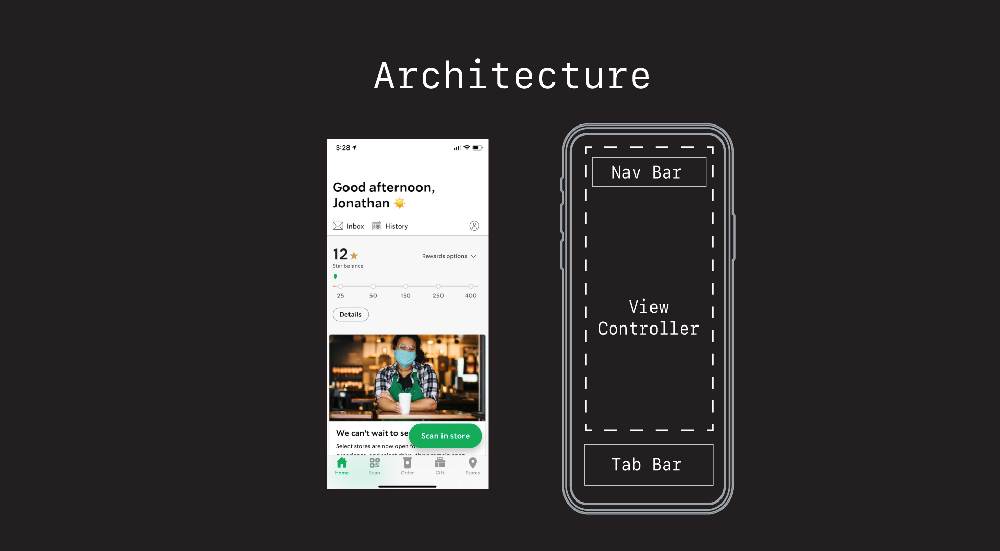
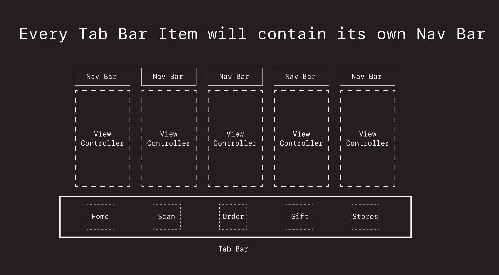
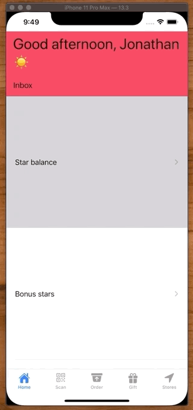
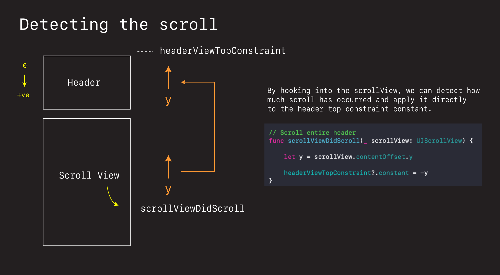
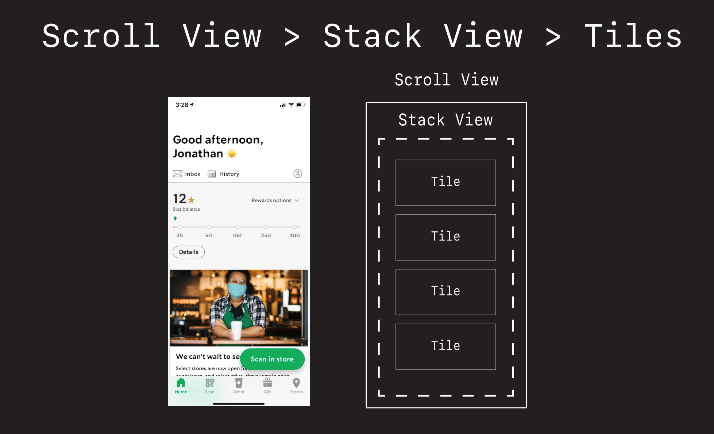
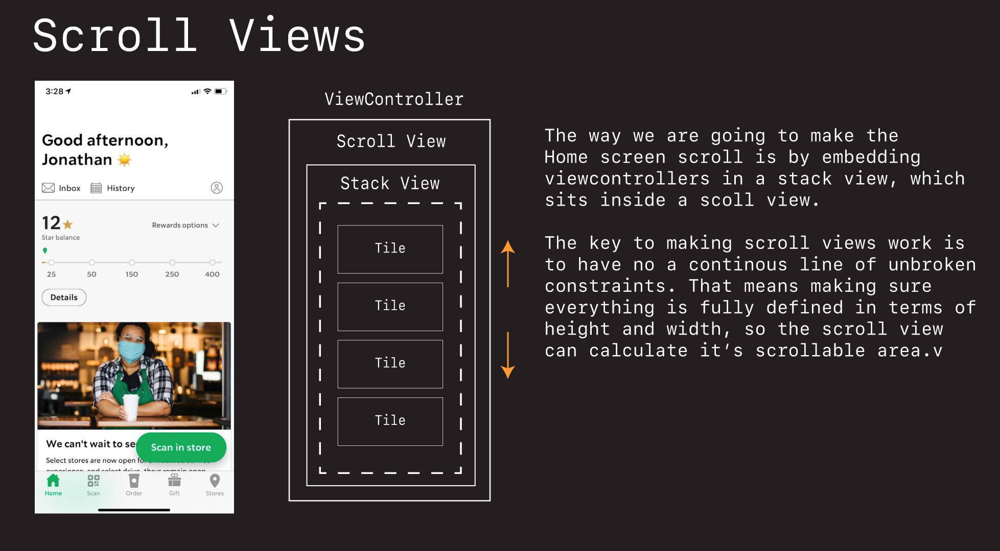
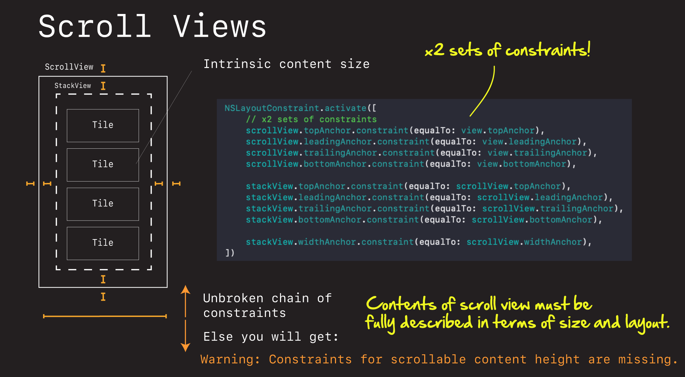
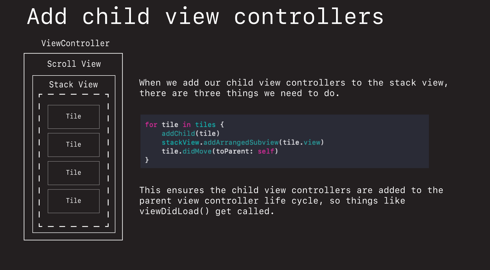

# Starbucks App ☕

This walk through shows you some of the architecture, mechanics, and designs that went into building the Starbucks application.

## High-Level Architecture

The Starbucks app is made up for various view controllers, each containing their own navigation bar.




We can set this up in our `AppDelegate` and present in our main `Window` like this.

**AppDelegate.swift**

```swift
@UIApplicationMain
class AppDelegate: UIResponder, UIApplicationDelegate {

    var window: UIWindow?

    func application(_ application: UIApplication, didFinishLaunchingWithOptions launchOptions: [UIApplication.LaunchOptionsKey: Any]?) -> Bool {
        
        window = UIWindow(frame: UIScreen.main.bounds)
        window?.makeKeyAndVisible()
        window?.backgroundColor = .systemBackground
                
        let homeVC = HomeViewController()
        let scanVC = ScanViewController()
        let orderVC = OrderViewController()
        let giftVC = GiftViewController()
        let storeVC = StoreViewController()
                
        let homeNC = UINavigationController(rootViewController: homeVC)
        let scanNC = UINavigationController(rootViewController: scanVC)
        let orderNC = UINavigationController(rootViewController: orderVC)
        let giftNC = UINavigationController(rootViewController: giftVC)
        let storeNC = UINavigationController(rootViewController: storeVC)

        let tabBarController = UITabBarController()
        tabBarController.viewControllers = [homeNC, scanNC, orderNC, giftNC, storeNC]

        window?.rootViewController = tabBarController
        
        return true
    }
 }
```

## Collapsible Header

The home screen has a header that collapses and expands as you swipe up and down.






To get this affect first build a custom header.

**HomeHeaderView.swift**

```swift
import UIKit

class HomeHeaderView: UIView {
    
    let greeting = UILabel()
    let inboxButton = UIButton()
    
    override init(frame: CGRect) {
        super.init(frame: .zero)
        layout()
    }
    
    required init?(coder: NSCoder) {
        fatalError("init(coder:) has not been implemented")
    }
}

extension HomeHeaderView {
    func layout() {
        
        greeting.translatesAutoresizingMaskIntoConstraints = false
        greeting.font = UIFont.preferredFont(forTextStyle: .largeTitle)
        greeting.text = "Good afternoon, Jonathan ☀️"
        greeting.numberOfLines = 0
        greeting.lineBreakMode = .byWordWrapping
        
        inboxButton.translatesAutoresizingMaskIntoConstraints = false
        inboxButton.setTitleColor(.label, for: .normal)
        inboxButton.setTitle("Inbox", for: .normal)
        
        addSubview(greeting)
        addSubview(inboxButton)
        
        NSLayoutConstraint.activate([
            greeting.topAnchor.constraint(equalToSystemSpacingBelow: topAnchor, multiplier: 1),
            greeting.leadingAnchor.constraint(equalToSystemSpacingAfter: leadingAnchor, multiplier: 2),
            trailingAnchor.constraint(equalToSystemSpacingAfter: greeting.trailingAnchor, multiplier: 2),
            
            inboxButton.topAnchor.constraint(equalToSystemSpacingBelow: greeting.bottomAnchor, multiplier: 2),
            inboxButton.leadingAnchor.constraint(equalToSystemSpacingAfter: leadingAnchor, multiplier: 2),
            bottomAnchor.constraint(equalToSystemSpacingBelow: inboxButton.bottomAnchor, multiplier: 1)
        ])
    }
    
    override var intrinsicContentSize: CGSize {
        return CGSize(width: 100, height: 100)
    }
}
```

Then make it collapse and snap by tying the scroll offset to the height of the header via an auto layout constraint.

**HomeViewController.swift**

```swift
// MARK: Animating scrollView
extension HomeViewController: UITableViewDelegate {
    
    // Snap to position
    func scrollViewDidScroll(_ scrollView: UIScrollView) {
        let y = scrollView.contentOffset.y

        let swipingDown = y <= 0
        let shouldSnap = y > 30
        let labelHeight = headerView.greeting.frame.height + 16 // label + spacer (102)

        UIView.animate(withDuration: 0.3) {
            self.headerView.greeting.alpha = swipingDown ? 1.0 : 0.0
        }

        UIViewPropertyAnimator.runningPropertyAnimator(withDuration: 0.3, delay: 0, options: [], animations: {
            self.headerViewTopConstraint?.constant = shouldSnap ? -labelHeight : 0
            self.view.layoutIfNeeded()
        })
    }
 }
```

## Scroll View > Stack View > Tiles

The home screen can be built as a series of Tiles (View Controllers) embedded in a stack view, embedded in a scroll view.



The trick with scroll views is making sure you have an unbroken chain of continous constraints.



That, and remembering that when you layout a scroll view, there are two sets of constraints. The scroll view to the the view. Then the contents to the scroll view.



Adding child view controllers to a parent view controller requires we follow these three steps.

```swift
for tile in tiles {
    addChild(tile)
    stackView.addArrangedSubview(tile.view)
    tile.didMove(toParent: self)
}
```



**HomeViewController.swift**

```swift
import UIKit

class HomeViewController: StarBucksViewController {
    
    let headerView = HeaderView()
    let scrollView = UIScrollView()
    let rootStackView = UIStackView()
    
    var headerViewTopConstraint: NSLayoutConstraint?
    
    let tiles = [
                Tile("Star balance"),
                Tile("Bonus stars"),
                Tile("Try these"),
                Tile("Welcome back"),
                Tile("Uplifting")
                ]

    override func viewDidLoad() {
        super.viewDidLoad()
        layout()
        setupScrollView()
    }
    
    override func commonInit() {
        setTabBarImage(imageName: "house.fill", title: "Home")
    }
    
    func setupScrollView() {
        scrollView.delegate = self
    }
    
}

// MARK: Layout
extension HomeViewController {
    func layout() {
        headerView.translatesAutoresizingMaskIntoConstraints = false
        headerView.backgroundColor = .systemPink

        scrollView.translatesAutoresizingMaskIntoConstraints = false
        rootStackView.translatesAutoresizingMaskIntoConstraints = false
        
        rootStackView.axis = .vertical
        rootStackView.spacing = 8
        
        view.addSubview(headerView)
        view.addSubview(scrollView)
        
        scrollView.addSubview(rootStackView)
        
        for tile in tiles {
            addChild(tile)
            rootStackView.addArrangedSubview(tile.view)
            tile.didMove(toParent: self)
        }
        
        headerViewTopConstraint = headerView.topAnchor.constraint(equalTo: view.safeAreaLayoutGuide.topAnchor)

        NSLayoutConstraint.activate([
            headerViewTopConstraint!,
            headerView.leadingAnchor.constraint(equalTo: view.leadingAnchor),
            headerView.trailingAnchor.constraint(equalTo: view.trailingAnchor),
            
            scrollView.topAnchor.constraint(equalTo: headerView.bottomAnchor, constant: 8),
            scrollView.leadingAnchor.constraint(equalTo: view.leadingAnchor, constant: 8),
            scrollView.trailingAnchor.constraint(equalTo: view.trailingAnchor, constant: -8),
            scrollView.bottomAnchor.constraint(equalTo: view.safeAreaLayoutGuide.bottomAnchor),
            
            rootStackView.topAnchor.constraint(equalTo: scrollView.topAnchor),
            rootStackView.leadingAnchor.constraint(equalTo: scrollView.leadingAnchor),
            rootStackView.trailingAnchor.constraint(equalTo: scrollView.trailingAnchor),
            rootStackView.bottomAnchor.constraint(equalTo: scrollView.bottomAnchor),
            rootStackView.widthAnchor.constraint(equalTo: scrollView.widthAnchor),
        ])
    }
}

// MARK: Animating scrollView
extension HomeViewController: UIScrollViewDelegate {
        
    // Snap to position
    func scrollViewDidScroll(_ scrollView: UIScrollView) {
        let y = scrollView.contentOffset.y

        let swipingDown = y <= 0
        let shouldSnap = y > 30
        let labelHeight = headerView.greeting.frame.height + 16

        UIView.animate(withDuration: 0.3) {
            self.headerView.greeting.alpha = swipingDown ? 1.0 : 0.0
        }

        UIViewPropertyAnimator.runningPropertyAnimator(withDuration: 0.3, delay: 0, options: [], animations: {
            self.headerViewTopConstraint?.constant = shouldSnap ? -labelHeight : 0
            self.view.layoutIfNeeded()
        })
    }
    
}
```

**Tile.swift**

```swift
import UIKit

class Tile: UIViewController {
    
    let label = UILabel()
    
    init(_ text: String) {
        super.init(nibName: nil, bundle: nil)
        label.text = text
    }

    override func viewDidLoad() {
        super.viewDidLoad()
        view.backgroundColor = .systemYellow
        layout()
    }
        
    required init?(coder: NSCoder) {
        fatalError("init(coder:) has not been implemented")
    }
    
    func layout() {
        label.translatesAutoresizingMaskIntoConstraints = false
        
        view.addSubview(label)
        
        NSLayoutConstraint.activate([
            label.centerXAnchor.constraint(equalTo: view.centerXAnchor),
            label.centerYAnchor.constraint(equalTo: view.centerYAnchor),
            view.heightAnchor.constraint(equalToConstant: 300)
        ])
    }
}
```

