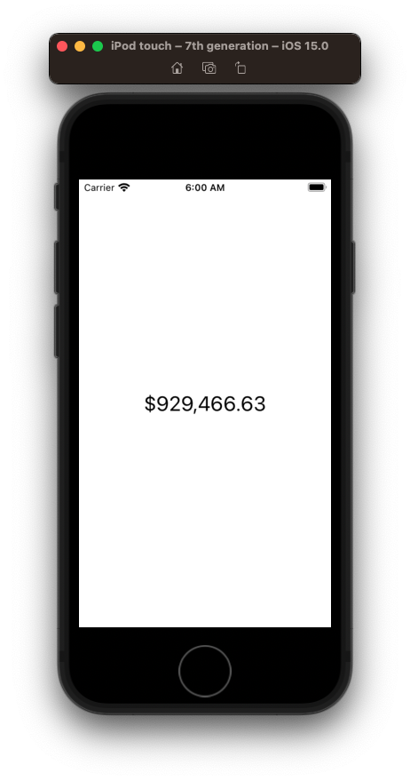
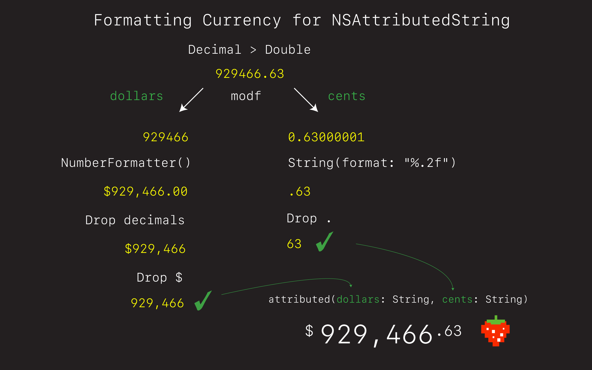

# Currency Formatting

## NumberFormatter 



Money in Swift is best represented as a `Decimal`.

`let amount: Decimal = 929466.63`

- You can then convert a `Decimal` to a `Double` via an extension.
- And then format the string using the `NumberFormatter`.

**ViewController**

```swift
import UIKit

class ViewController: UIViewController {
    
    let amount: Decimal = 929466.63
    
    var amountFormatted: String {
        let formatter = NumberFormatter()
        formatter.numberStyle = .currency
        formatter.usesGroupingSeparator = true
        
        let doubleValue = amount.doubleValue
        if let result = formatter.string(from: doubleValue as NSNumber) {
            return result
        }
        
        return ""
    }
    
    let stackView = UIStackView()
    let label = UILabel()
    
    override func viewDidLoad() {
        super.viewDidLoad()
        style()
        layout()
    }
}

extension ViewController {
    func style() {
        stackView.translatesAutoresizingMaskIntoConstraints = false
        stackView.axis = .vertical
        stackView.spacing = 20
        
        label.translatesAutoresizingMaskIntoConstraints = false
        label.text = amountFormatted
        label.font = UIFont.preferredFont(forTextStyle: .title1)
    }
    
    func layout() {
        stackView.addArrangedSubview(label)
        
        view.addSubview(stackView)
        
        NSLayoutConstraint.activate([
            stackView.centerXAnchor.constraint(equalTo: view.centerXAnchor),
            stackView.centerYAnchor.constraint(equalTo: view.centerYAnchor),
        ])
    }
}

extension Decimal {
    var doubleValue: Double {
        return NSDecimalNumber(decimal:self).doubleValue
    }
}
```

## NSAttributedString


If you want to get fancy, you can do something like this.



- `modf` is a `Darwin` function that splits a floating point into integer and fraction.
- We then can use `NumberFormatter` for the `dollar` part and simply format the `cent` part.
- We then set the text on the `UILabel` as `attributedText`.

**ViewController**

```swift
//
//  ViewController.swift
//  CurrencyFormatter
//
//  Created by jrasmusson on 2021-10-16.
//

import UIKit

class ViewController2: UIViewController {
    
    let amount: Decimal = 929466.01
    let label = UILabel()
    
    // 1
    var amountAttributed: NSAttributedString {
        let parts = formattedDollarsAndCents // tuple
        let dollarPart = parts.0
        let centPart = parts.1
        return makeFormattedBalance(dollars: dollarPart, cents: centPart)
    }
        
    // 2
    var formattedDollarsAndCents: (String, String) {
        let parts = modf(amount.doubleValue)
        
        let dollarsWithDecimal = dollarsFormatted(parts.0) // $100,000.01
        let formatter = NumberFormatter()
        let decimalSeparator = formatter.decimalSeparator!
        let dollarParts = dollarsWithDecimal.components(separatedBy: decimalSeparator)
        var dollars = dollarParts.first! // $100,000
        dollars.removeFirst() // 100,000
        
        let centPart = parts.1
        let cents: String
        if centPart == 0 {
            cents = "00"
        } else {
            cents = String(format: "%.0f", centPart * 100)
        }
        
        return (dollars, cents)
    }
    
    // 3
    private func dollarsFormatted(_ dollars: Double) -> String {
        let formatter = NumberFormatter()
        formatter.numberStyle = .currency
        formatter.usesGroupingSeparator = true
        
        if let result = formatter.string(from: dollars as NSNumber) {
            return result
        }
        
        return ""
    }

    // 4
    func makeFormattedBalance(dollars: String, cents: String) -> NSMutableAttributedString {
        let dollarSignAttributes: [NSAttributedString.Key: Any] = [.font: UIFont.preferredFont(forTextStyle: .callout), .baselineOffset: 8]
        let dollarAttributes: [NSAttributedString.Key: Any] = [.font: UIFont.preferredFont(forTextStyle: .title1)]
        let centAttributes: [NSAttributedString.Key: Any] = [.font: UIFont.preferredFont(forTextStyle: .footnote), .baselineOffset: 8]
        
        let rootString = NSMutableAttributedString(string: "$", attributes: dollarSignAttributes)
        let dollarString = NSAttributedString(string: dollars, attributes: dollarAttributes)
        let centString = NSAttributedString(string: cents, attributes: centAttributes)
        
        rootString.append(dollarString)
        rootString.append(centString)
        
        return rootString
    }

    override func viewDidLoad() {
        super.viewDidLoad()
        style()
        layout()
    }
}

extension ViewController2 {
    func style() {
        
        label.translatesAutoresizingMaskIntoConstraints = false
        label.attributedText = amountAttributed
    }
    
    func layout() {
        view.addSubview(label)
        
        NSLayoutConstraint.activate([
            label.centerXAnchor.constraint(equalTo: view.centerXAnchor),
            label.centerYAnchor.constraint(equalTo: view.centerYAnchor),
        ])
    }
}
```

### Links that help

- [Swift Arcade Video](https://www.youtube.com/watch?v=03PpTLh3AdY&lc=Ugy_AIVQ1_Xgmwuib6F4AaABAg&ab_channel=SwiftArcade)
- [Why Decimal](https://floating-point-gui.de/basic/)
- [Stack Overflow](https://stackoverflow.com/questions/41558832/how-to-format-a-double-into-currency-swift-3)
- [modf](https://www.techonthenet.com/c_language/standard_library_functions/math_h/modf.php)
- [Tuple](https://github.com/jrasmusson/level-up-swift/tree/master/5-tuples)
