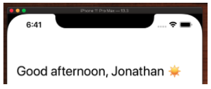

# Large Titles 🕹

## prefersLargeTitles

Large titles are a navigation controller setting where you can make the nav bar title really big and bold.

```swift
navigationController.navigationBar.prefersLargeTitles = true
```


## Style with attributed strings

The way to style a large title is with `NSAttributedStrings`.

```swift
navigationController.navigationBar.prefersLargeTitles = true
    
let attrs = [
    NSAttributedString.Key.foregroundColor: UIColor.label,
    NSAttributedString.Key.font: UIFont.preferredFont(forTextStyle: .title1)
]

navigationController.navigationBar.largeTitleTextAttributes = attrs

```



## Hide bar on swipe or tap

You can make the large title navigation bar disappear on a swipe or a tap like this.

```swift
navigationController?.hidesBarsOnSwipe = true
navigationController?.hidesBarsOnTap = true
```

## Bar Button Items

Add bar button items to give your navigation bar some functionality.

```swift
lazy var inboxBarButtonItem: UIBarButtonItem = {
        let barButtonItem = UIBarButtonItem(title: "Inbox", style: .plain, target: self, action: #selector(inboxTapped))
        barButtonItem.tintColor = .label
        return barButtonItem
    }()
    
lazy var historyBarButtonItem: UIBarButtonItem = {
    let barButtonItem = UIBarButtonItem(title: "History", style: .plain, target: self, action: #selector(historyTapped))
    barButtonItem.tintColor = .label
    return barButtonItem
}()

navigationItem.leftBarButtonItems = [inboxBarButtonItem, historyBarButtonItem]
```


## Full Source

**AppDelegate.swift**

```swift
import UIKit

@UIApplicationMain
class AppDelegate: UIResponder, UIApplicationDelegate {

    var window: UIWindow?

    func application(_ application: UIApplication, didFinishLaunchingWithOptions launchOptions: [UIApplication.LaunchOptionsKey: Any]?) -> Bool {
        window = UIWindow(frame: UIScreen.main.bounds)
        window?.makeKeyAndVisible()
        window?.backgroundColor = .systemBackground
        
        let navigationController = UINavigationController(rootViewController: ViewController())
        window?.rootViewController = navigationController
        
        navigationController.navigationBar.prefersLargeTitles = true
        
        let attrs = [
            NSAttributedString.Key.foregroundColor: UIColor.label,
            NSAttributedString.Key.font: UIFont.preferredFont(forTextStyle: .title1)
        ]

        navigationController.navigationBar.largeTitleTextAttributes = attrs
        
        return true
    }

}
```

**ViewController.swift**

```swift
import UIKit

class ViewController: UIViewController {
    
    lazy var inboxBarButtonItem: UIBarButtonItem = {
        let barButtonItem = UIBarButtonItem(title: "Inbox", style: .plain, target: self, action: #selector(inboxTapped))
        barButtonItem.tintColor = .label
        return barButtonItem
    }()
    
    lazy var historyBarButtonItem: UIBarButtonItem = {
        let barButtonItem = UIBarButtonItem(title: "History", style: .plain, target: self, action: #selector(historyTapped))
        barButtonItem.tintColor = .label
        return barButtonItem
    }()
    
    @objc func inboxTapped() {}
    @objc func historyTapped() {}
    
    let games = [
        "Pacman",
        "Space Invaders",
        "Space Patrol",
        "Galaga",
        "Donkey Kong",
        "Frogger",
        "Defender",
        "Dig Dug",
        "Zaxxon",
        "Qbert",
        "Burger Time",
        "Joust",
        "Paperboy",
        "Missle Command",
        "Pole Position",
        "Robotron",
        "Spy Hunter",
        "Star Wars",
        "1942",
        "Dragon's Lair",
        "Moon Patrol",
        "Centipede",
        "Bezerk",
        "Elevator Action",
        "Gauntlet",
        "Sinistar",
        "Tempest",
    ]
    
    let cellId = "cellId"

    var tableView = UITableView()

    override func viewDidLoad() {
        super.viewDidLoad()
        setupNavBar()
        setupTableView()
    }
    
    func setupNavBar() {
        title = "Good afternoon, Jonathan ☀️"
        navigationController?.hidesBarsOnSwipe = true
        navigationController?.hidesBarsOnTap = true
        navigationItem.leftBarButtonItems = [inboxBarButtonItem, historyBarButtonItem]
    }

    func setupTableView() {
        tableView.delegate = self
        tableView.dataSource = self

        tableView.register(UITableViewCell.self, forCellReuseIdentifier: cellId)

        tableView.tableFooterView = UIView() // hide empty rows

        view = tableView
    }
}

extension ViewController: UITableViewDelegate {

}

extension ViewController: UITableViewDataSource {
    func tableView(_ tableView: UITableView, cellForRowAt indexPath: IndexPath) -> UITableViewCell {
        let cell = tableView.dequeueReusableCell(withIdentifier: cellId, for: indexPath)

        cell.textLabel?.text = games[indexPath.row]
        cell.accessoryType = UITableViewCell.AccessoryType.disclosureIndicator

        return cell
    }

    func tableView(_ tableView: UITableView, numberOfRowsInSection section: Int) -> Int {
        return games.count
    }

    func tableView(_ tableView: UITableView, didSelectRowAt indexPath: IndexPath) {

    }
}
```


