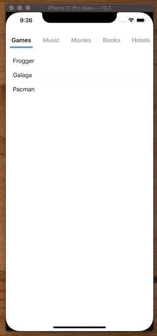
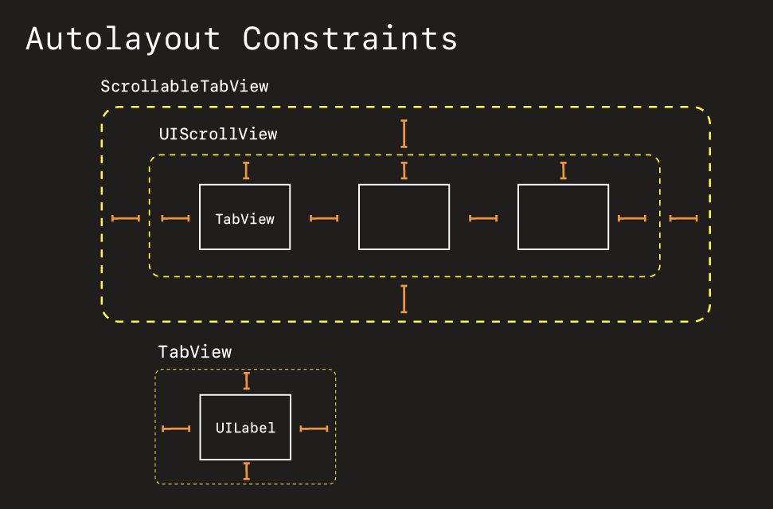
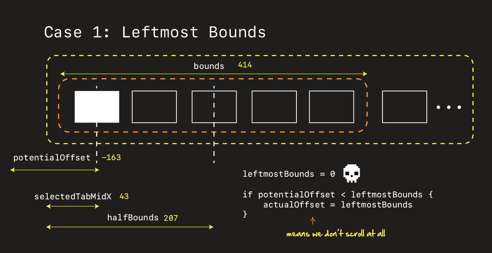
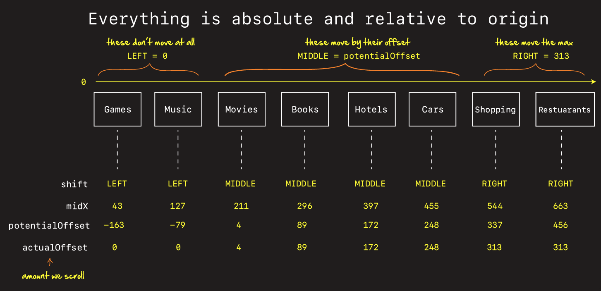

# How to create a ScrollableTabView custom control

This custom control allows users to swipe left and right on a tab bar, while also centering the scroll view around the tab or category they tape.



## High-level architecture



## How scrolling and selecting tab bar works

When the user selects a tab, there are three cases we need to consider when trying to figure out how far to scroll in order to center the tab.

- Left
- Middle
- Right


The first thing we do is calculate the `potentialOffset` which represents how far we would scroll, if we wanted to exactly center the tab. 

Because we don't want to center the extreme left and right most tabs we clamp them with bounds.

```swift
let leftmostBounds: CGFloat = 0
let rightmostBounds = scrollView.contentSize.width - (scrollView.bounds.width)
```

And this is what prevents us from scrolling off the edges. Then depending on how big our scroll is, we fall into one of three cases.

```swift
if potentialOffset < leftmostBounds {           // Left
    actualOffset = leftmostBounds
actualOffset = \(actualOffset)")
} else if potentialOffset > rightmostBounds {   // Right
    actualOffset = rightmostBounds
actualOffset = \(actualOffset)")
} else {                                        // Middle
    actualOffset = potentialOffset
}
```

scrollView.setContentOffset(CGPoint(x: actualOffset, y: 0.0), animated: true)

### Case 1: Leftmost Bounds



### Case 2: Middle


### Case 3: Right


### Relative to the origin

It helps to understand how it all works if you remember that the origin of the `UIScrollView` is what everything is based off (extreme left hand side).

Study this, and observe how 

- the `midX` variable grows as you move left to right.
- the `potentialOffset` flips form negative to positive.
- how the groupings of left, right, and middle work when you take all this into account.



### Links that help

- [Swift Arcade Video](https://www.youtube.com/watch?v=ysT9-NjjyjA)