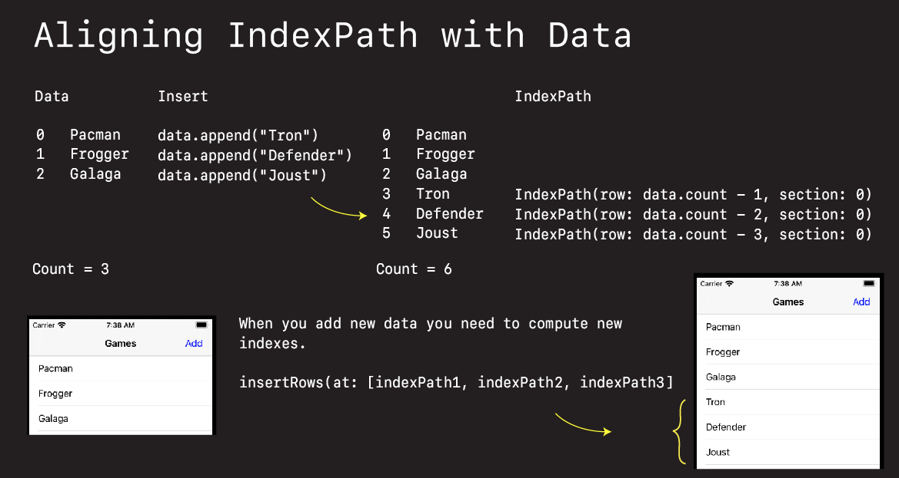

# Inserting Cells

## Insert Single


New cells can be animated in by:

- adding them to your data source
- calculating the index paths required
- wrapping `insertRows` in begin and end updates


```swift
@objc func addTapped(_ sender: UIBarButtonItem) {
    games.append("Tron")

    let indexPath = IndexPath(row: games.count - 1, section: 0)

    tableView.beginUpdates()
    tableView.insertRows(at: [indexPath], with: .fade)
    tableView.endUpdates()
}
```

### Example

```swift
import UIKit

class ViewController: UIViewController {

    var data = [
        "Pacman",
        "Space Invaders",
        "Space Patrol",
    ]

    lazy var addBarButtonItem: UIBarButtonItem = {
        let barButtonItem = UIBarButtonItem(title: "Add", style: .plain, target: self, action: #selector(addTapped))
        barButtonItem.tintColor = UIColor.blue
        return barButtonItem
    }()

    var tableView = UITableView()

    override func viewDidLoad() {
        super.viewDidLoad()
        setupTable()
        setupNavigationBar()
    }

    @objc func addTapped(_ sender: UIBarButtonItem) {
        data("Tron")

        let indexPath = IndexPath(row: games.count - 1, section: 0)

        tableView.beginUpdates()
        tableView.insertRows(at: [indexPath], with: .fade)
        tableView.endUpdates()
    }
}

extension ViewController: UITableViewDataSource, UITableViewDelegate {
    func tableView(_ tableView: UITableView, cellForRowAt indexPath: IndexPath) -> UITableViewCell {
        let cell = UITableViewCell()
        cell.textLabel?.text = games[indexPath.row]
        return cell
    }

    func tableView(_ tableView: UITableView, numberOfRowsInSection section: Int) -> Int {
        return data.count
    }
}

// MARK: Setup
extension ViewController {
    private func setupTable() {
        tableView.delegate = self
        tableView.dataSource = self
        view = tableView
    }

    private func setupNavigationBar() {
        title = "Games"
        navigationItem.rightBarButtonItem = addBarButtonItem
    }
}
```

## Insert Batch

If you try inserting more than one row as using the technique above

```swift
@objc func addTapped(_ sender: UIBarButtonItem) {
    games.append("Tron")
    games.append("Dig Dug")
    games.append("Moon Patrol")

    let indexPath = IndexPath(row: data.count - 1, section: 0)

    tableView.beginUpdates()
    tableView.insertRows(at: [indexPath], with: .fade)
    tableView.endUpdates()
}
```

You will get an error:

```
*** Terminating app due to uncaught exception 'NSInternalInconsistencyException', 
reason: 'Invalid update: invalid number of rows in section 0. The number of rows 
contained in an existing section after the update (6) must be equal to the number of 
rows contained in that section before the update (3), plus or minus the number of 
rows inserted or deleted from that section (1 inserted, 0 deleted) and plus or minus 
the number of rows moved into or out of that section (0 moved in, 0 moved out).'
```

What this is saying is you added `3` rows, but only inserted `1` new index.

To fix you need to calculate an index for each new addition.

```swift
@objc func addTapped(_ sender: UIBarButtonItem) {
    data.append("Tron")
    data.append("Defender")
    data.append("Joust")

    // Create corresponding indexes
    let indexPath1 = IndexPath(row: data.count - 1, section: 0)
    let indexPath2 = IndexPath(row: data.count - 2, section: 0)
    let indexPath3 = IndexPath(row: data.count - 3, section: 0)

    tableView.beginUpdates()
    tableView.insertRows(at: [indexPath1, indexPath2, indexPath3], with: .fade)
    tableView.endUpdates()
}
```



### Example

```swift
import UIKit

class ViewController: UIViewController {

    var data = [
        "Pacman",
        "Frogger",
        "Galaga",
    ]

    lazy var addBarButtonItem: UIBarButtonItem = {
        let barButtonItem = UIBarButtonItem(title: "Add", style: .plain, target: self, action: #selector(addTapped))
        barButtonItem.tintColor = UIColor.blue
        return barButtonItem
    }()

    var tableView = UITableView()

    override func viewDidLoad() {
        super.viewDidLoad()
        setupTable()
        setupNavigationBar()
    }

    @objc func addTapped(_ sender: UIBarButtonItem) {
        data.append("Tron")
        data.append("Defender")
        data.append("Joust")

        let indexPath1 = IndexPath(row: data.count - 1, section: 0) // Tron
        let indexPath2 = IndexPath(row: data.count - 2, section: 0) // Defender
        let indexPath3 = IndexPath(row: data.count - 3, section: 0) // Joust


        tableView.beginUpdates()
        tableView.insertRows(at: [indexPath1, indexPath2, indexPath3], with: .fade)
        tableView.endUpdates()
    }
}

extension ViewController: UITableViewDataSource, UITableViewDelegate {
    func tableView(_ tableView: UITableView, cellForRowAt indexPath: IndexPath) -> UITableViewCell {
        let cell = UITableViewCell()
        cell.textLabel?.text = data[indexPath.row]
        return cell
    }

    func tableView(_ tableView: UITableView, numberOfRowsInSection section: Int) -> Int {
        return data.count
    }
}

// MARK: Setup
extension ViewController {
    private func setupTable() {
        tableView.delegate = self
        tableView.dataSource = self
        view = tableView
    }

    private func setupNavigationBar() {
        title = "Games"
        navigationItem.rightBarButtonItem = addBarButtonItem
    }
}
```
### Links that help

- [Apple - Batch Insertion, Deletion, and Reloading of Rows and Sections](https://developer.apple.com/library/archive/documentation/UserExperience/Conceptual/TableView_iPhone/ManageInsertDeleteRow/ManageInsertDeleteRow.html#//apple_ref/doc/uid/TP40007451-CH10-SW9)