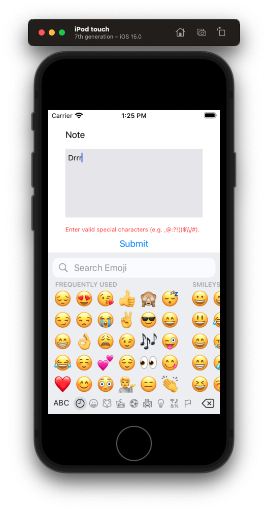
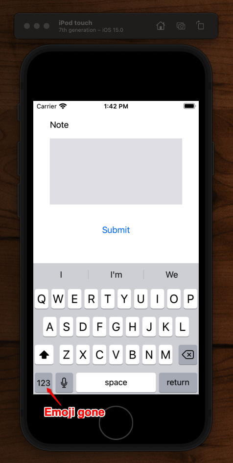

# Emoji Blocker

How to block emojis from being entered into a `UITextView`.



## Step 1: Filter out invalid chars

First, we can configure out `UITextView` to filter out invalid chars.

```swift
import UIKit

class ViewController: UIViewController {

    @IBOutlet weak var textView: UITextView!
    @IBOutlet weak var errorLabel: UILabel!

    override func viewDidLoad() {
        super.viewDidLoad()
        errorLabel.isHidden = true
        textView.delegate = self
    }
    @IBAction func submitTapped(_ sender: Any) {
        textView.resignFirstResponder()
    }
}

extension ViewController: UITextViewDelegate {
    func textView(_ textView: UITextView, shouldChangeTextIn range: NSRange, replacementText text: String) -> Bool {
        if containsValidCharacters(text) {
            errorLabel.isHidden = true
            return true
        }

        errorLabel.isHidden = false
        return false
    }

    private func containsValidCharacters(_ text: String) -> Bool {
        let validChars = "abcdefghijklmnopqrstuvwxyzABCDEFGHIJKLMNOPQRSTUVWXYZ0123456789.,@:?!()$\\/# \n"
        let invalidSet = CharacterSet(charactersIn: validChars).inverted

        return text.rangeOfCharacter(from: invalidSet) == nil
    }
}
```

Now this is good. It will stop users from entering emojis from both the keyboard, and via copy and paste.

But what would be even better is if we could stop users from even entering them in the first place from the keyboard. 

Fortunately we can. Simply make the keyboard ascii only, and the keyboard emjois go away.

```swift
textView.keyboardType = .asciiCapable
```

Now when we run the app. The emjoys won't even be there 🤗.



