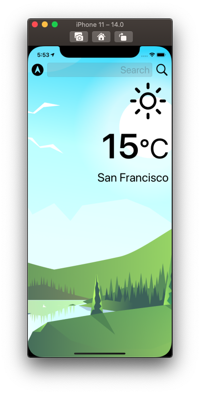

# Weathery 🌦

This app was built using many modern iOS development techniques and will show you the following:

- No storyboards
- Auto Layout
- Vector Assets
- Dark Mode
- Protocol-Delegate
- Parsing JSON
- HTTP/URLSession
- Weather API
- Error Handling
- Unit Testing